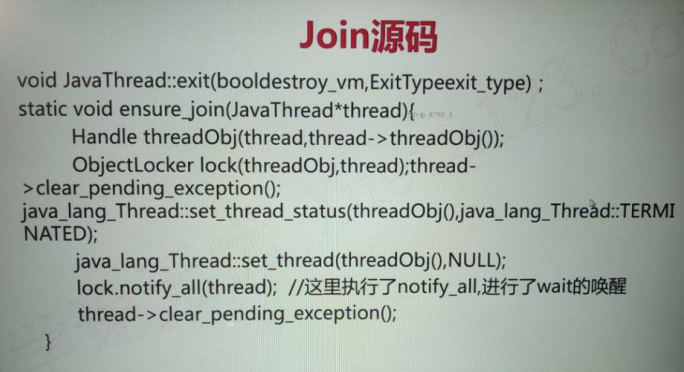

# join 方法详解

## 作用

因为新的线程加入了我们，所以我们要等待他执行完再出发

## 用法

main 等待 thread1 执行完毕，注意谁等谁，是**<font color=red>主线程等待子线程</font>**

## 三个示例

### 普通用法

使用 join 的情况：

代码如下：

```java
package threadcoreknowledge.threadobjectclasscommonmethods.join;

import java.util.concurrent.TimeUnit;

/**
 * @author mfh
 * @date 2020/4/26 15:38
 */
public class Join {
    public static void main(String[] args) throws InterruptedException {
        Thread t0 = new Thread(() -> {
            try {
                TimeUnit.SECONDS.sleep(1);
                System.out.println(Thread.currentThread().getName() + " 执行完毕");
            } catch (InterruptedException e) {
                e.printStackTrace();
            }
        });

        Thread t1 = new Thread(() -> {
            try {
                TimeUnit.SECONDS.sleep(2);
                System.out.println(Thread.currentThread().getName() + " 执行完毕");
            } catch (InterruptedException e) {
                e.printStackTrace();
            }
        });

        t0.start();
        t1.start();
        System.out.println(Thread.currentThread().getName() + " 等待所有线程执行完毕！");
        t0.join();
        t1.join();
        System.out.println("所有子线程执行完毕");
    }
}
```

结果：

```java
main 等待所有线程执行完毕！
Thread-0 执行完毕
Thread-1 执行完毕
所有子线程执行完毕
```

不使用 join 的情况：

将上面的代码 `t0.join();t1.join();`删除，这里就不再写一遍了。

结果：

```java
main 等待所有线程执行完毕！
所有子线程执行完毕
Thread-0 执行完毕
Thread-1 执行完毕
```

比较两次的输出结果，可见如果没有了 join，主线程不会等待其他两个子线程执行完。

### 遇到中断

**注意：join 遇到中断时，情况有些特殊**

以下代码演示 join 期间被中断的效果，我们一步一步来分析，代码每次会有略有不同。

```java
package threadcoreknowledge.threadobjectclasscommonmethods.join;

/**
 * @author mfh
 * @date 2020/4/26 15:57
 */
public class JoinInterrupt {
    public static void main(String[] args) {
        Thread t0 = new Thread(() -> {
            try {
                Thread.sleep(5000);
                System.out.println(Thread.currentThread().getName() + " 线程执行完毕！");
            } catch (InterruptedException e) {
                e.printStackTrace();
            }
        });
        t0.start();
        System.out.println(Thread.currentThread().getName() + " 等待子线程执行完毕！");
        try {
            t0.join();
        } catch (InterruptedException e) {
            System.out.println(Thread.currentThread().getName() + " 被中断！");
        }
        System.out.println("所有子线程执行完毕！");
    }
}
```

以上代码中，`t0.join()` 会抛出 `InterruptedException`，这里究竟是谁被中断？

分析：

`t0.join()`是**主线程**等待`t0`执行结束，所以**这里被中断的是主线程**。也可以在`catch`中打印出当前线程的名字，就知道是谁被中断了。既然是主线程被中断，那么应该如何中断主线程呢？在什么地方中断主线程呢？

首先要获取到主线程，然后在`Thread.sleep(5000)`前面中断主线程。这也就达到了一种效果，即，在主线程等待子线程时，主线程被打断。中断主线程时，主线程已经在等待子线程了。

代码如下：

```java
package threadcoreknowledge.threadobjectclasscommonmethods.join;

/**
 * @author mfh
 * @date 2020/4/26 15:57
 */
public class JoinInterrupt {
    public static void main(String[] args) {
        // 获取主线程
        Thread mainThread = Thread.currentThread();
        Thread t0 = new Thread(() -> {
            try {
                mainThread.interrupt();
                Thread.sleep(5000);
                System.out.println(Thread.currentThread().getName() + " 线程执行完毕！");
            } catch (InterruptedException e) {
                e.printStackTrace();
            }
        });
        t0.start();
        System.out.println("线程 " + Thread.currentThread().getName() + " 等待子线程执行完毕！");
        try {
            t0.join();
        } catch (InterruptedException e) {
            System.out.println("线程 " + Thread.currentThread().getName() + " 被中断！");
        }
        System.out.println("所有子线程执行完毕！");
    }
}

```

结果：

```java
线程 main 等待子线程执行完毕！
线程 main 被中断！
所有子线程执行完毕！
Thread-0 线程执行完毕！
```

以上代码，由于主线程被中断，所以

```java
try {
    t0.join();
} catch (InterruptedException e) {
    System.out.println("线程 " + Thread.currentThread().getName() + " 被中断！");
}
```

的`catch`块中捕获到了异常并打印`线程 main 被中断！`。紧接着打印了`所有子线程执行完毕！`。但此时子线程并没有执行完毕，等待了5秒之后，才会打印`Thread-0 线程执行完毕！`。也就是说，主线程被中断并没有对子线程造成什么影响，主线程在打印`所有子线程执行完毕！`时，子线程根本没有执行完毕。

这是在告诉我们，在`join`期间被打断，我们应该在处理中断异常的时候，把子线程的内容都给停止，否则就会出现不一致的情况。

可以在主线程获取到中断时，将这个中断传递给子线程，这样子线程会在`sleep`期间获取到中断，代码会执行到子线程`sleep`的`catch`块中，我们可以`catch`中处理子线程的收尾工作。

代码如下：

```java
package threadcoreknowledge.threadobjectclasscommonmethods.join;

/**
 * @author mfh
 * @date 2020/4/26 15:57
 */
public class JoinInterrupt {
    public static void main(String[] args) {
        // 获取主线程
        Thread mainThread = Thread.currentThread();
        Thread t0 = new Thread(() -> {
            try {
                mainThread.interrupt();
                Thread.sleep(5000);
                System.out.println(Thread.currentThread().getName() + " 线程执行完毕！");
            } catch (InterruptedException e) {
                System.out.println("子线程执行完毕！");
                //TODO 收尾工作
            }
        });
        t0.start();
        System.out.println("线程 " + Thread.currentThread().getName() + " 等待子线程执行完毕！");
        try {
            t0.join();
        } catch (InterruptedException e) {
            System.out.println("线程 " + Thread.currentThread().getName() + " 被中断！");
            // 在主线程获取到中断时，将这个中断传递给子线程
            t0.interrupt();
        }
        System.out.println("所有子线程执行完毕！");
    }
}
```

结果：

```java
线程 main 等待子线程执行完毕！
线程 main 被中断！
所有子线程执行完毕！
子线程运行完毕！
```


我们并不能保证`所有子线程执行完毕！`打印在`子线程执行完毕！`之前，因为当主线程把中断信号传递给子线程时，主线程与子线程的处理是并行的，如果子线程的收尾工作很耗时，主线程的工作都结束了，子线程也不一定结束。

这与前面文章说到的 interrupt 不同，因为这是中断主线程。

### join 期间，线程是什么状态？

答案：WAITING

```java
package threadcoreknowledge.threadobjectclasscommonmethods.join;

/**
 * 演示 join 期间，线程状态
 * @author mfh
 * @date 2020/4/26 17:03
 */
public class JoinThreadState {
    public static void main(String[] args) throws InterruptedException {
        Thread main = Thread.currentThread();
        Thread t0 = new Thread(() -> {
            try {
                Thread.sleep(3000);
                System.out.println("主线程状态：" + main.getState());
                System.out.println("子线程执行完毕");
            } catch (InterruptedException e) {
                e.printStackTrace();
            }
        });
        t0.start();
        System.out.println("等待子线程运行完毕");
        t0.join();
        System.out.println("所以线程执行完毕");
    }
}
```

结果：

```java
等待子线程运行完毕
主线程状态：WAITING
子线程执行完毕
所以线程执行完毕
```

## join源码

```java
public final synchronized void join(long millis)
    throws InterruptedException {
        long base = System.currentTimeMillis();
        long now = 0;

        if (millis < 0) {
            throw new IllegalArgumentException("timeout value is negative");
        }

        if (millis == 0) {
            while (isAlive()) {
                wait(0);
            }
        } else {
            while (isAlive()) {
                long delay = millis - now;
                if (delay <= 0) {
                    break;
                }
                wait(delay);
                now = System.currentTimeMillis() - base;
            }
        }
    }
```

主要的方法是调用了`wait(0)`，疑惑的是并没有地方调用notify，那么`wait(0)`之后是如何被唤醒的呢？这就要追溯到 jvm 源码，在线程 run 方法结束时，会调用 notify，这是jvm实现的。

c++源码：起唤醒作用的代码：`lock.notify_all(thread);`



替代写法：

```java
package threadcoreknowledge.threadobjectclasscommonmethods.join;

import java.util.concurrent.TimeUnit;

/**
 * 通过讲解 join 原理，分析出 join 的替代写法
 * @author mfh
 * @date 2020/4/26 18:09
 */
public class JoinPrinciple {
    public static void main(String[] args) throws InterruptedException {
        Thread t0 = new Thread(() -> {
            try {
                TimeUnit.SECONDS.sleep(1);
                System.out.println(Thread.currentThread().getName() + " 执行完毕");
            } catch (InterruptedException e) {
                e.printStackTrace();
            }
        });

        t0.start();
        System.out.println(Thread.currentThread().getName() + " 等待所有线程执行完毕！");
        synchronized (t0) {
            t0.wait();
        }
        System.out.println("所有子线程执行完毕");
    }
}
```

由于 join 底层是 wait，这里的替代方案也是 wait()，而对于 wait 本身是要在 synchronized 代码块保护之中才能运行的，使用 Thread 本身实例 t0 作为锁，主线程运行到同步代码块时自然会拿到锁，因为没有任何线程于其竞争。拿到锁之后执行`t0.wait()`，之后主线程就会进入休眠状态，直到有人唤醒。根据上面 join 的源码分析得知，t0 线程在结束时，会调用 notify()，所以当 t0 结束后，主线程会被唤醒，然后输出`所有子线程执行完毕`，这也就实现了与 join 一样的效果。