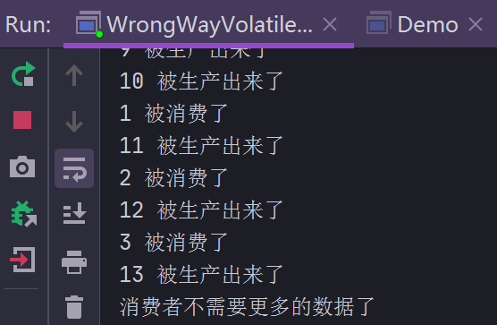

# 停止线程之interrupt

## 如何正确停止线程

* 原理介绍：使用 interrupt 来通知，而不是强制

### run 方法内没有 sleep 或 wait 方法

```java
/**
 * run 方法内没有 sleep 或 wait 方法时，停止线程
 * @author mfh
 * @date 2020/4/13 21:06
 */
public class RightWayStopThreadWithoutSleep implements Runnable {

    @Override
    public void run() {
        int num = 0;
        /**
         * Thread.currentThread().isInterrupted()
         * 实时监控着，观察着此线程是否被通知中断，如果通知了，就不再执行。
         * 这就是响应中断，如果此处不响应中断，线程对象调用 interrupt()
         * 是没有任何作用的
         */
        while (!Thread.currentThread().isInterrupted() && num <= Integer.MAX_VALUE / 2) {
            if (num % 100_00 == 0) {
                System.out.printf("%d 是 10000 的倍数\n", num);
            }
            num++;
        }
    }
    
    public static void main(String[] args) throws InterruptedException {
        Thread thread = new Thread(new RightWayStopThreadWithoutSleep());
        thread.start();
        /**
         * 让子线程执行 1 秒，如果上来就中断，那么将不会打印任何内容
         */
        Thread.sleep(1000);
        /**
         * run 方法内如果没有响应中断，此处调用 interrupt() 是没有任何作用的
         */
        thread.interrupt();
    }
}
```

### run 方法内有 sleep 或 wait 方法

```java
package threadcoreknowledge.stopthreads;

/**
 * run 方法内有 sleep 或 wait 方法时，停止线程
 *
 * @author mfh
 * @date 2020/4/13 21:29
 */
public class RightWayStopThreadWithSleep {
    public static void main(String[] args) throws InterruptedException {
        Runnable r = () -> {
            int num = 0;
            try {
                while (!Thread.currentThread().isInterrupted() && num <= Integer.MAX_VALUE / 2) {
                    if (num % 100 == 0) {
                        System.out.printf("%d 是 100 的倍数\n", num);
                    }
                    num++;
                }
                Thread.sleep(1000);
            } catch (InterruptedException e) {
                e.printStackTrace();
            }
        };
        Thread thread = new Thread(r);
        thread.start();
        Thread.sleep(500);
        thread.interrupt();
    }
    /**
     * 当线程正在休眠的过程中，如果收到了中断信号，便会响应这个中断，它响应中断的方式比较特殊，是通过抛出异常的方式来响应中断。
     * 这是当程序带有 sleep 或者 wait 这种能让线程进行阻塞的方法时，我们需要中断的时候需要注意的情况。
     * 它会让调用者把 interruptException 异常给处理掉，我们选择 catch 的方式处理掉之后，就可以做到，当线程进入阻塞过程中，依
     * 然能够响应中断。
     */
}
```

### 每次迭代都阻塞线程的情况

```java
package threadcoreknowledge.stopthreads;

/**
 * 每次迭代都阻塞线程的情况
 * @author mfh
 * @date 2020/4/13 22:11
 */
public class RightWayStopThreadWithSleepEveryLoop {
    public static void main(String[] args) throws InterruptedException {
        Runnable r = () -> {
            int num = 0;
            try {
                while (num <= Integer.MAX_VALUE / 2) {
                    if (num % 100 == 0) {
                        System.out.printf("%d 是 100 的倍数\n", num);
                    }
                    Thread.sleep(10);
                    num++;
                }
            } catch (InterruptedException e) {
                e.printStackTrace();
            }
        };
        Thread thread = new Thread(r);
        thread.start();
        Thread.sleep(5000);
        thread.interrupt();
    }
    /**
     * 如果在执行过程中，每次循环都会调用 sleep 或 wait 等方法，那么不需要加入 Thread.currentThread().isInterrupted() ，每次都检查是否已中断，这是多余的判断。
     * 即使没有这样的判断，也能中断线程。
     */
}
```

### while 内 try..catch 不能中断线程

```java
package threadcoreknowledge.stopthreads;

/**
 * @author mfh
 * @date 2020/4/14 21:20
 */
public class CantInterrupt {
    public static void main(String[] args) throws InterruptedException {
        Runnable runnable = () -> {
            int num = 0;
            while (num <= 10000 && !Thread.currentThread().isInterrupted()) {
                if (num % 100 == 0) {
                    System.out.printf("%d是100的倍数\n", num);
                }
                num++;
                try {
                    Thread.sleep(10);
                } catch (InterruptedException e) {
                    e.printStackTrace();
                }
            }
        };
        Thread thread = new Thread(runnable);
        thread.start();
        Thread.sleep(5000);
        thread.interrupt();
    }
    /**
     * while 内 try..catch，即使加入 Thread.currentThread().isInterrupted() 判断，循环也不会中断，抛出异常后会继续执行
     * 原因：java 设计 sleep 函数时，有这样一个理念，当它一旦响应中断，于是便会把线程的 interrupt 标记位清除，也就是说确实是
     * 在 sleep 过程中收到了中断，并且 catch 住了并打印了异常栈，但 sleep 设计的理念导致 interrupt 标记位会被清除，所以再次
     * 循环时，Thread.currentThread().isInterrupted() 判断就不起作用了，因为中断标记位已经被清除了，它检查不到任何被中断的
     * 迹象，导致程序不能退出。
     */
}
```

## 最佳实践

```java
package threadcoreknowledge.stopthreads.bestpractice;

/**
 * 最佳实践：catch 了 InterruptException 之后的优先选择：在方法签名中抛出异常
 * @author mfh
 * @date 2020/4/14 22:11
 */
public class RightWayStopThreadInProd implements Runnable {

    @Override
    public void run() {
        while (true && !Thread.currentThread().isInterrupted()) {
            System.out.printf("业务处理...\n");
            throwInMethod();
        }
    }

    private void throwInMethod() {
        try {
            Thread.sleep(2000);
        } catch (InterruptedException e) {
            e.printStackTrace();
        }
    }

    public static void main(String[] args) throws InterruptedException {
        Thread t = new Thread(new RightWayStopThreadInProd());
        t.start();
        Thread.sleep(1000);
        t.interrupt();
    }
}
```

执行结果

```java
业务处理...
java.lang.InterruptedException: sleep interrupted
	at java.lang.Thread.sleep(Native Method)
	at threadcoreknowledge.stopthreads.bestpractice.RightWayStopThreadInProd.throwInMethod(RightWayStopThreadInProd.java:20)
	at threadcoreknowledge.stopthreads.bestpractice.RightWayStopThreadInProd.run(RightWayStopThreadInProd.java:14)
	at java.lang.Thread.run(Thread.java:748)
业务处理...
业务处理...
业务处理...
```

收到中断信号后，throwInMethod() 方法做出了响应，抛出了异常，但此方法自己处理了异常，并没有向上抛出，以至于 while 中没有感知到异常，最终结果就是虽然打印了异常，但是程序继续执行，没有停止。

正确的做法应该是 throwInMethod **向上**抛出异常，代码如下：

> P.S. 向上
>
> throwInMethod 方法相对于 run 方法，是低级方法，run  方法为高级方法。因为 run 方法是先调用的，throwInMethod 方法是后调用的，是在 run 方法内部调用的。从方法调用栈也可以看出，run 方法所处的位置比 throwInMethod 方法要高

```java
package threadcoreknowledge.stopthreads.bestpractice;

/**
 * 最佳实践：catch 了 InterruptException 之后的优先选择：在方法签名中抛出异常
 *
 * @author mfh
 * @date 2020/4/14 22:11
 */
public class RightWayStopThreadInProd implements Runnable {

    @Override
    public void run() {
        while (true && !Thread.currentThread().isInterrupted()) {
            System.out.printf("业务处理...\n");
            try {
                throwInMethod();
            } catch (InterruptedException e) {
                System.out.printf("记录日志\n");
                System.out.printf("停止程序\n");
                e.printStackTrace();
                Thread.currentThread().interrupt();
            }
        }
    }

    private void throwInMethod() throws InterruptedException {
        Thread.sleep(2000);
    }

    public static void main(String[] args) throws InterruptedException {
        Thread t = new Thread(new RightWayStopThreadInProd());
        t.start();
        Thread.sleep(1000);
        t.interrupt();
    }
}
```

执行结果：

```java
业务处理...
记录日志
停止程序
java.lang.InterruptedException: sleep interrupted
	at java.lang.Thread.sleep(Native Method)
	at threadcoreknowledge.stopthreads.bestpractice.RightWayStopThreadInProd.throwInMethod(RightWayStopThreadInProd.java:27)
	at threadcoreknowledge.stopthreads.bestpractice.RightWayStopThreadInProd.run(RightWayStopThreadInProd.java:16)
	at java.lang.Thread.run(Thread.java:748)
```


以上代码，在 while 循环中 catch 了异常，本来 while 内 try..catch 不能中断线程（因为中断标记位被清除了），但在 catch 中加入了 `Thread.currentThread().interrupt()`后，就相当于**恢复中断**，这样一来，`Thread.currentThread().isInterrupted()`判断就生效了，所以就成功中断了线程。

如果就不希望向上抛出异常，应如何处理呢？代码如下：

```java
package threadcoreknowledge.stopthreads.bestpractice;

/**
 * 最佳实践2：在 catch 子句中调用 Thread.currentThread().interrupt() 来恢复
 * 设置中断状态，以便于在后续的执行中，依然能够检查到刚才发生的中断
 *
 * @author mfh
 * @date 2020/4/14 22:11
 */
public class RightWayStopThreadInProd2 implements Runnable {

    @Override
    public void run() {
        while (true) {
            System.out.printf("业务处理...\n");
            if (Thread.currentThread().isInterrupted()) {
                System.out.printf("停止运行");
                break;
            }
            throwInMethod();
        }
    }

    private void throwInMethod() {
        try {
            Thread.sleep(2000);
        } catch (InterruptedException e) {
            e.printStackTrace();
            Thread.currentThread().interrupt();
        }
    }

    public static void main(String[] args) throws InterruptedException {
        Thread t = new Thread(new RightWayStopThreadInProd2());
        t.start();
        Thread.sleep(1000);
        t.interrupt();
    }
}
```

执行结果：

```java
业务处理...
java.lang.InterruptedException: sleep interrupted
	at java.lang.Thread.sleep(Native Method)
	at threadcoreknowledge.stopthreads.bestpractice.RightWayStopThreadInProd2.throwInMethod(RightWayStopThreadInProd2.java:26)
	at threadcoreknowledge.stopthreads.bestpractice.RightWayStopThreadInProd2.run(RightWayStopThreadInProd2.java:20)
	at java.lang.Thread.run(Thread.java:748)
业务处理...
停止运行
```

throwInMethod() 方法 catch 了异常并使用 `Thread.currentThread().interrupt()`恢复中断，程序正常结束。

## 	为什么使用 interrupt() 方法停止线程？

被中断的线程自身拥有如何响应中断的权利，因为有些线程的某些代码是非常重要的，我们必须要等待这些线程处理完之后或者它们准备好之后，再由它们自己主动终止，或者它们真的不想理会我们的中断，这也是完全ok的。不应该鲁莽的使用 stop 方法，而是使用 interrupt() 方法来发出一个信号，让它们自己处理，这样使我们的线程代码在实际使用中更加安全，同时也完成了清理工作，数据的完整性也得到了保障。

## volatile 方式停止线程

### 看似可行的方式

```java
package threadcoreknowledge.stopthreads.volatiledemo;

/**
 * 演示用 volatile 的局限：part1 看似可行
 * @author mfh
 * @date 2020/4/18 11:38
 */
public class WrongWayVolatile implements Runnable {
    private volatile boolean canceled = false;
    @Override
    public void run() {
        int num = 1;
        while (num <= 100 * 100 * 10 && !canceled) {
            if (num % 100 == 0) {
                System.out.printf("%d 是100的倍数\n", num);
                try {
                    Thread.sleep(10);
                } catch (InterruptedException e) {
                    e.printStackTrace();
                }
            }
            num++;
        }
    }

    public static void main(String[] args) throws InterruptedException {
        WrongWayVolatile r = new WrongWayVolatile();
        Thread t1 = new Thread(r);
        t1.start();
        Thread.sleep(1000);
        r.canceled = true;
    }
}
```

结果：

```java
100 是100的倍数
200 是100的倍数
300 是100的倍数
400 是100的倍数
500 是100的倍数
600 是100的倍数
700 是100的倍数
800 是100的倍数
900 是100的倍数
1000 是100的倍数
```

由于 canceled 被 volatile 修饰，其值其他线程可见，将 canceled 更新为 true，会正常停止线程，这种方式看似可行，但不是一种正统的方式，在这个例子中是可行的，但是在下面的例子中，则暴露出其缺陷。代码如下：

```java
package threadcoreknowledge.stopthreads.volatiledemo;

import java.util.concurrent.ArrayBlockingQueue;
import java.util.concurrent.BlockingQueue;

/**
 * 演示用 volatile 的局限：part2 线程陷入阻塞，无法使用 volatile
 * 停止线程
 *
 * @author mfh
 * @date 2020/4/18 11:48
 */
public class WrongWayVolatileCantStop {
    public volatile boolean canceled = false;

    class Producer implements Runnable {
        private BlockingQueue<Integer> blockingQueue;

        public Producer(BlockingQueue<Integer> blockingQueue) {
            this.blockingQueue = blockingQueue;
        }

        @Override
        public void run() {
            int num = 1;
            try {
                while (num <= 100 && !canceled) {
                    blockingQueue.put(num);
                    System.out.printf("%d 被生产出来了\n", num);
                    num++;
                }
            } catch (InterruptedException e) {
                e.printStackTrace();
            } finally {
                System.out.println("生产者停止生产");
            }
        }
    }

    class Consumer {
        private BlockingQueue<Integer> blockingQueue;

        public Consumer(BlockingQueue<Integer> blockingQueue) {
            this.blockingQueue = blockingQueue;
        }

        void consume() {
            try {
                while (Math.random() <= 0.95) {
                    Integer take = blockingQueue.take();
                    System.out.printf("%d 被消费了\n", take);
                    Thread.sleep(100);
                }
            } catch (InterruptedException e) {
                e.printStackTrace();
            }
            System.out.println("消费者不需要更多的数据了");
            canceled = true;
        }
    }

    public static void main(String[] args) throws InterruptedException {
        BlockingQueue<Integer> queue = new ArrayBlockingQueue<>(10);
        WrongWayVolatileCantStop wwvcs = new WrongWayVolatileCantStop();
        Producer producer = wwvcs.new Producer(queue);
        Consumer consumer = wwvcs.new Consumer(queue);
        Thread t = new Thread(producer);
        t.start();
        Thread.sleep(1000);
        consumer.consume();
    }
}
```

结果：

```java
1 被生产出来了
2 被生产出来了
3 被生产出来了
4 被生产出来了
5 被生产出来了
6 被生产出来了
7 被生产出来了
8 被生产出来了
9 被生产出来了
10 被生产出来了
1 被消费了
11 被生产出来了
2 被消费了
12 被生产出来了
3 被消费了
13 被生产出来了
消费者不需要更多的数据了
```



如上图所示，已经打印出了`消费者不需要更多的数据了`结果，但程序依然没有停止。

正如此程序描述中所说的：<font color=red>线程阻塞后，无法使用 volatile 停止线程</font>。

原因：

程序使用了 BlockingQueue，它是一阻塞队列，特点是当满队列时，便会进入阻塞状态。进入阻塞状态后，程序停留在`blockingQueue.put(num)`。那么即使 canceled 值被改为 ture，线程也不会被停止，因为判断 canceled 状态是在 while 循环中，即`while (num <= 100 && !canceled)`，但线程停留在`blockingQueue.put(num)`这句话，所以 canceled 根本不会被判断。java 源程序的开发人员早就考虑到了此问题，所以基于这种情况，还是需要 interrupt 的方式停止线程。代码如下：

```java
package threadcoreknowledge.stopthreads.volatiledemo;

import java.util.concurrent.ArrayBlockingQueue;
import java.util.concurrent.BlockingQueue;

/**
 * @author mfh
 * @date 2020/4/18 22:51
 */
public class WrongWayVolatileFixed {
    class Producer implements Runnable {
        private BlockingQueue<Integer> blockingQueue;

        public Producer(BlockingQueue<Integer> blockingQueue) {
            this.blockingQueue = blockingQueue;
        }

        @Override
        public void run() {
            int num = 1;
            try {
                while (num <= 100 && !Thread.currentThread().isInterrupted()) {
                    blockingQueue.put(num);
                    System.out.printf("%d 被生产出来了\n", num);
                    num++;
                }
            } catch (InterruptedException e) {
                e.printStackTrace();
            } finally {
                System.out.println("生产者停止生产");
            }
        }
    }

    class Consumer {
        private BlockingQueue<Integer> blockingQueue;

        public Consumer(BlockingQueue<Integer> blockingQueue) {
            this.blockingQueue = blockingQueue;
        }

        void consume() {
            try {
                while (Math.random() <= 0.95) {
                    Integer take = blockingQueue.take();
                    System.out.printf("%d 被消费了\n", take);
                    Thread.sleep(10);
                }
            } catch (InterruptedException e) {
                e.printStackTrace();
            }
            System.out.println("消费者不需要更多的数据了");
        }
    }

    public static void main(String[] args) throws InterruptedException {
        BlockingQueue<Integer> queue = new ArrayBlockingQueue<>(10);
        WrongWayVolatileCantStop wwvcs = new WrongWayVolatileCantStop();
        WrongWayVolatileCantStop.Producer producer = wwvcs.new Producer(queue);
        WrongWayVolatileCantStop.Consumer consumer = wwvcs.new Consumer(queue);
        Thread t = new Thread(producer);
        t.start();
        Thread.sleep(1000);
        consumer.consume();
        t.interrupt();
    }
}
```

结果：

```java
1 被生产出来了
2 被生产出来了
3 被生产出来了
...
5 被消费了
6 被消费了
16 被生产出来了
7 被消费了
17 被生产出来了
消费者不需要更多的数据了
生产者停止生产
java.lang.InterruptedException
	at java.util.concurrent.locks.AbstractQueuedSynchronizer$ConditionObject.reportInterruptAfterWait(AbstractQueuedSynchronizer.java:2014)
	at java.util.concurrent.locks.AbstractQueuedSynchronizer$ConditionObject.await(AbstractQueuedSynchronizer.java:2048)
	at java.util.concurrent.ArrayBlockingQueue.put(ArrayBlockingQueue.java:353)
	at threadcoreknowledge.stopthreads.volatiledemo.WrongWayVolatileCantStop$Producer.run(WrongWayVolatileCantStop.java:28)
	at java.lang.Thread.run(Thread.java:748)
```

使用 interrupt 方式停止了线程。

## 停止线程相关重要函数解析

* static boolean interrupted()
  * 此方法返回之后，会把线程的中断状态设置为 false，也就是说它把线程的中断状态给清除了，这是**唯一能清除线程状态的办法**。所以如果返回的 true，实际上它内部帮我们清除了，那么我们自然需要对这种行为作出处理，无论是抛出 InterruptedException 或者是再次执行 interrupt() 方法来中断它。
* boolean isInterrupted()
  * 和上面的方法一样，都是返回当前线程是否被中断，但**不同的是，此方法不会做清除工作**。
* Thread.interrupted() 的目标对象是什么？
  * 通过代码分析，代码如下：

```java
package threadcoreknowledge.stopthreads;

/**
 * 注意：Thread.interrupted() 方法的目标对象是 “当前线程”，而不管本方法来自于哪个对象
 * @author mfh
 * @date 2020/4/19 11:13
 */
public class RightWayInterrupted {
    public static void main(String[] args) throws InterruptedException {
        Thread t = new Thread(() -> {
            for (; ; ) {

            }
        });
        // 启动线程
        t.start();
        // 设置中断标志
        t.interrupt();
        // 获取中断标志
        System.out.println("isInterrupted:" + t.isInterrupted());
        // 获取中断标志并重置
        System.out.println("isInterrupted:" + t.interrupted());
        // 获取中断标志并重置
        System.out.println("isInterrupted:" + Thread.interrupted());
        // 获取中断标志
        System.out.println("isInterrupted:" + t.isInterrupted());
        t.join();
        System.out.println("Main thread is over");
    }
}
```

结果：

```java
isInterrupted:true
isInterrupted:false
isInterrupted:false
isInterrupted:true
```

分析：

1. t.interrupt()，设置了中断标志

2. t.isInterrupted()

   1. 错误认识：由于上面设置了中断标志，所以获取到的是 true，已经中断了嘛。
   2. 正确：以下是 isInterrupted() 方法的官方注释（部分）

   >Tests whether the current thread has been interrupted. 

   注意第一句话，测试**当前线程**是否已经被终止。这里说的很清楚，isInterrupted() 方法测试的是当前线程，那么调用`System.out.println("isInterrupted:" + t.interrupted());`的当前线程是主线程，主线程没有被设置中断，所以`t.interrupted()`返回 false。

   isInterrupted() 方法并不关心是谁调用的，它只认当前线程的状态，而不是调用它的线程对象的状态。

3. Thread.interrupted()，与上同理，当前线程为主线程，没有设置中断标志，所以返回 false，即没有中断。

4. t.isInterrupted()，官方注释（部分）

   >Tests whether this thread has been interrupted

   isInterrupted() 方法关心的是**调用它的线程对象**是否被中断。由于刚开始执行了`t.interrupt()`，所以 t 线程已经被中断，所以返回 true

## 停止线程面试常见问题

### 如何停止线程

1. 原理：用 interrupt 来请求，好处
2. 想停止线程，要请求放，被停止放，子方法被调用放相互配合
3. 最后再说错误处理的方法：stop/suspend 已被弃用了，volatile 的 boolean 无法处理长时间阻塞的情况

用以上三点思路串一下：

我们要用 interrupt 来请求，而不是 stop、suspend 或者 valotile。讲一下好处，比如数据安全。我们要把主动权交给被中断的线程。要想达到这样的效果，不光是我们要调用 interrupt 方法来中断它，还需要被中断的线程配合，这个配合是三方配合，分别是：请求方，被停止方，被调用方。请求方发出一个 interrupt 信号，被停止方必须在每次的循环中或者适当时候检查中断信号，并且在可能抛出 InterruptedException 的时候去处理这个信号，每一个线程它都应该做这样的事情，以便于自己可以被停止。如果我们是去写子方法的，子方法是会被我们线程所调用的，那么我们有两点最佳实践，第一是在方法层抛出exception，让其他人做进一步的处理；或者在收到中断信号之后把它再次设置为中断状态。这两种方式都可以。最后在延伸一下，如果不用 interrupt ，其他错误的方式会带来哪些后果。可以着重说一下 volatile 的 boolean 无法处理长时间阻塞的情况。

## 如何处理不可中断的阻塞

interrupt 方法不是万能的，之所以它能及时让我们响应中断，是由于 wait、sleep它是可以被我们所唤醒的，但是有些方法是不能被我们及时唤醒的。比如执行 SocketIO 操作时，即便发出 interrupt 信号，它也无法及时响应的。

很遗憾，没有一个通用的解决方案。比如可重入锁，我们使用了它的 lock 方法，并且在 lock 时阻塞，是没有办法及时响应的，我们应该使用它提供的 lockInterruptibly 方法。也就是说在编写代码过程中，要使用那些可响应中断的方法，这是一种解决方案。针对 IO 的操作，也应该使用可响应中断的 IO 方法。

针对特定的情况使用特定的方法，尽可能做到能响应中断，但没有一个万能的方式。