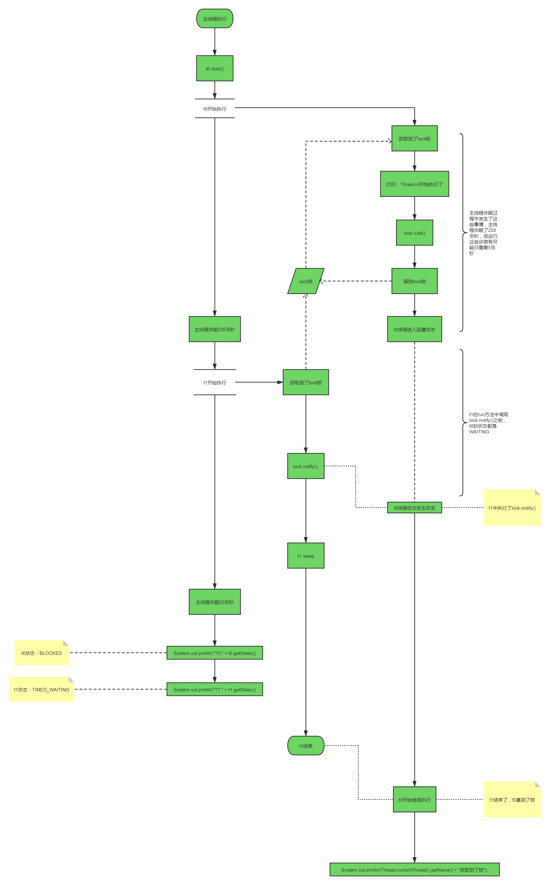

# 线程状态分析

前提条件： 状态分析的前提是先了解了线程的各个状态，掌握了线程状态流转图。

首先上代码：

```java
package threadcoreknowledge.threadobjectclasscommonmethods.me;

/**
 * @author mfh
 * @date 2020/4/21 9:59
 */
public class ThreadA implements Runnable {
    private Object lock;

    public ThreadA(Object lock) {
        this.lock = lock;
    }

    @Override
    public void run() {
        synchronized (lock) {
            System.out.println(Thread.currentThread().getName() + "开始执行了");
            try {
                lock.wait();
            } catch (InterruptedException e) {
                e.printStackTrace();
            }
                System.out.println(Thread.currentThread().getName() + "获取到了锁");
        }
    }
}
```

```java
package threadcoreknowledge.threadobjectclasscommonmethods.me;

/**
 * @author mfh
 * @date 2020/4/21 10:00
 */
public class ThreadB implements Runnable {
    private Object lock;

    public ThreadB(Object lock) {
        this.lock = lock;
    }

    @Override
    public void run() {
        synchronized (lock) {
            lock.notify();
            System.out.println(Thread.currentThread().getName() + "调用了 notify()");
            try {
                Thread.sleep(1000 * 2);
            } catch (InterruptedException e) {
                e.printStackTrace();
            }
        }
    }
}
```

```java
package threadcoreknowledge.threadobjectclasscommonmethods.me;

/**
 * m1 与 m2 的差别是 m2 在输出线程状态前
 * 休眠了 20ms，正是由于这 20ms，打印出
 * 的效果是不一样的
 * @author mfh
 * @date 2020/4/19 22:15
 */
public class Wait {
    public final Object lock = new Object();

    public static void main(String[] args) throws InterruptedException {
        Wait w = new Wait();
        w.m1();
 		// w.m2();
    }

    private void m1() throws InterruptedException {
        Thread t0 = new Thread(new ThreadA(this.lock));
        Thread t1 = new Thread(new ThreadB(this.lock));
        t0.start();
        Thread.sleep(200);
        t1.start();
        System.out.println("T0:" + t0.getState());
        System.out.println("T1:" + t1.getState());
        System.out.println("T0:" + t0.getState());
    }
    private void m2() throws InterruptedException {
        Thread t0 = new Thread(new ThreadA(this.lock));
        Thread t1 = new Thread(new ThreadB(this.lock));
        t0.start();
        Thread.sleep(200);
        t1.start();
        Thread.sleep(20);
        System.out.println("T0:" + t0.getState());
        System.out.println("T1:" + t1.getState());
    }
}
```

执行`m1()`方法的流程图分析：.png)

以下为左侧三块备注文字描述：

>备注一
>
>由于并发速度很快，当线程1还没有唤醒线程0的时候，有可能这句代码就已经执行了，所以此时线程0的状态还是WAITING

>备注二
>
>此时线程1已经 sleep(time)，所以状态是TIMED_WAITING

>备注三
>
>此时`t1`已经调用了`lock.notify()`，所以`t0`的状态不在是`WAITING`。又由于`t1`处于`sleep`，也就是依然持有`monitor`锁，所以`t0`还处于一个获取锁的状态，并且它又处于`synchronized`关键字的包裹的代码中，所以此时`t0`的状态应该是`BLOCKED`（注意：根据线程状态流转图得知，线程的状态不可能从`WAITING`直接到`BLOCKED`，中间要经历`RUNNABLE`的过程，所以`BLOCKED`的状态是从`RUNNABLE`状态改变来的，只不过是`RUNNABLE`状态时间很短，不容易捕获到）。等到`t1`结束休眠并且执行完`synchronized`代码块中的代码时，`t0`才能获取到`monitor`锁（由于这里只有`t0`一个线程抢锁，所以只要锁被释放了，它很轻易就可以拿到，但是如果有多个线程同时抢，`t0`就不一定能抢到锁，如果没抢到锁，则继续阻塞），然后继续执行（状态变成了`RUNNABLE`，但即使状态变成了`RUNNABLE`也不是一定立刻开始执行，还需要`cpu`分配资源才能继续执行）。

执行`m2()`方法的流程图分析：