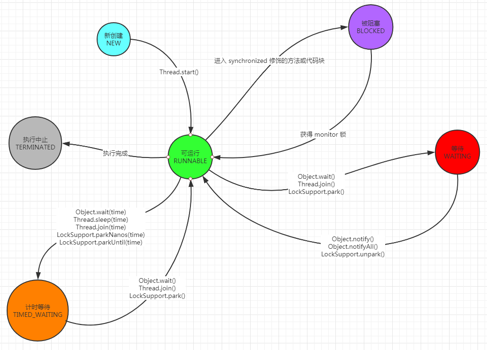

# 线程的一生

## 状态图



## 6个状态（生命周期）

* New
  * 线程对象还没有执行 start() 方法（当然也没有执行 run() 方法中的代码）时的状态，就是 New
* Runnable
  * Runnable 状态比较特殊，一旦从 new 调用了 start() 方法后，线程的状态就由 New 变成了 Runnable。但即使调用了 start() 方法，线程也不一定启动，因为现在有可能系统没有足够的资源分配给它，它还是处于等待状态，所以即使线程状态是 Runnable，此线程也不一定是正在运行的线程，也有可能是等待状态。这里说的等待状态并不是 Waiting，而还是 Runnable。记住，一旦调用了 start() 方法，线程便会进入 Runnable 状态，状态只会从 New 到 Runnable，而不会从 New 到 Waiting。一旦拿到了系统资源，线程开始运行，其状态还是 Runnable，和之前等待运行时状态是一样的。Java 中的 Runnable 状态对应操作系统的两种状态，分别是 ready 和 running。还有一种情况，线程已经拿到 cup 资源了，线程已经开始运行了，已经是 Runnable 状态了，由于 cup 资源是被调度器不停调度的，有的时候会被突然拿走，如果线程正在运行时，它的 cup 资源又被拿走了，那么这个线程的状态依旧是 Runnable，它虽然现在不在运行了，但依旧是可运行的状态，所以状态依旧是 Runnable。
* Blocked
  * 当一个线程进入被 synchronized 修饰的代码块时，并且该锁已经被其他线程拿走了，当前线程拿不到锁，此时状态就是 Blocked。此状态仅仅针对 synchronized 关键字，只有 synchronized 才能使线程进入 Blocked 状态。也就是被 synchronized 保护的代码（代码块，方法），并且没有拿到锁，进入等待状态，此时的状态就是 Blocked。Blocked 的等待是在等待一个排它锁，Waiting 和 Timed Waiting 是在等待被唤醒和等待一定的时间。
* Waiting
* Timed Waiting
* Terminated

## 代码示例

下面通过代码演示这六种状态，首先演示 NEW、RUNNABLE、TERMINATED 这三种状态，代码如下：

```java
package threadcoreknowledge.sixstates;

/**
 * 展示了线程的三种状态，分别是：
 * 1、New
 * 2、Runnable
 * 3、Terminated
 * @author mfh
 * @date 2020/4/19 20:27
 */
public class NewRunnableTerminated implements Runnable {
    public static void main(String[] args) {
        Thread t = new Thread(new NewRunnableTerminated());
        // 线程状态：NEW
        System.out.println(t.getState());
        t.start();
        // 线程状态：RUNNABLE
        System.out.println(t.getState());
        try {
            Thread.sleep(10);
        } catch (InterruptedException e) {
            e.printStackTrace();
        }
        // 此时线程 t 一定是在运行中的，因为主线程休眠了 10 毫秒，t 线程有机会运行
        // 线程状态：RUNNABLE，而不是 RUNNING
        System.out.println(t.getState());
        // 此处休眠为了让 t 线程一定执行完毕
        try {
            Thread.sleep(1000);
        } catch (InterruptedException e) {
            e.printStackTrace();
        }
        // 线程状态：TERMINATED
        System.out.println(t.getState());
    }
    @Override
    public void run() {
        for (int i = 0; i < 1000; i++) {
            System.out.println(i);
        }
    }
}
```

结果：

```java
NEW
RUNNABLE
0
1
2
3
...
507
508
509
510
RUNNABLE
511
512
513
...
996
997
998
999
TERMINATED
```

以下代码演示了 BLOCKED、WAITING、TIMED_WAITING 三种状态

```java
package threadcoreknowledge.sixstates;

/**
 * 演示 BLOCKED，WAITING，TIMED_WAITING 状态
 * @author mfh
 * @date 2020/4/19 20:46
 */
public class BlockedWaitingTimedWaiting implements Runnable {
    public static void main(String[] args) throws InterruptedException {
        BlockedWaitingTimedWaiting bwtw = new BlockedWaitingTimedWaiting();
        Thread t1 = new Thread(bwtw);
        Thread t2 = new Thread(bwtw);
        t1.start();
        t2.start();
        // 线程状态：TIMED_WAITING，因为正在执行 Thread.sleep(1000);
        System.out.println("t1 状态：" + t1.getState());
        // 线程状态：BLOCKED，因为 t2 想拿到 sync() 锁却拿不到
        System.out.println("t2 状态：" + t2.getState());
        // 保证已调用 wait() 方法
        Thread.sleep(1300);
        // 线程状态：WAITING，因为执行了 wait() 方法
        System.out.println("t1 状态：" + t1.getState());
    }
    @Override
    public void run() {
        this.sync();
    }

    private synchronized void sync() {
        try {
            Thread.sleep(1000);
            wait();
        } catch (InterruptedException e) {
            e.printStackTrace();
        }
    }
}
```

结果：

```java
t1 状态：TIMED_WAITING
t2 状态：BLOCKED
t1 状态：WAITING
```

## 状态转换过程中的注意点

1. 有些状态是不可逆的，比如只能从 NEW 到 RUNNABLE，而不能从 RUNNABLE 回到 NEW；只能从 RUNNABLE 到 TERMINATED，而不能从 TERMINATED 到 RUNNABLE。
2. 状态是不可跳跃的，比如从 NEW 到 BLOCKED，肯定要经过 RUNNABLE，而不可能从 NEW 直接到 BLOCKED

以上两个注意点通过图都可以看出来。

## 阻塞状态

* 一般习惯而言，把 Blocked(被阻塞)、Waiting(等待)、Timed_waiting(计时等待)都统称为阻塞
* 不仅仅是 Blocked

