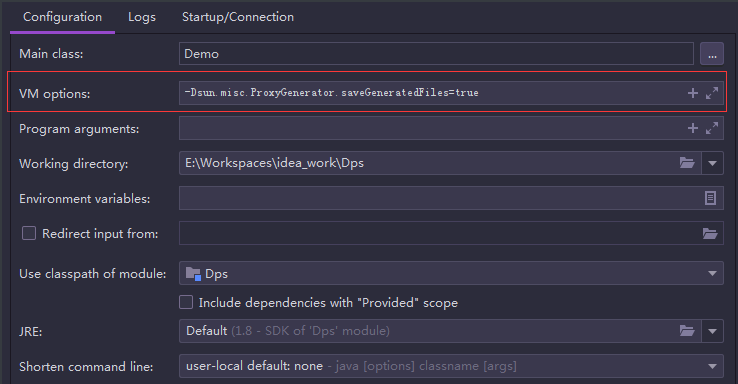
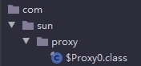

# 代理模式

本文使用的 `jdk` 版本为：1.8.0_144

## 静态代理

```java
package org.ml;

/**
 * @author mfh
 * @date 2020/2/25 16:55
 */
public interface Chargable {
    void charge();
}
```

```java
package org.ml;

import java.util.Random;

/**
 * 闪电快充
 * @author mfh
 * @date 2020/2/25 16:56
 */
public class LightningCharger implements Chargable {
    @Override
    public void charge() {
        System.out.println("闪电快充开始充电...");
        try {
            Thread.sleep(new Random().nextInt(10000));
        } catch (InterruptedException e) {
            e.printStackTrace();
        }
    }
}
```

需求：现要记录充电的时间

### 修改源码

```java
package org.ml;

/**
 * @author mfh
 * @date 2020/2/25 17:03
 */
public class Client {
    public static void main(String[] args) {
        Chargable lightning = new LightningCharger();
        long begin = System.currentTimeMillis();
        lightning.charge();
        System.out.println("共充电：" + (System.currentTimeMillis() - begin) + "毫秒");
    }
}
```

以上的实现前提是能得到源码的情况下。

如果得不到源码应该如何实现呢？最不幸的方法可以使用继承。

### 继承

```java
package org.ml;

/**
 * @author mfh
 * @date 2020/2/25 17:11
 */
public class LightningChargerSub extends LightningCharger {
    @Override
    public void charge() {
        long begin = System.currentTimeMillis();
        super.charge();
        System.out.println("共充电：" + (System.currentTimeMillis() - begin) + "毫秒");
    }
}
```

```java
package org.ml;

/**
 * @author mfh
 * @date 2020/2/25 17:03
 */
public class Client {
    public static void main(String[] args) {
        Chargable lightning = new LightningChargerSub();
        lightning.charge();
    }
}
```

关于继承的缺点自行度娘吧，这里不再说了，比较好的方式应该使用组合。

### 组合具体类

```java
package org.ml;

/**
 * @author mfh
 * @date 2020/2/25 17:15
 */
public class LightningChargerTimeProxy {
    private LightningCharger charger;

    public LightningChargerTimeProxy(LightningCharger charger) {
        this.charger = charger;
    }

    public void recordTime() {
        long begin = System.currentTimeMillis();
        this.charger.charge();
        System.out.println("共充电：" + (System.currentTimeMillis() - begin) + "毫秒");
    }
}
```

```java
package org.ml;

/**
 * @author mfh
 * @date 2020/2/25 17:03
 */
public class Client {
    public static void main(String[] args) {
        LightningChargerTimeProxy proxy = new LightningChargerTimeProxy(new LightningCharger());
        proxy.recordTime();
    }
}
```

以上的组合方式，LightningChargerTimeProxy 只能代理 LightningCharger，如果将 LightningCharger 改为接口 Chargable，那么将会有更好的灵活性，即只要实现了 Chargable 接口的类就能被代理。

### 组合接口

```java
package org.ml;

/**
 * @author mfh
 * @date 2020/2/25 17:15
 */
public class LightningChargerTimeProxy {
    private Chargable charger;

    public LightningChargerTimeProxy(Chargable charger) {
        this.charger = charger;
    }

    public void recordTime() {
        long begin = System.currentTimeMillis();
        this.charger.charge();
        System.out.println("共充电：" + (System.currentTimeMillis() - begin) + "毫秒");
    }
}
```

现不仅要记录充电的时间，还要记录充电前的电量和充电后的电量。

为了实现新的需求，很容易想到的一个方式是，新增一个代理类，然后在组合一个 Chargable 接口，记录电量。

```java
package org.ml;

/**
 * @author mfh
 * @date 2020/2/25 17:54
 */
public class BatteryRecordProxy {
    private Chargable chargable;

    public BatteryRecordProxy(Chargable chargable) {
        this.chargable = chargable;
    }

    public void recordBattery() {
        System.out.println("充电前的电量");
        chargable.charge();
        System.out.println("充电后的电量");
    }
}
```

```java
package org.ml;

/**
 * @author mfh
 * @date 2020/2/25 17:03
 */
public class Client {
    public static void main(String[] args) {
        LightningCharger lightningCharger = new LightningCharger();
        LightningChargerTimeProxy lightningChargerTimeProxy = new LightningChargerTimeProxy(lightningCharger);
        BatteryRecordProxy batteryRecordProxy = new BatteryRecordProxy(lightningCharger);
        lightningChargerTimeProxy.recordTime();
        batteryRecordProxy.recordBattery();
    }
}
```

```java
闪电快充开始充电...
共充电：2568毫秒
充电前的电量
闪电快充开始充电...
充电后的电量
```

通过这种方式，可实现充电前后的电量，但是与记录充电时间的操作就不在同一次操作，实际的需求是记录充电时间，并记录电量，是在同一次充电操作完成的。

### 代理与被代理类实现相同接口

代理与被代理的类实现同一接口，这样代理类与被代理类就可以相互嵌套，实现代理传递，类似于装饰模式。

```java
package org.ml;

/**
 * @author mfh
 * @date 2020/2/25 17:15
 */
public class LightningChargerTimeProxy implements Chargable {
    private Chargable charger;

    public LightningChargerTimeProxy(Chargable charger) {
        this.charger = charger;
    }

    @Override
    public void charge() {
        long begin = System.currentTimeMillis();
        this.charger.charge();
        System.out.println("共充电：" + (System.currentTimeMillis() - begin) + "毫秒");
    }
}
```

```java
package org.ml;

/**
 * @author mfh
 * @date 2020/2/25 17:54
 */
public class BatteryRecordProxy implements Chargable {
    private Chargable chargable;

    public BatteryRecordProxy(Chargable chargable) {
        this.chargable = chargable;
    }

    @Override
    public void charge() {
        System.out.println("充电前的电量");
        chargable.charge();
        System.out.println("充电后的电量");
    }
}
```

```java
package org.ml;

/**
 * @author mfh
 * @date 2020/2/25 17:03
 */
public class Client {
    public static void main(String[] args) {
        LightningChargerTimeProxy proxy = new LightningChargerTimeProxy(
                                            new BatteryRecordProxy(
                                                new LightningCharger()
                                            )
                                        );
        proxy.charge();
    }
}
```

```java
充电前的电量
闪电快充开始充电...
充电后的电量
共充电：2440毫秒
```

静态代理的代理类都是通过硬编码的方式提前写好的，而动态代理则是在运行期间，动态生成的代理类。

## 动态代理

### jdk

```java
package org.ml;

/**
 * @author mfh
 * @date 2020/2/25 16:55
 */
public interface Chargable {
    void charge();
}
```

```java
package org.ml;

import java.util.Random;

/**
 * 闪电快充
 * @author mfh
 * @date 2020/2/25 16:56
 */
public class LightningCharger implements Chargable {
    @Override
    public void charge() {
        System.out.println("闪电快充开始充电...");
        try {
            Thread.sleep(new Random().nextInt(10000));
        } catch (InterruptedException e) {
            e.printStackTrace();
        }
    }
}
```

```java
package org.ml;

import java.lang.reflect.InvocationHandler;
import java.lang.reflect.Method;

/**
 * @author mfh
 * @date 2020/2/25 18:28
 */
public class ChargerInvocationHandler implements InvocationHandler {
    private Chargable chargable;

    public ChargerInvocationHandler(Chargable chargable) {
        this.chargable = chargable;
    }

    @Override
    public Object invoke(Object proxy, Method method, Object[] args) throws Throwable {
        long begin = System.currentTimeMillis();
        method.invoke(chargable, args);
        System.out.println("共充电：" + (System.currentTimeMillis() - begin) + "毫秒");
        return null;
    }
}
```

```java
package org.ml;

import java.lang.reflect.InvocationHandler;
import java.lang.reflect.Proxy;

/**
 * @author mfh
 * @date 2020/2/25 17:03
 */
public class Client {
    public static void main(String[] args) {
        Chargable charger = new LightningCharger();
        InvocationHandler ih = new ChargerInvocationHandler(charger);
        Chargable proxy = (Chargable)Proxy.newProxyInstance(charger.getClass().getClassLoader(),
                                                            charger.getClass().getInterfaces(),
                                                            ih);
        proxy.charge();
    }
}
```

```java
闪电快充开始充电...
共充电：567毫秒
```

#### newProxyInstance

```java
java.lang.reflect.Proxy#newProxyInstance(ClassLoader loader,Class<?>[] interfaces,InvocationHandler hi)throws IllegalArgumentException
```

##### 参数

ClassLoader loader：一般情况使用与被代理的类相同的类加载器即可

Class<?>[] interfaces：被代理的类实现的接口们，这里是一个 Class 类型的数组

InvocationHandler hi：顾名思义，执行处理器。它处理在执行动态代理时，即调用被代理的类的方法时需要做的事情，也就是在调用被代理对象的方法前后干点什么事情。

当执行 `proxy.charge();`代码后， `org.ml.ChargerInvocationHandler#invoke`方法就被调用了，感觉有点神奇，我们并没有调用`org.ml.ChargerInvocationHandler#invoke`方法，那么究竟是谁调用了`org.ml.ChargerInvocationHandler#invoke`方法呢？其实不难猜出，肯定是`proxy.charge();`方法内部调用了 `org.ml.ChargerInvocationHandler#invoke`，所以玄机就在`proxy`这个代理对象。它就是运行时动态生成的代理类，存在于内存中。如果我们可以看到此代理类的源码，很多问题就可以得到解答，下面我们就让此代理类现行。

#### 让代理类现形的三种方式

##### 方式一

采用文件写入的方式，具体代码如下：

```java
package org.ml;

import sun.misc.ProxyGenerator;

import java.io.FileOutputStream;
import java.io.IOException;

/**
 * @author mfh
 * @date 2020/2/25 17:03
 */
public class Client {
    public static void main(String[] args) {
        String path = "E:/$Proxy0.class";
        byte[] classFile = ProxyGenerator.generateProxyClass("$Proxy0", new Class[]{Chargable.class});
        try(FileOutputStream out = new FileOutputStream(path)) {
            out.write(classFile);
            out.flush();
        } catch (IOException e) {
            e.printStackTrace();
        }
    }
}
```

##### 方式二

对于 1.8.0_144 版本的 `jdk`，需要加入虚拟机参数，`-Dsun.misc.ProxyGenerator.saveGeneratedFiles=true`

如下图所示：



##### 方式三

如果是较新的版本（具体到哪一版没有考证过），则不需要添加虚拟机参数，直接在 main 方法开始出加入

`System.getProperties().put("jdk.misc.ProxyGenerator.saveGeneratedFiles", true);`代码即可，程序运行后，就会看见生成的代理类：`com/sun/proxy/$Proxy0.class`，如下图所示：



#### 代理类源码

```java
package com.sun.proxy;

import java.lang.reflect.InvocationHandler;
import java.lang.reflect.Method;
import java.lang.reflect.Proxy;
import java.lang.reflect.UndeclaredThrowableException;
import org.ml.Chargable;

public final class $Proxy0 extends Proxy implements Chargable {
    private static Method m1;
    private static Method m2;
    private static Method m3;
    private static Method m0;

    public $Proxy0(InvocationHandler var1) throws  {
        super(var1);
    }

    public final boolean equals(Object var1) throws  {
        try {
            return (Boolean)super.h.invoke(this, m1, new Object[]{var1});
        } catch (RuntimeException | Error var3) {
            throw var3;
        } catch (Throwable var4) {
            throw new UndeclaredThrowableException(var4);
        }
    }

    public final String toString() throws  {
        try {
            return (String)super.h.invoke(this, m2, (Object[])null);
        } catch (RuntimeException | Error var2) {
            throw var2;
        } catch (Throwable var3) {
            throw new UndeclaredThrowableException(var3);
        }
    }

    public final void charge() throws  {
        try {
            super.h.invoke(this, m3, (Object[])null);
        } catch (RuntimeException | Error var2) {
            throw var2;
        } catch (Throwable var3) {
            throw new UndeclaredThrowableException(var3);
        }
    }

    public final int hashCode() throws  {
        try {
            return (Integer)super.h.invoke(this, m0, (Object[])null);
        } catch (RuntimeException | Error var2) {
            throw var2;
        } catch (Throwable var3) {
            throw new UndeclaredThrowableException(var3);
        }
    }

    static {
        try {
            m1 = Class.forName("java.lang.Object").getMethod("equals", Class.forName("java.lang.Object"));
            m2 = Class.forName("java.lang.Object").getMethod("toString");
            m3 = Class.forName("org.ml.Chargable").getMethod("charge");
            m0 = Class.forName("java.lang.Object").getMethod("hashCode");
        } catch (NoSuchMethodException var2) {
            throw new NoSuchMethodError(var2.getMessage());
        } catch (ClassNotFoundException var3) {
            throw new NoClassDefFoundError(var3.getMessage());
        }
    }
}
```

#### 分析代理类

##### 实现接口的用处

通过源码得知，代理类继承自 Proxy，实现了 Chargable 接口。它为什么知道要实现 Chargable 接口？就是因为调用

```java
java.lang.reflect.Proxy#newProxyInstance(ClassLoader loader,Class<?>[] interfaces,InvocationHandler hi)throws IllegalArgumentException
```

方法时，传入了接口，根据接口，就得知需要实现哪些方法，所以它生成了 charge 方法。当执行`proxy.charge()`代码后，实际上调用的就是`com.sun.proxy.$Proxy0#charge`，charge() 方法源码如下：

```java
 public final void charge() throws  {
        try {
            super.h.invoke(this, m3, (Object[])null);
        } catch (RuntimeException | Error var2) {
            throw var2;
        } catch (Throwable var3) {
            throw new UndeclaredThrowableException(var3);
        }
    }
```

##### Proxy 类

super 即 Proxy 类，我们看下 Proxy 类部分源码：

```java
public class Proxy implements java.io.Serializable {
    private static final long serialVersionUID = -2222568056686623797L;
    protected InvocationHandler h;
    private Proxy() {
    }
    protected Proxy(InvocationHandler h) {
        Objects.requireNonNull(h);
        this.h = h;
    }
    ....
}
```

###### 成员变量 InvocationHandler h 的赋值

成员变量 h，就是调用 

```java
java.lang.reflect.Proxy#newProxyInstance(ClassLoader loader,Class<?>[] interfaces,InvocationHandler hi)throws IllegalArgumentException
```

时，给 InvocationHandler hi 参数传递的 ChargerInvocationHandler 对象。所以执行`super.h.invoke(this, m3, (Object[])null);`就是调用我们定义的 ChargerInvocationHandler 类的`Object invoke(Object proxy, Method method, Object[] args)`方法。

##### ChargerInvocationHandler 的 invoke 方法的参数们

参数一：this，所以`org.ml.ChargerInvocationHandler#invoke`方法的`Object proxy`参数，实际上就是生成的代理类的对象。虽然我们一般不会用到它，但既然传了就有可能会有应用的场景。

参数二：m3，通过生成的代理类的静态代码块中的代码`m3 = Class.forName("org.ml.Chargable").getMethod("charge");`得知，m3 其实就是 Chargable 类的 charge 方法。那么当执行`method.invoke(chargable, args);`时，由于 chargable 是 Chargable 接口，根据多态原理， 在运行时，实际调用的就是实现了 Chargable 接口的类的 charge 方法，很具有灵活性。chargable 当然也可以是被包装了很多层的 Chargable  类型的对象，即与装饰模式搭配使用。

参数三：调用 charge 方法时需要的参数，由于 charge 没有参数，所以这里传 null。

介绍完代理类的调用过程，下面简单说说 jdk 是如何生成代理类的。

#### 代理类的生成

```java
@CallerSensitive
    public static Object newProxyInstance(ClassLoader loader,
                                          Class<?>[] interfaces,
                                          InvocationHandler h)
        throws IllegalArgumentException
    {
        Objects.requireNonNull(h);

        final Class<?>[] intfs = interfaces.clone();
        final SecurityManager sm = System.getSecurityManager();
        if (sm != null) {
            checkProxyAccess(Reflection.getCallerClass(), loader, intfs);
        }

        /*
         * Look up or generate the designated proxy class.
         */
        Class<?> cl = getProxyClass0(loader, intfs);
        ...
    } 
```

```java
private static Class<?> getProxyClass0(ClassLoader loader,
                                           Class<?>... interfaces) {
        if (interfaces.length > 65535) {
            throw new IllegalArgumentException("interface limit exceeded");
        }

        // If the proxy class defined by the given loader implementing
        // the given interfaces exists, this will simply return the cached copy;
        // otherwise, it will create the proxy class via the ProxyClassFactory
        return proxyClassCache.get(loader, interfaces);
    }
```

由上面注释得知，如果存在由实现了给定接口的给定加载器定义的代理类，则将仅返回缓存的副本；否则，它将通过ProxyClassFactory 创建代理类。

proxyClassCache 定义如下：

```java
private static final WeakCache<ClassLoader, Class<?>[], Class<?>>
    proxyClassCache = new WeakCache<>(new KeyFactory(), new ProxyClassFactory());
```

它是 WeakCache 类型的对象，在构造时使用了 ProxyClassFactory。

第一次从缓存中获取肯定获取不到，所以要通过 ProxyClassFactory 创建代理类，所以会调用`java.lang.reflect.Proxy.ProxyClassFactory#apply`方法。

```java
public Class<?> apply(ClassLoader loader, Class<?>[] interfaces) {
    ...
       /*
        * Generate the specified proxy class.
        */
    	byte[] proxyClassFile = ProxyGenerator.generateProxyClass(
        proxyName, interfaces, accessFlags);
    ...
}
```

```java
public static byte[] generateProxyClass(final String var0, Class<?>[] var1, int var2) {
        ProxyGenerator var3 = new ProxyGenerator(var0, var1, var2);
    	// 真正生成代理类的方法，具体就不在跟进了，底层使用的是 Asm 技术
        final byte[] var4 = var3.generateClassFile();
    	// saveGeneratedFiles 为是否生成代理类的标记，就是之前设置的那个
        if (saveGeneratedFiles) {
            AccessController.doPrivileged(new PrivilegedAction<Void>() {
                public Void run() {
                    try {
                        int var1 = var0.lastIndexOf(46);
                        Path var2;
                        if (var1 > 0) {
                            Path var3 = Paths.get(var0.substring(0, var1).replace('.', File.separatorChar));
                            Files.createDirectories(var3);
                            var2 = var3.resolve(var0.substring(var1 + 1, var0.length()) + ".class");
                        } else {
                            var2 = Paths.get(var0 + ".class");
                        }
                        Files.write(var2, var4, new OpenOption[0]);
                        return null;
                    } catch (IOException var4x) {
                        throw new InternalError("I/O exception saving generated file: " + var4x);
                    }
                }
            });
        }
        return var4;
    }
```

### cglib

```java
package com.mfh.cglib;

/**
 * @author mfh
 * @date 2020/2/26 11:29
 */
public class TypecCharger {
    public void charge() {
        System.out.println("TypeC 充电...");
    }
}
```

```java
package org.cglib;

import net.sf.cglib.proxy.MethodInterceptor;
import net.sf.cglib.proxy.MethodProxy;

import java.lang.reflect.Method;

/**
 * @author mfh
 * @date 2020/2/26 11:30
 */
public class TimeRecordInterceptor implements MethodInterceptor {
    @Override
    public Object intercept(Object o, Method method, Object[] objects, MethodProxy methodProxy) throws Throwable {
        long begin = System.currentTimeMillis();
        Object result = methodProxy.invoke(o, objects);
        System.out.println("共充电：" + (System.currentTimeMillis() - begin) + "毫秒");
        return result;
    }
}
```

```java
package org.cglib;

/**
 * @author mfh
 * @date 2020/2/26 11:29
 */
public class TypecCharger {
    public void charge() {
        System.out.println("TypeC 充电...");
    }
}
```

```java
package org.cglib;

import net.sf.cglib.proxy.Enhancer;

/**
 * @author mfh
 * @date 2020/2/26 11:33
 */
public class Client {
    public static void main(String[] args) {
        Enhancer enhancer = new Enhancer();
        enhancer.setSuperclass(TypecCharger.class);
        enhancer.setCallback(new TimeRecordInterceptor());
        TypecCharger typecCharger = (TypecCharger)enhancer.create();
        typecCharger.charge();
    }
}
```

jdk 实现的动态代理要实现接口，cglib 却不需要实现接口。由代码 `enhancer.setSuperclass(TypecCharger.class);` 得知，生成的代理类是被代理类的子类。

### 应用场景

#### 接口式调用

只提供接口，不需要实现类，也可以生成动态代理，即直接代理接口。比如只代理 Chargable 接口。

```java
package org.ml;

/**
 * @author mfh
 * @date 2020/2/25 16:55
 */
public interface Chargable {
    void charge();
}
```

```java
package org.ml;

import java.lang.reflect.InvocationHandler;
import java.lang.reflect.Method;

/**
 * @author mfh
 * @date 2020/2/25 18:28
 */
public class ChargerInvocationHandler implements InvocationHandler {
    @Override
    public Object invoke(Object proxy, Method method, Object[] args) throws Throwable {
        System.out.println("做点什么呢？");
        return null;
    }
}
```

```java
package org.ml;

import java.lang.reflect.InvocationHandler;
import java.lang.reflect.Proxy;

/**
 * @author mfh
 * @date 2020/2/25 17:03
 */
public class Client {
    public static void main(String[] args) {
        InvocationHandler ih = new ChargerInvocationHandler();
        Chargable proxyInstance = (Chargable)Proxy.newProxyInstance(Thread.currentThread().getContextClassLoader(), new Class[]{Chargable.class}, ih);
        proxyInstance.charge();
    }
}
```

类似于 Mybatis 的实现，只有接口，没有实现类，但是可以执行持久化方法。

#### 结合工厂使用

```java
package org.factory;

/**
 * 收钱
 * @author mfh
 * @date 2020/2/25 22:19
 */
public interface Waiter {
    String collectMoney();
}
```

```java
package org.factory;

/**
 * 前置通知
 * @author mfh
 * @date 2020/2/25 22:22
 */
public interface BeforeAdvice {
    void before();
}
```

```java
package org.factory;

/**
 * 后置通知
 * @author mfh
 * @date 2020/2/25 22:22
 */
public interface AfterAdvice {
    void after();
}
```

```java
package org.factory;

import java.util.Random;

/**
 * @author mfh
 * @date 2020/2/25 22:20
 */
public class FemaleWaiter implements Waiter {
    @Override
    public String collectMoney() {
        int money = new Random().nextInt(10000);
        System.out.printf("共收费%d元\n", money);
        return money > 1000 ? "^_^" : ">_<";
    }
}
```

```java
package org.factory;

import java.lang.reflect.Proxy;

/**
 * @author mfh
 * @date 2020/2/25 22:23
 */
public class ProxyFactory<T> {
    T target;
    private BeforeAdvice beforeAdvice;
    private AfterAdvice afterAdvice;

    public ProxyFactory(T target, BeforeAdvice beforeAdvice, AfterAdvice afterAdvice) {
        this.target = target;
        this.beforeAdvice = beforeAdvice;
        this.afterAdvice = afterAdvice;
    }

    public T createProxy() {
        ClassLoader loader = target.getClass().getClassLoader();
        Class<?>[] interfaces = target.getClass().getInterfaces();
        return (T)Proxy.newProxyInstance(loader, interfaces, (proxy, method, args) -> {
            if (null != beforeAdvice) {
                beforeAdvice.before();
            }
            Object result = method.invoke(target, args);
            if (null != afterAdvice) {
                afterAdvice.after();
            }
            return result;
        });
    }

    public T getTarget() {
        return target;
    }

    public void setTarget(T target) {
        this.target = target;
    }

    public BeforeAdvice getBeforeAdvice() {
        return beforeAdvice;
    }

    public void setBeforeAdvice(BeforeAdvice beforeAdvice) {
        this.beforeAdvice = beforeAdvice;
    }

    public AfterAdvice getAfterAdvice() {
        return afterAdvice;
    }

    public void setAfterAdvice(AfterAdvice afterAdvice) {
        this.afterAdvice = afterAdvice;
    }
}
```

```java
package org.factory;

/**
 * @author mfh
 * @date 2020/2/25 22:30
 */
public class Client {
    public static void main(String[] args) {
        Waiter waiter = new FemaleWaiter();
        ProxyFactory<Waiter> pf = new ProxyFactory(waiter,
                                            () -> System.out.println("您好，要结账吗？"),
                                            () -> System.out.println("欢迎下次光临！"));
        Waiter proxy = pf.createProxy();
        String face = proxy.collectMoney();
        System.out.println(face);
    }
}
```


#### 限制方法调用

老板开了一家公司做生意，雇佣了一秘书作为代理人，帮老板决定一些事情。比如有客户想一起赚钱，秘书当然会同意；如果有客户想解散公司，秘书当然不会放行，如果是老板要解散公司，自然是可以的。

```java
package org.limited;

/**
 * @author mfh
 * @date 2020/2/26 10:45
 */
public interface DoBusiness {
    /**
     * 挣钱
     * @return
     */
    int makeMoney();

    /**
     * 解散公司
     */
    void disbanded();
}
```

```java
package org.limited;

import java.util.Random;

/**
 * @author mfh
 * @date 2020/2/26 10:43
 */
public class Boss implements DoBusiness {
    @Override
    public int makeMoney() {
        return new Random().nextInt(100_00_00);
    }

    @Override
    public void disbanded() {
        System.out.println("老板解散了公司...");
    }
}
```

```java
package org.limited;

import java.lang.reflect.InvocationHandler;
import java.lang.reflect.Method;

/**
 * @author mfh
 * @date 2020/2/26 10:54
 */
public class Secretary implements InvocationHandler {
    private DoBusiness business;

    public Secretary(DoBusiness business) {
        this.business = business;
    }

    @Override
    public Object invoke(Object proxy, Method method, Object[] args) throws Throwable {
        if ("makeMoney".equals(method.getName())) {
            return method.invoke(business, args);
        } else if ("disbanded".equals(method.getName()) && !business.getClass().getSimpleName().equals("Boss")) {
            throw new IllegalAccessException("对不起，您越界了！");
        } else {
            method.invoke(business, args);
        }
        return null;
    }
}
```

```java
package org.limited;

import java.util.Random;

/**
 * @author mfh
 * @date 2020/2/26 11:00
 */
public class Partner implements DoBusiness {
    @Override
    public int makeMoney() {
        return new Random().nextInt(1000);
    }

    @Override
    public void disbanded() {
        System.out.println("我要解散公司！！");
    }
}
```

```java
package org.limited;

import java.lang.reflect.Proxy;

/**
 * @author mfh
 * @date 2020/2/26 10:57
 */
public class Client {
    public static void main(String[] args) {
        DoBusiness partner = new Partner();
        DoBusiness db = (DoBusiness) Proxy.newProxyInstance(Thread.currentThread().getContextClassLoader(), new Class[]{DoBusiness.class}, new Secretary(partner));
        int money = db.makeMoney();
        System.out.printf("赚了%d元\n", money);
        db.disbanded();
    }
}
```

```java
赚了840元
Exception in thread "main" java.lang.reflect.UndeclaredThrowableException
	at com.sun.proxy.$Proxy0.disbanded(Unknown Source)
	at org.limited.Client.main(Client.java:14)
Caused by: java.lang.IllegalAccessException: 对不起，您越界了！
	at org.limited.Secretary.invoke(Secretary.java:22)
	... 2 more
```

将`DoBusiness partner = new Partner();`改为`DoBusiness partner = new Boss();`

```java
赚了579038元
老板解散了公司...
```

> https://www.cnblogs.com/youzhibing/p/10464274.html#autoid-4-1-0
>
> https://blog.csdn.net/lizhiyuan_eagle/article/details/88707253
>
> https://www.cnblogs.com/zuidongfeng/p/8735241.html