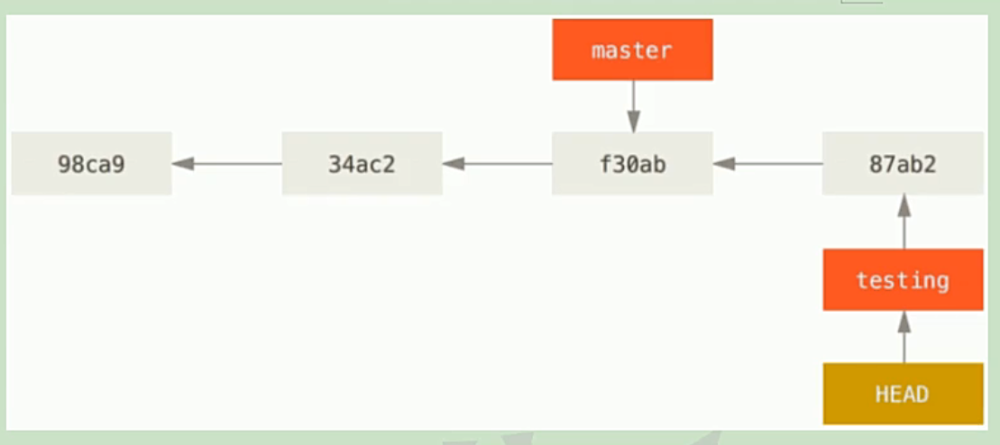

# 常用命令

## git diff


* 比较对象：工作区与暂存区文件进行比较

* 颜色
  * 白色：新旧文件共有的内容
  * +绿色：新增的内容
  * -红色：删除的内容

* 解释 `@@  -1,5  +1,14  @@`

  * -1,5：减号（-）指旧文件，`-1,5`指的是旧文件（暂存区）从第1行开始，共5行，它们分别为下面的五行：

  1. public class HelloGit {
  2. public static void main(String args[]) {
  3. System.out.println("Hello Git");
  4. }
  5. }

  注意：虽然第3行被删除了，但它也属于旧文件的内容。

  * +1,14：加号（+）指新文件，`-1,14`指的是新文件（工作区）从第1行开始，共14行，分别为：

  1. public class HelloGit {
  2. int num = 0;
  3. String word = "<C4><E3><BA><C3> Git~";
  4. public static void main(String args[]) {
  5. HelloGit hg = new HelloGit();
  6. System.out.println("Hey GitHub");
  7. }
  8. 
  9. private void print(String value) {
  10. String str = value;
  11. if(null != value) {
  12. }
  13. }
  14. }

  注意：不包括被删除的行；第8行为空行，也应计算在内。

## git diff	快照ID1	快照ID2

比较两个历史快照。

## git diff 快照ID

比较工作区和Git本地仓库中的快照

## git diff HEAD

比较工作区和Git本地仓库中最新的快照

## git diff --cached [快照ID]

比较暂存区和Git本地仓库快照。快照ID是可选的，如果不带快照ID，比较与最新的本地仓库比较；带上快照ID，就是与指导快照ID的本地仓库做比较

## git commit --amend

已经把修改的内容提交到本地仓库了，但是突然发现有两个文件还没有提交，需要把这两个文件提交了，但不希望增加快照ID，可使用下面的操作：

1. 将文件添加到暂存区
2. 使用 `git commit -amend -m "new add another two files"`将文件提交到本地仓库

提交完成后，不会新增快照ID。

## git  rm file

删除工作区文件与暂存区文件，也就是取消跟踪，在下次提交时不纳入版本管理。但本地仓库快照中的文件是不会被连带删除的，所以，此时执行 `git status`会看到删除记录，如图所示：


，如果不想让看到删除的记录 ，需要将快照切掉，可以使用`git reset --soft [上一次的快照ID]`，先使用`git log`查看快照ID，如图所示：


`git reset --soft 006f4b55`，执行完以后使用`git log`、`git status`查看，如下图所示：


删除的记录已经没有了。但是使用`git reflog`还是会看到，如图所示：


如果想保存工作区文件，删除暂存区文件，命令：`git rm --cached filename`

另一种情况，如果工作区与暂存区的文件，有着相同的文件名，但是文件内容不容，此时使用`git rm filename`是不会删除文件的，git 会给出提示，因为 git 也不知道要删除哪一个文件。，如图所示：


使用`-f`参数可强制删除，`git rm -f filename`，入下图所示：


## git mv oldFileName newFileName

重命名文件。如果直接修改文件名，而不是通过命令修改，会较为麻烦，这样会使 git 认为之前的旧文件被删除了，而且还需要手工完成暂存区的更新。

其实`git mv oldFileName newFileName`就是以下两个命令的组合：

1. git rm 旧文件
2. git add 新文件

重命名成功后，使用`git status`可以看到`renamed`记录，如图所示：


最后使用`git commit -m "message"`提交到本地库

## git branch branchName

创建分支，`git branck featrue`，创建完后使用`git log`或者`git log --decorate`查看。

## git checkout branchName

切换分支，`git checkout featrue`，切换到 featrue 分支

## git log --decorate --oneline --graph --all

`--graph`：图形化显示

`--all`：显示所有分支

## git merge branchName

现在想把  feature 分支合并到 master，必须要先切换到 master 分支。

`git checkout master`

`git merge feature`


从提示中得知，本地的合并操作失败了，合并 c_new.txt 文件时，出现了冲突，需要自己解决冲突然后提交。

注意红框处，变成了（master|MERGING）。

输入：`git status`


此时打开 c_new.txt

```txt
<<<<<<< HEAD
qweasd123@!
=======
123
>>>>>>> featrue
```

以等号（=）分界。

下面是 HEAD  指向的 master 分支中 c_new.txt 的内容

```txt
<<<<<<< HEAD
qweasd123@!
=======
```

下面是 feature 分支中 c_new.txt 的内容

```txt
=======
123
>>>>>>> featrue
```

手动处理后的结果如下：

```txt
qweasd123@!
123
```

处理完后，执行：`git add c_new.txt`，`git commit -m 'fix conflicts'`，使用

`git log --oneline --decorate --all --graph`查看状态。


可以看到分支已经合并成功了。如果在合并过程中，两个快照没有冲突，则会直接合并，就不需要手动处理了。

## git checkout -b branchName

创建并切换到该分支。

## git branch -d branckName

删除分支

## 匿名分支

`git checkout 快照ID`，此时会切换到一个匿名分支。匿名分支通常用作测试，做尝试。

切换到别的分支，在此匿名分支下创建的文件都不会被保留，当然也可以将此分支下创建的文件保留，即，将此分支创建一个名称就可以了。

## checkout 与 reset 命令讨论

两种功能：

* 从历史快照（或者暂存区）中拷贝文件到工作目录


* 切换分支
* 


## Git 的文件管理机制


每个文件提交以后都会产生一个哈希值（黄色方块）；所有目录中的文件的哈希值构成一个树对象（蓝色方块），树对象中包含每一个具体文件以及文件的哈希值，树对象自己也会有一个哈希值；提交对象（白色方块）也有自己的哈希值（git log 显示的 commit 后面的哈希），里面包含了数对象的哈希，指向了树对象。 


每一个快照会有一个 parent 属性，会执行其父节点，按提交对象来说就是父对象，各个版本就是通过这样的父子关系形成了历史记录。


各个提交对象通过父对象的方式建立了一个紧密的连接。

98ca9 就是第一次提交（root commit，根提交）的记录。初始化本地库以后，本身就会有 master 分支，HEAD 指针指向 master。当新建分支时，git 只是新建一个指针，然后用这个指针指向某一个版本，比如这里 testing 就是新创建的分支，它也是一个指针，指向了 f30ab 这个版本。

切换分支就是改变 HEAD 指针的指向，master 分支是 HEAD 指针指向 master，现在切换到 testing 分支，就是将 HEAD 指针指向 testing 分支。但现在指向的版本还是同一个版本，都是 f30ab。

如果此时提交，只会影响 testing 指针的指向，而不会影响 master 指针指向，如下图所示：



有图可见，master 还是指向 f30ab，而由于 testing 分支提交了一次，所以会产生一个新的提交对象，testing 指向新的提交对象 87ab2，由于还是在 testing 分支，所以 HEAD 依旧指向 testing。对于 87ab2 来说，f30ab 已经成了它的父对象，所以 87ab2 指向 f30ab。

当我在切换回 master 分支时，HEAD 指针指向 master 就好了。正是这种切换，才使得 git 对于分支切换可以快速响应。


如果此时 master 在提交一次，那么 testing 和 master 就分别指向两个不同的版本，这两个版本都是以 f30ab 为父对象的，如图所示：


其实到这一步，从版本的数据角度讲，才真正的产生了分支。

git 为什么会这么流畅？它文件版本管理就是一个链条，在链条的基础上，创建分支是创建指针，切换分支是切换指针指向的位置，所以效率会很高。

## fetch

fetch 只是把远程库的内容拉到本地，但不会做合并操作，当执行了 fetch 命令后，不会影响本地工作区文件，即不会覆盖本地工作区。可以使用 `git checkout origin master`切换分支（origin 是起的别名，可以随意起），然后查看 fetch 下来的内容。

使用这个有什么好处呢？当操作比较复杂的时候，可以暂时先不对本地文件做合并，我们可以先看好从远程库下载下来的东西，然后在做合并。保险起见就用 fetch，如果确定没有冲突，做的修改比较简单，就用 pull。

## 合作

* 克隆的别人的项目，然后修改代码，修改完后，执行 push 操作想将代码推送至远程库，这样是不可以的。必须要让这个项目库的创建者邀请你一起开发，你才有权推送。


* fork 别人的项目，就是把别人的项目拷贝到自己的远程仓库，这时你自己也有一份这个项目。然后你可以将此项目克隆到本地，然后对其进行修改，修改完后，可以 push 到远程仓库，为什么现在就可以推送了呢？因为现在项目在你的远程仓库，你当然可以随便推送。等最终修改完之后，使用 pull request，发起合并请求


## git rebase -i

https://blog.csdn.net/not_say/article/details/82180129