# 图解运行流程

## 源码

```java
/**
* 演示 字节码指令 和 操作数栈、常量池的关系
*/
public class Demo1 {
    public static void main(String[] args) {
        int a = 10;
        int b = Short.MAX_VALUE + 1;
        int c = a + b;
        System.out.println(c);
    }
}
```

## 反编译的字节码

```java
$ javap -v Demo1.class
Classfile /E:/Workspaces/idea_work/Practice/jvm/out/bytecode/Demo1.class
  Last modified 2020-1-2; size 595 bytes
  MD5 checksum d16a8f224b1c8016e35d25abc31ca138
  Compiled from "Demo1.java"
public class bytecode.Demo1
  minor version: 0
  major version: 52
  flags: ACC_PUBLIC, ACC_SUPER
Constant pool:
   #1 = Methodref          #7.#25         // java/lang/Object."<init>":()V
   #2 = Class              #26            // java/lang/Short
   #3 = Integer            32768
   #4 = Fieldref           #27.#28        // java/lang/System.out:Ljava/io/PrintStream;
   #5 = Methodref          #29.#30        // java/io/PrintStream.println:(I)V
   #6 = Class              #31            // bytecode/Demo1
   #7 = Class              #32            // java/lang/Object
   #8 = Utf8               <init>
   #9 = Utf8               ()V
  #10 = Utf8               Code
  #11 = Utf8               LineNumberTable
  #12 = Utf8               LocalVariableTable
  #13 = Utf8               this
  #14 = Utf8               Lbytecode/Demo1;
  #15 = Utf8               main
  #16 = Utf8               ([Ljava/lang/String;)V
  #17 = Utf8               args
  #18 = Utf8               [Ljava/lang/String;
  #19 = Utf8               a
  #20 = Utf8               I
  #21 = Utf8               b
  #22 = Utf8               c
  #23 = Utf8               SourceFile
  #24 = Utf8               Demo1.java
  #25 = NameAndType        #8:#9          // "<init>":()V
  #26 = Utf8               java/lang/Short
  #27 = Class              #33            // java/lang/System
  #28 = NameAndType        #34:#35        // out:Ljava/io/PrintStream;
  #29 = Class              #36            // java/io/PrintStream
  #30 = NameAndType        #37:#38        // println:(I)V
  #31 = Utf8               bytecode/Demo1
  #32 = Utf8               java/lang/Object
  #33 = Utf8               java/lang/System
  #34 = Utf8               out
  #35 = Utf8               Ljava/io/PrintStream;
  #36 = Utf8               java/io/PrintStream
  #37 = Utf8               println
  #38 = Utf8               (I)V
{
  public bytecode.Demo1();
    descriptor: ()V
    flags: ACC_PUBLIC
    Code:
      stack=1, locals=1, args_size=1
         0: aload_0
         1: invokespecial #1        // Method java/lang/Object."<init>":()V
         4: return
      LineNumberTable:
        line 7: 0
      LocalVariableTable:
        Start  Length  Slot  Name   Signature
            0       5     0  this   Lbytecode/Demo1;

  public static void main(java.lang.String[]);
    descriptor: ([Ljava/lang/String;)V
    flags: ACC_PUBLIC, ACC_STATIC
    Code:
      stack=2, locals=4, args_size=1
         0: bipush        10
         2: istore_1
         3: ldc           #3          // int 32768
         5: istore_2
         6: iload_1
         7: iload_2
         8: iadd
         9: istore_3
        10: getstatic     #4           // Field java/lang/System.out:Ljava/io/PrintStream;
        13: iload_3
        14: invokevirtual #5           // Method java/io/PrintStream.println:(I)V
        17: return
      LineNumberTable:
        line 9: 0
        line 10: 3
        line 11: 6
        line 12: 10
        line 13: 17
      LocalVariableTable:
        Start  Length  Slot  Name   Signature
            0      18     0  args   [Ljava/lang/String;
            3      15     1     a   I
            6      12     2     b   I
           10       8     3     c   I
}
SourceFile: "Demo1.java"
```

## 运行

### 常量池载入运行时常量池

常量池在方法区（jdk1.8称为元空间）

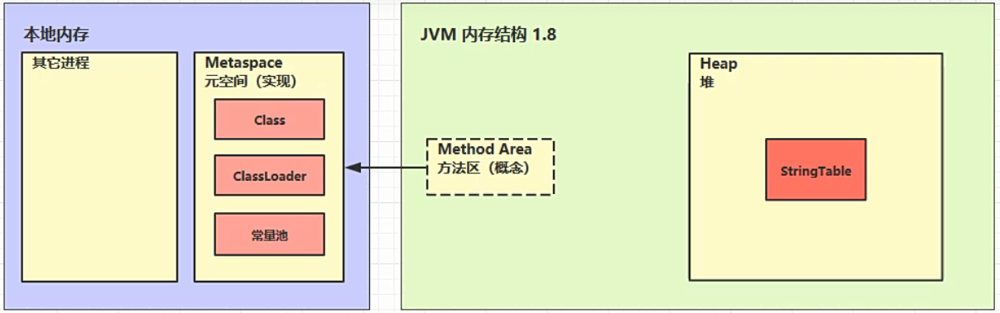

**运行时常量池属于方法区的组成部分，在此由于它较为特殊，才将其分开表示**

将Class文件的常量池的内容，都会存储在运行时常量池中。将来寻找方法引用、成员变量运用、具体数值等信息，都是在运行时常量池中查找。在此没有列出所有项，只是列出了重要的几项。

`#3 = Integer	32768`，它对应源码`int b = Short.MAX_VALUE + 1`。

注意：**一旦数字的范围超过了整数的最大值（`Short.MAX_VALUE`），就会存储在常量池中，比如这里的`32768`。如果在`Short.MAX_VALUE`范围内，则会跟方法的字节码指令一样存储在方法区。**

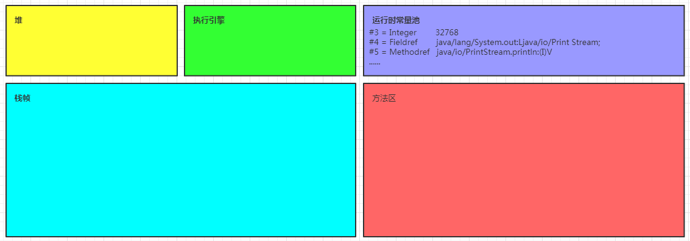

### 方法字节码载入方法区

```java
public static void main(java.lang.String[])
    Code:
        stack=2, locals=4, args_size=1
        bipush         10
        istore_1
        ldc            #3 int 32768
        istore_2
        iload_1
        iload_2
        iadd
        istore_3
        getstatic      #4 Field java/lang/System.out:Ljava/io/PrintStream
        iload_3
        invokevirtual  #5 Method java/io/PrintStream.println:(I)V
        return
```


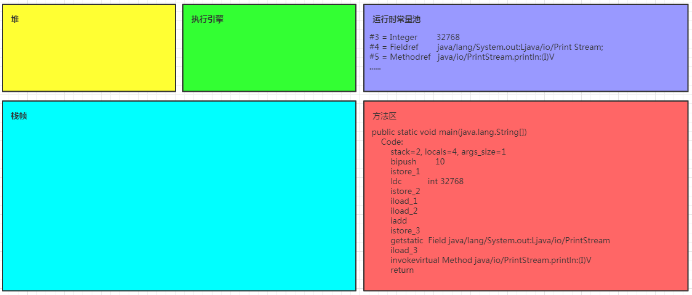

### main线程开始运行，分配栈帧内存

* locals为局部变量表（Local Variable Table），长度为4

* stack为操作数栈（Operand Stack），最大深度为2

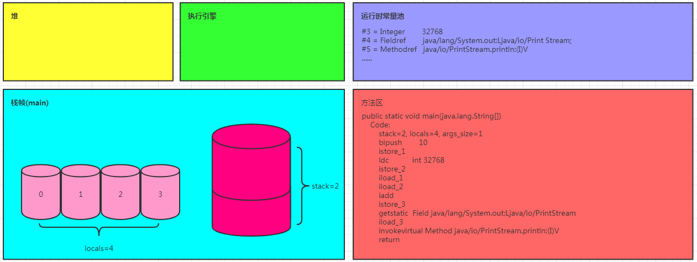

### 执行引擎开始执行字节码

#### bipush        10

将一个 byte 压入操作数栈（其长度会补齐 4 个字节）

由于`-128<=10<=127`，所以采用了`bipush`指令。操作数栈的宽度为4字节，byte只有1个字节，所以剩下的三个字节会用0或者1补齐，如果正数就用0补齐。

与`bipush`类似的指令

* `sipush` 将一个 short 压入操作数栈（其长度会补齐 4 个字节）
* `ldc` 将一个 int 压入操作数栈
* `ldc2_w` 将一个 long 压入操作数栈（分两次压入，因为 long 是 8 个字节，操作数栈的宽度为4字节）

**小的数字都是和字节码指令存在一起，超过 short 范围的数字存入了常量池**

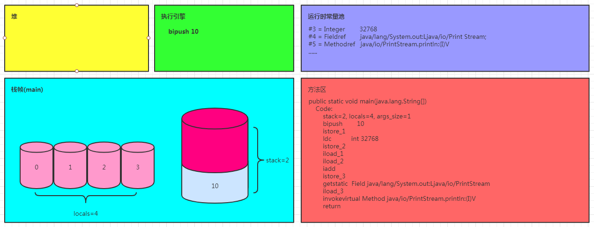

#### istore_1

将操作数栈顶数据弹出，存入局部变量表的 slot 1

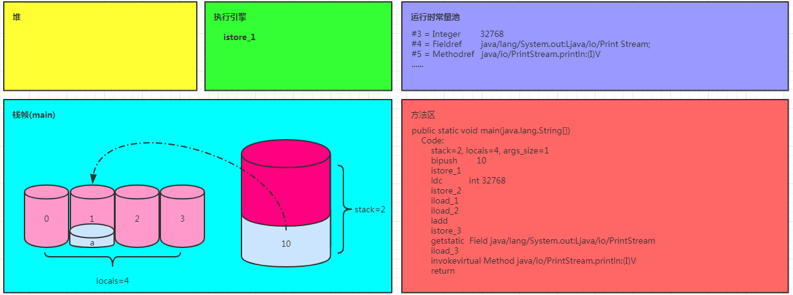

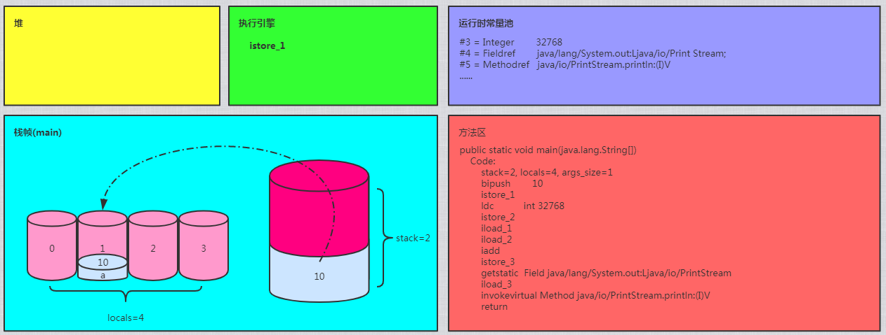

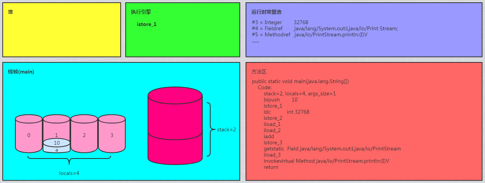

`bipush 10`、`istore_1`

以上两个指令对应源码：`int a = 10`

#### ldc	#3

从常量池加载 #3 数据到操作数栈

**注意：`Short.MAX_VALUE` 是 32767，所以 `32768 = Short.MAX_VALUE + 1` 实际是在编译期间计算**
**好的**

由于`32768`超过了`Short.MAX_VALUE`的值，所以存储在常量池中

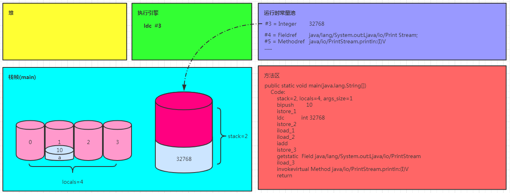

#### istore_2

将操作数栈顶的32768弹出，存储到局部变量表2号槽位


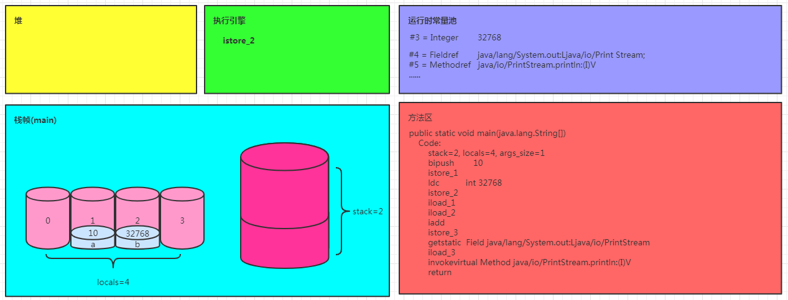

#### iload_1

将局部变量表1号槽位的数据压入操作数栈


#### iload_2

将局部变量表2号槽位的数据压入操作数栈

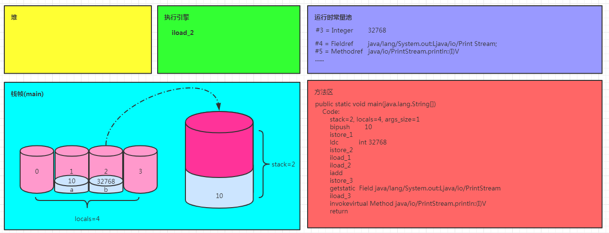

`iload_1`、`iload_2`的目的是为了执行下面的加法运算，因为运算要在操作数栈中执行，所以要将数据压入操作数栈。

#### iadd

从操作数栈弹出10、32768两数做加法运算。最后结果为32778

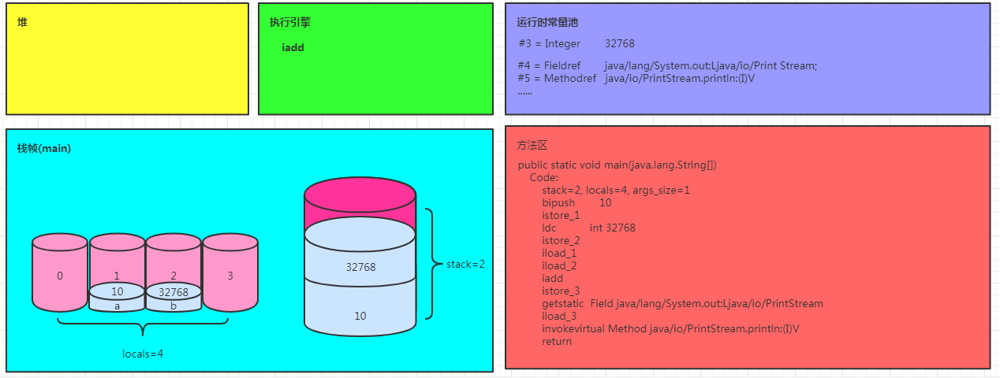

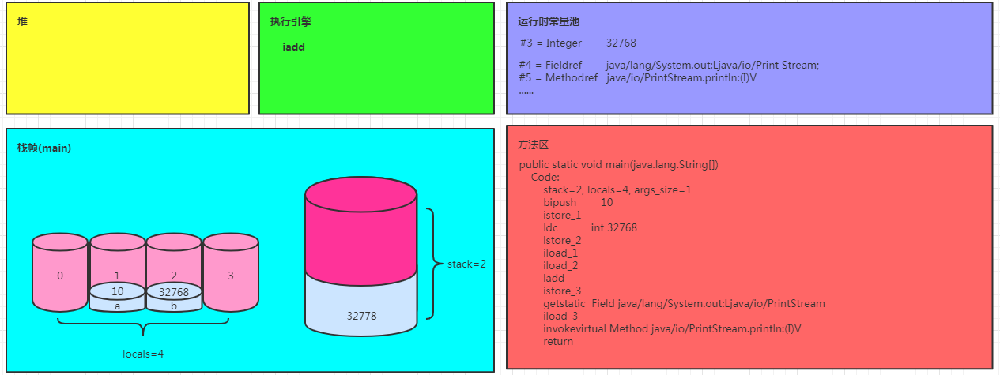

#### istore_3

将操作数栈顶32778弹出，存入局部变量表3号槽位

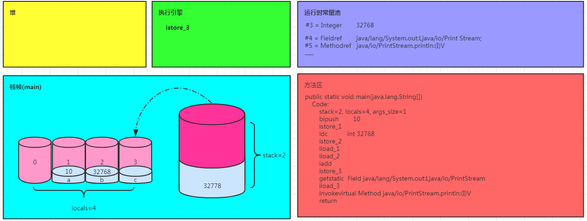

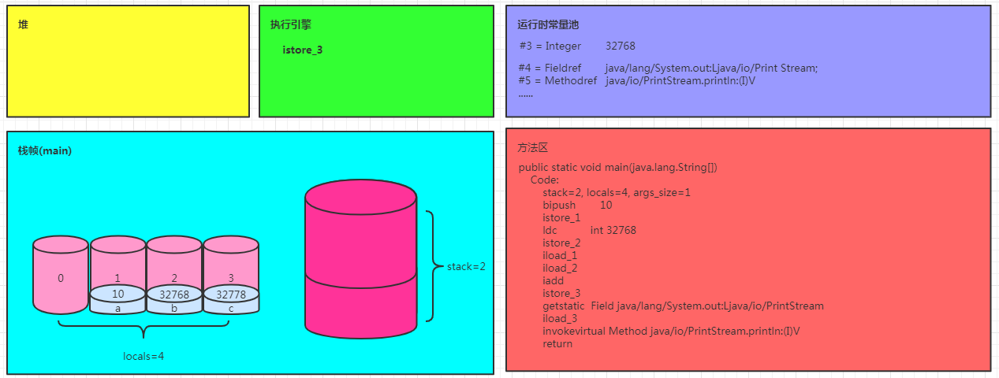

`iload_1`、`iload_2`、`iadd`、`istore_3`

以上指令对应源代码：`int c = a + b;`

#### getstatic #4

从运行时常量池4号位置找到一个成员变量的引用

`#4 = Fieldref    // java/lang/System.out:Ljava/io/Print`

由以上代码得知，此成员变量的引用所属类为System，成员变量名是out

`System.out`存储在堆内存中，所以是将堆内存中的`System.out对象的引用`（**注意，是对象引用，并不是对象本身**）压入操作数栈

步骤：

1. 找到常量池4号位置
2. 从堆内存找到对象引用
3. 将对象引用压入操作数栈

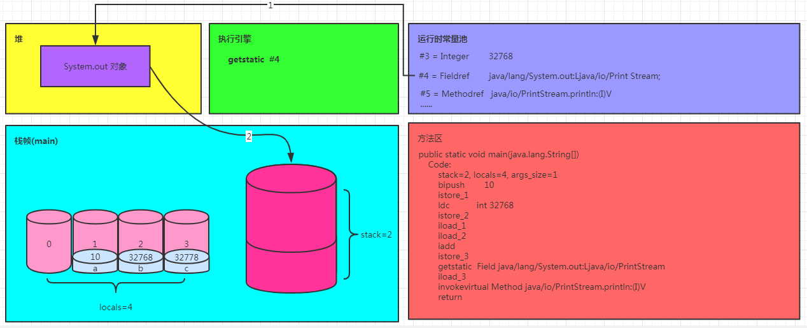

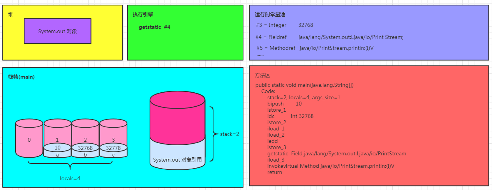

#### iload_3

将局部变量表3号槽位的数据读入到操作数栈

既然要打印，肯定要有参数，于是加载了局部变量表3号槽位的数据用于打印，打印的动作需要在操作数栈完成。

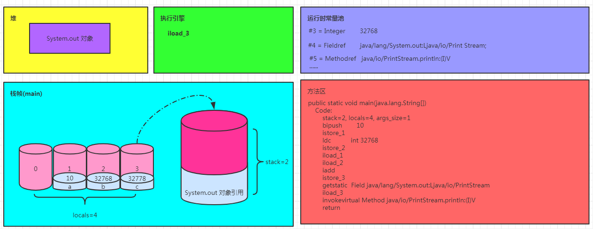

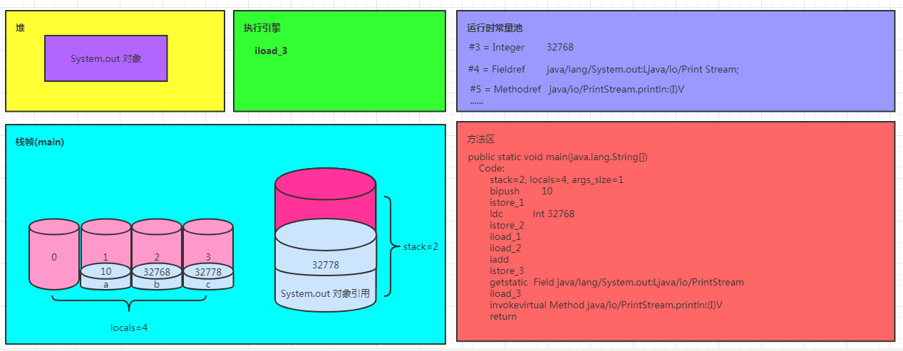

#### invokevirtual  #5

找到运行时常量池5号位置，执行找到的方法

`#5 = Methodref     // java/io/PrintStream.println:(I)V`

由以上代码得知，要执行的方法时`PrintStream`类的`println`方法，参数类型为`int`，返回值为`void`

步骤：

1. 找到常量池 #5 项
2. 定位到方法区 `java/io/PrintStream.println:(I)V` 方法
3. 生成新的栈帧（分配 locals、stack等）
4. 传递参数，执行新栈帧中的字节码

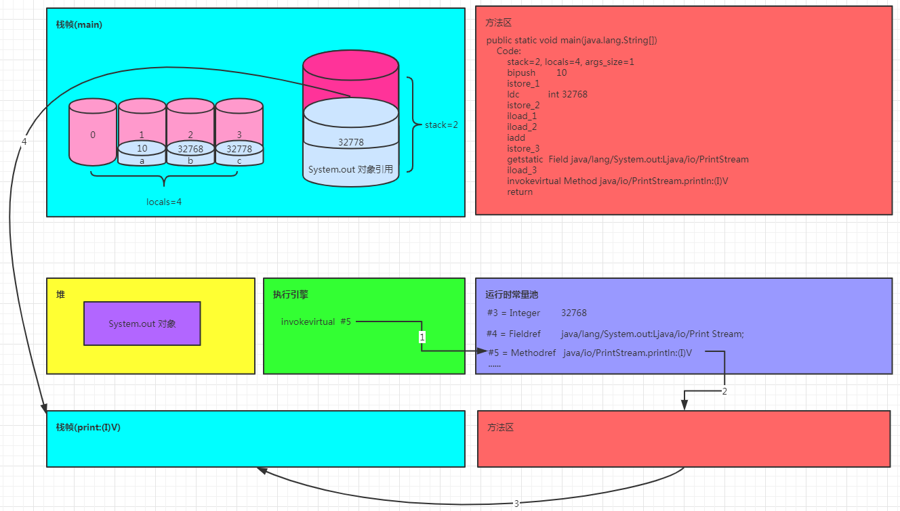

5. 执行完毕，弹出栈帧
6. 清除 main 操作数栈内容

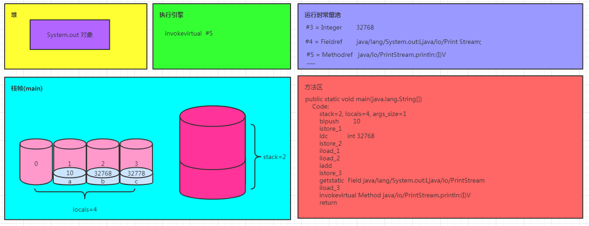

`getstatic #4`、`iload_3`、`invokevirtual #5`

以上指令对应源代码：`System.out.println(c);`

#### return

* 完成 main 方法调用，弹出 main 栈帧
* 程序结束