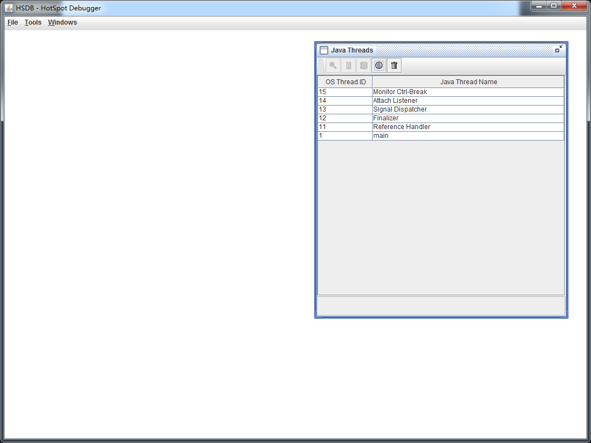

# 多态的原理

## 源码

```java
package bytecode;

import java.io.IOException;

/**
 * @author : mfh
 * @date : 2020-01-06 11:12
 **/
public class Demo13 {
    public static void test(Animal animal) {
        animal.eat();
        System.out.println(animal.toString());
    }
    public static void main(String[] args) throws IOException {
        test(new Dog());
        test(new Cat());
        System.in.read();
    }
}
abstract class Animal {
    public abstract void eat();

    @Override
    public String toString() {
        return "我是" + this.getClass().getSimpleName();
    }
}

class Dog extends Animal {

    @Override
    public void eat() {
        System.out.println("啃骨头");
    }
}

class Cat extends Animal {
    @Override
    public void eat() {
        System.out.println("吃鱼");
    }
}
```

>为什么要使用指针压缩？
>
>64位虚拟机为了节省空间，采用了指针压缩的技术，但是使用了指针压缩后，我们在查看内存地址的时候就不太方便，还要进行地址换算，所以先禁用指针压缩。

## 运行代码

运行程序，程序停留在`System.in.read()`，使用`jps`命令查看进程`id`。

## 运行 HSDB 工具

进入`JDK`安装目录，执行

`java -cp ./lib/sa-jdi.jar sun.jvm.hotspot.HSDB`

`File -> Attach to Hot Spot process`


输入进程`ID`




## 查找对象

打开 `Tools -> Find Object By Query`
输入 `select d from bytecode.Dog d` 点击 `Execute` 执行


[0x00000001e8dde4b0](0x00000001e8dde4b0)  是`Dog`对象的内存地址。

点击内存地址后会显示对象在内存中的实际表示


对象里面有对象头和成员变量，由于`Dog`对象比较简单，没有成员变量，所以只有对象头。


## 对象头

红框部分就是对象头，大小为16个字节。

* 前8个字节是`markword`，包括了对象的哈希码以及对象加锁的锁标记
* 后8个字节是对象的类型指针，根据类型指针就能找到对象的`Class`类

类型指针展开后，如下图所示


包括了`_java_mirror（Dog.class）`，父类的类型，子类类型，静态成员的个数，非静态成员个数等等。

下面来看一下内存的实际地址是什么样子的，因为上图中并没有显示对象类型指针地址，注意，是对象类型指针的地址。

## 通过 mem 命令类型指针地址

`Windows -> Console`


输入 `mem 0x00000001e8dde4b0 2`并回车

0x00000001e8dde4b0：对象内存地址

2：要查看word数据的个数（一个word占8个字节）。这里要查看两个，第一个是`markword`，第二个是类型指针的地址


0x0000000000000001：markword 地址

0x000000001c2a3b20：类型指针地址

Tools -> Inspector


输入内存指针地址 `0x000000001c2a3b20`并回车


上图就是`Dog`类在`JVM`中的实际样子，处于方法区，包含了类的所有信息。比如常量池的指针地址，方法入口的指针地址。

## 寻找类中的方法

这里要找的方法指的值多态的方法，存在于`vtable`的虚方法表中。静态方法、`final`方法、私有方法，都不在虚方法表中。


在这里看不了`vtable`的内存地址，但可以看出虚方法的个数为6。

可以用`mem`命令来查看，当然要先知道`vtable`的内存起始地址。这里可以这样算，因为`vtable`是在`instanceKlass`对象实例的尾部，而`instanceKlass`大小在64位系统的大小为`0x1B8`，因此`vtable`的起始地址等于`instanceKlass`内存首地址加上`0x1B`，计算结果如下

`0x000000001c2a3b20 + 0x1b8 = 0x000000001C2A3CD8`

`mem`命令：`mem 0x000000001C2A3CD8 6`

由于要查看6个`word`（`vtable`长度是6），所以结尾是6


以上就是Dog所有的支持重写的方法的入口地址，一共有6个，那么每个方法对应的是什么方法呢？

由于Dog继承自Animal，Animal继承自Object，所以现在看看Animal和Object中的方法能否与上面的方法地址对应上。

使用 `Tools -> Class Browser`查找`Dog`类


由上图得知，Dog类中虚方法表中的其中一个方法属于Dog本身，即重写的eat方法。这说明，当调用eat方法时，肯定会调用dog类的eat方法。

`<init>`构造方法不在虚方法表中

查看Animal方法


由上图得知，`Dog`类中虚方法表中的其中一个方法是`Animal`的`toString()`方法。这说明了调用`toString()`方法时，调用的是`Animal`的`toString()`方法。

查看Object方法


由上图得知，Dog类中虚方法表中的其中四个方法属于Object类。分别是：

1. finalize
2. equals
3. hashCode
4. clone

通过对象找到它的class类，通过class类知道了它的虚方法表了以后，就可以确定每个方法的实际入口地址。其中有些方法来自于父类，有的是自己本类的方法，这样就能知道了，到时候一个对象调用方法时，到底找的是哪个方法。

虚方法表是在类加载时的链接阶段生成，所以在链接时确定了每一个方法的入口地址。

## 总结

当执行`invokevirtual`指令时
1. 先通过栈帧中的对象引用找到对象
2. 分析对象头，找到对象的实际`Class`
3. `Class`结构中有`vtable`，它在类加载的链接阶段就已经根据方法的重写规则生成好了
4. 查表得到方法的具体地址
5. 执行方法的字节码

这就是多态调用时方法的查找过程，可见查找过程还是比较繁琐的，但是`jvm`会这种方法查找做出优化，后面会提到，比如增加缓存，单态的优化等。

>* Java 子类会继承父类的 vtable
>* Java 所有的类都会继承 java.lang.Object 类，Object 类中有 5 个虚方法可以被继承和重写，当一个类不包
>* 任何方法时，其 vtable 长度为 5，即 Object 类的 5 个虚方法
>* final 和 static 修饰的方法不会被放到 vtable 表里
>* 当子类重写了父类方法，子类 vtable 原本指向父类的方法指针会被替换为子类的方法指针
>* 子类的 vtable 保持了父类的 vtable 的顺序
>
>https://blog.csdn.net/qq_21586317/article/details/91358278