# 字节码角度分析自增运算

## 目的

从字节码角度分析`a++`相关题目

## 源码

```java
public class Demo3 {
    public static void main(String[] args) {
        int a = 10;
        int b = a++ + ++a + a--;
        System.out.println(a);
        System.out.println(b);
    }
}
```

## 反编译字节码

```java
public static void main(java.lang.String[]);
    descriptor: ([Ljava/lang/String;)V
    flags: ACC_PUBLIC, ACC_STATIC
    Code:
      stack=2, locals=3, args_size=1
         0: bipush        10
         2: istore_1
         3: iload_1
         4: iinc          1, 1
         7: iinc          1, 1
        10: iload_1
        11: iadd
        12: iload_1
        13: iinc          1, -1
        16: iadd
        17: istore_2
      LineNumberTable:
        line 9: 0
        line 10: 3
        line 11: 18
        line 12: 25
        line 13: 32
      LocalVariableTable:
        Start  Length  Slot  Name   Signature
            0      33     0  args   [Ljava/lang/String;
            3      30     1     a   I
           18      15     2     b   I
```

以上非全部字节码，只列出分析要用到的部分。

**注意：**

* **`iinc`指令是直接在局部变量`slot`上进行运算**
* **a++ 和 ++a 的区别是先执行`iload`还是 先执行`iinc`**
  * **a++：先执行`iload`，在执行`iinc`**
  * **++a：先执行`iinc`，后执行`iload`**

### bipush  10

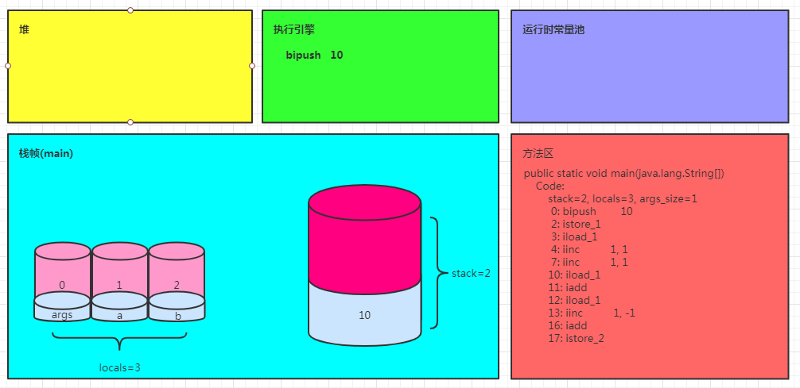

### istore_1

将操作数栈顶数据弹出，存入局部变量表的 slot 1

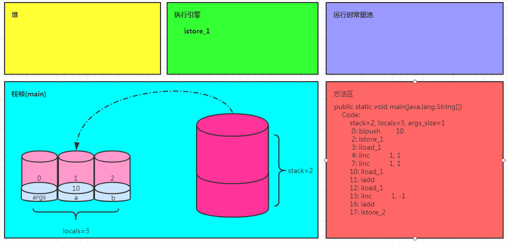

### iload_1

加载局部变量表 slot 1 的值

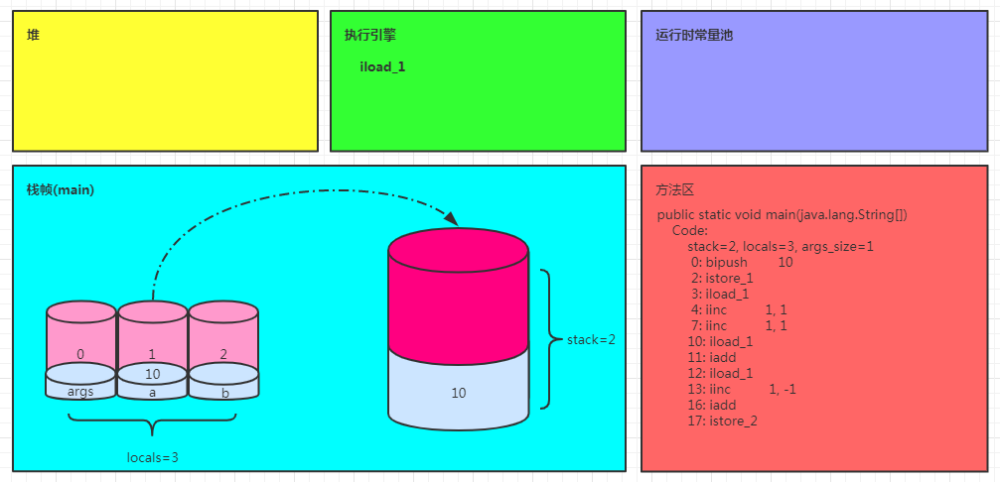

### iinc   1,1

>*iinc*  *index* ,*const*
>
>index:槽位号
>
>const:增量

将局部变量表1号槽位的值加1（逗号前面的1表示1号槽位，后面的1表示加1）

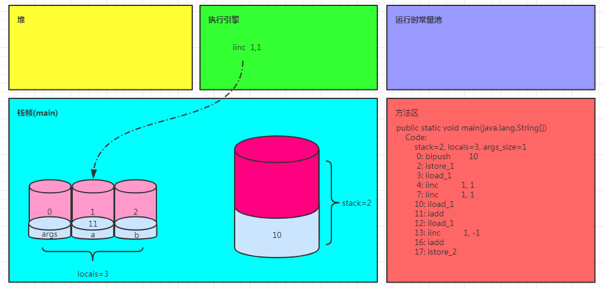

`iload_1`、`iinc  1,1`

以上指令对应源码：a++

步骤：

1. 加载局部变量表1号位置到操作数栈
2. 将局部变量表1号位置的值加1

### iinc  1,1

将局部变量表1号槽位的值加1（逗号前面的1表示槽位数，后面的1表示加1）

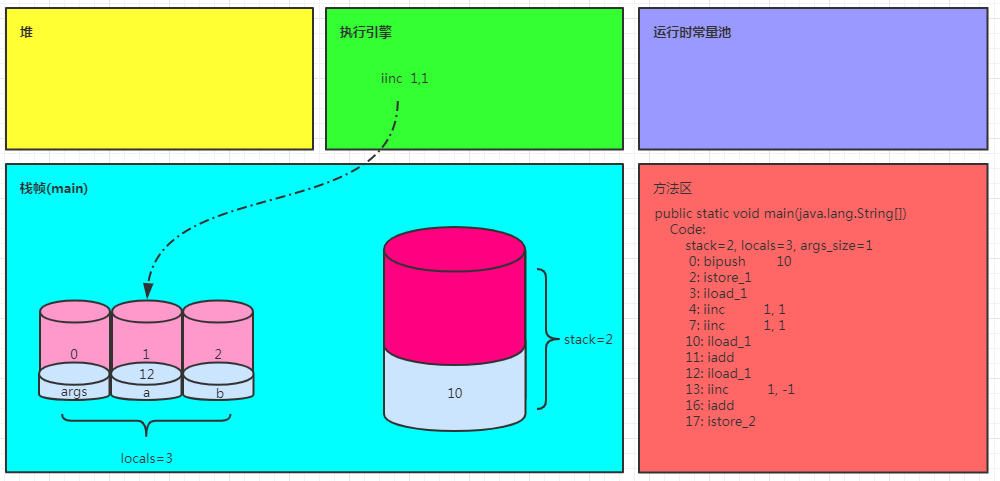

### iload_1

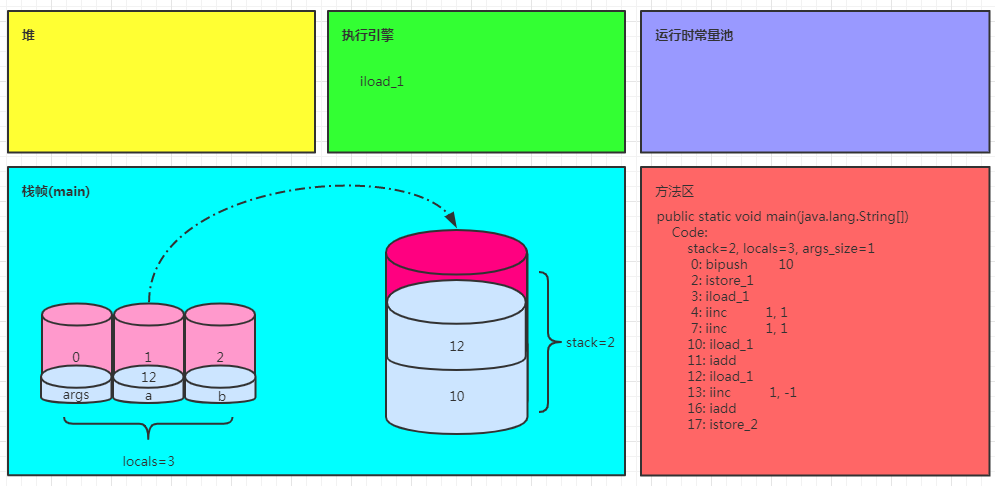

`iinc  1,1、iload_1`

以上指令对应源码：++a

步骤：

1. 将局部变量表1号位置的值加1
2. 加载局部变量表1号位置到操作数栈

### iadd

执行加法运算（10+12），结果存入了操作数栈，10、12被弹出

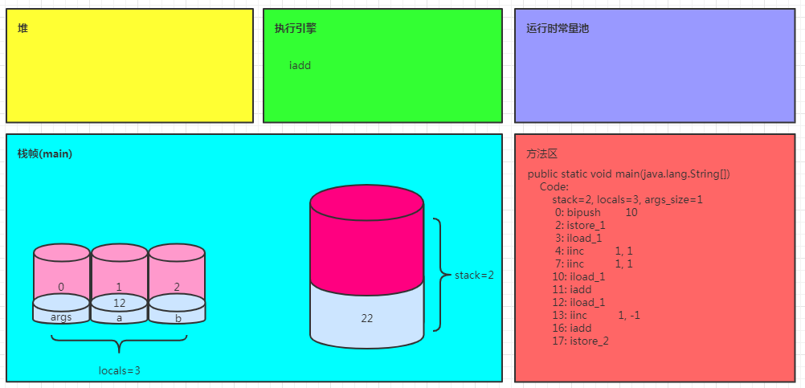

### iload_1

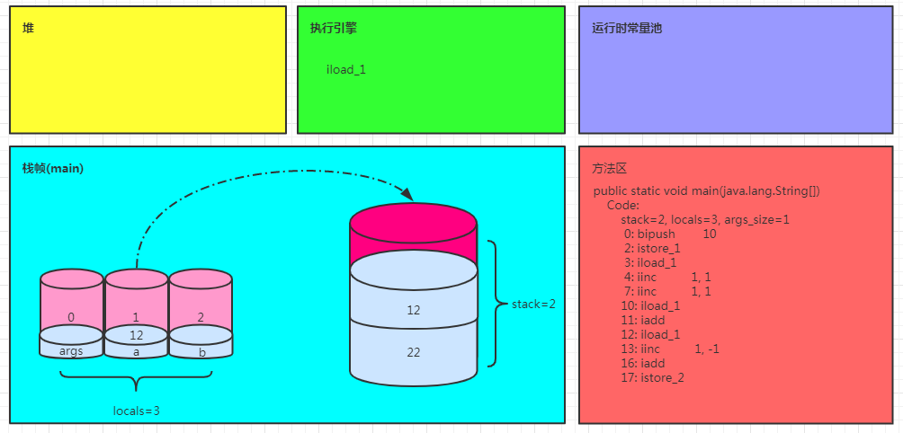

### iinc     1,-1

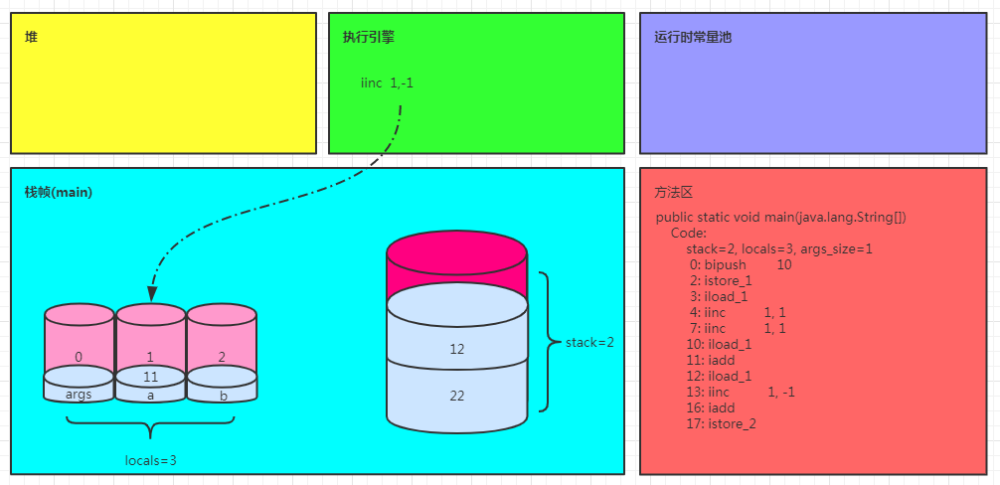

`iload_1`、`iinc  1,-1`

以上指令对应源码：a--

步骤：

1. 加载局部变量表1号位置到操作数栈
2. 将局部变量表1号位置的值减1

### iadd

执行加法运算（22 +12），结果存入了操作数栈，22、12被弹出

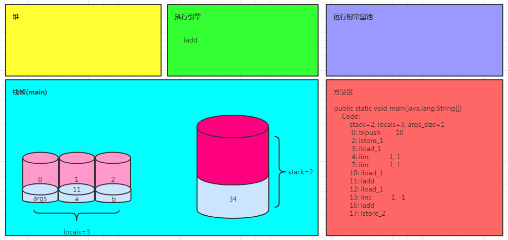

### istore_2

将操作数栈顶数据弹出，存入局部变量表的 slot 2

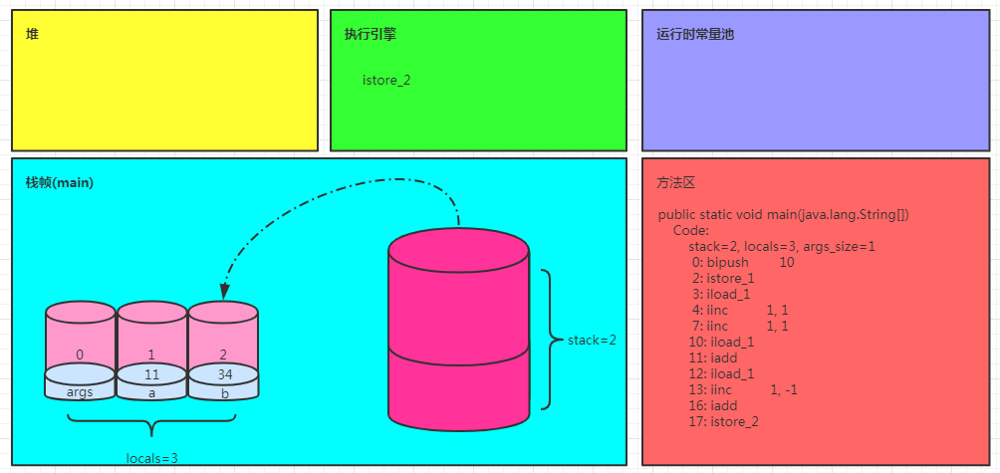

* iload_1
* iinc  1, 1
* iinc  1, 1
* iload_1
* iadd
* iload_1
* iinc  1, -1
* iadd
* istore_2

以上指令对应源码：`int b = a++ + ++a + a--`