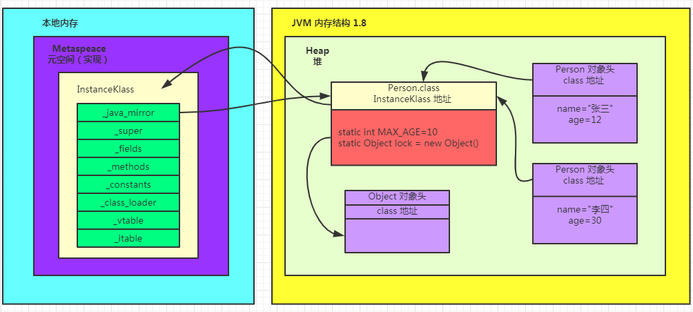
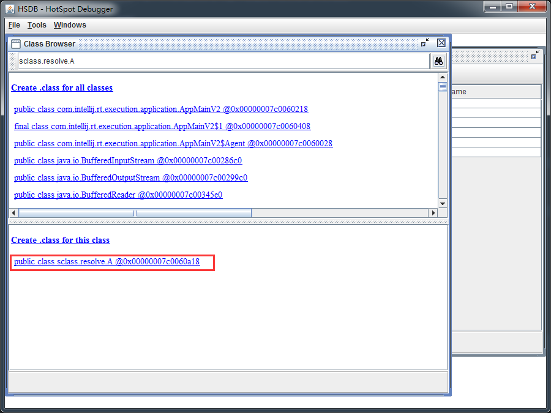
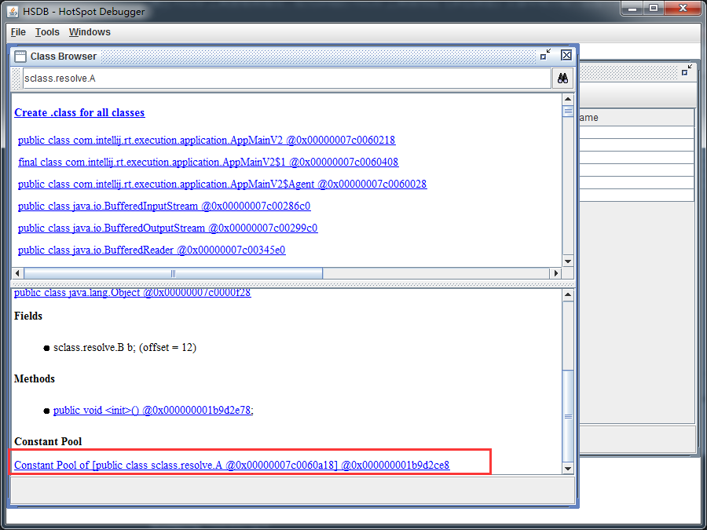
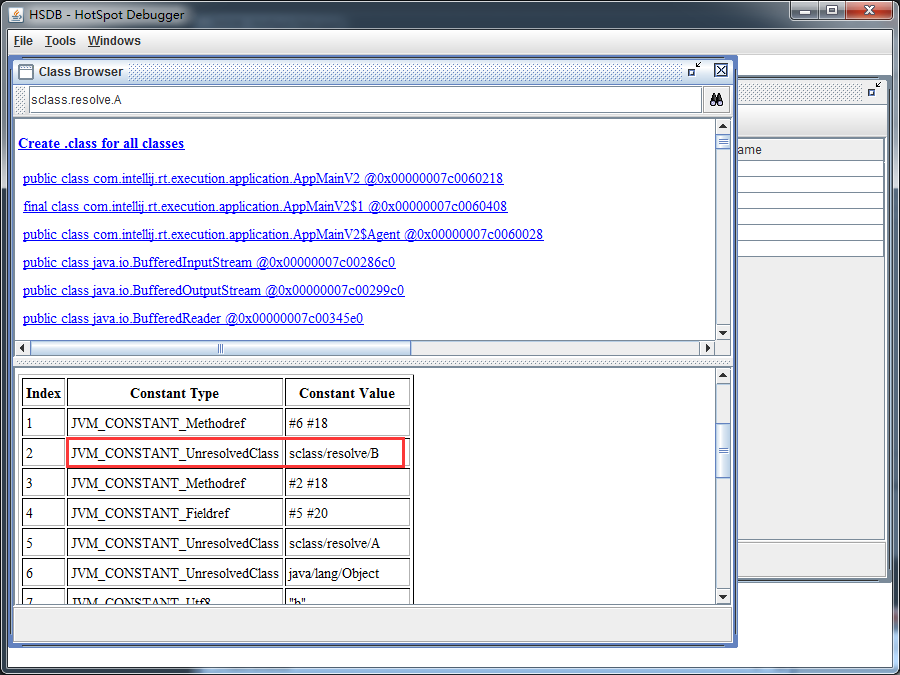
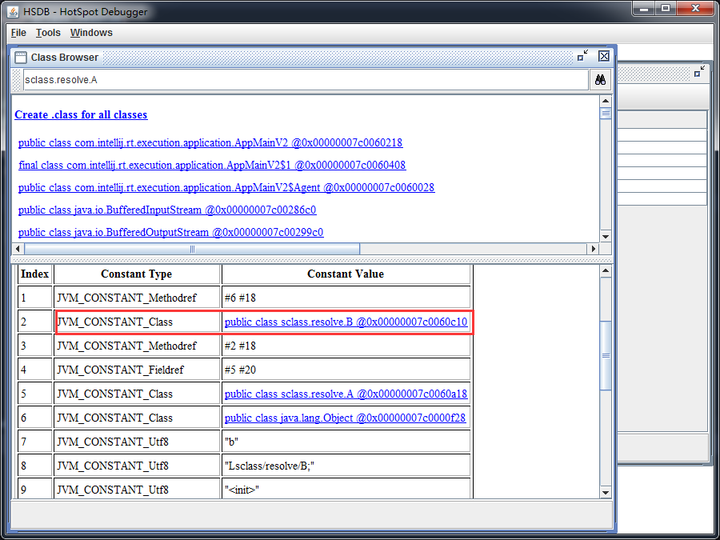

# 类加载

## 加载

将类的字节码载入方法区中，内部采用 C++ 的 instanceKlass 描述 java 类，它的重要 field 有：

* _java_mirror 即 java 的类镜像，例如对 String 来说，就是 String.class，作用是把 klass 暴露给 java 使用
* _super 即父类
* _fileds 即成员变量
* _methods 即方法
* _constants 即常量池
* _class_loader 即类加载器
* _vtable 即虚方法表
* _itable 即接口方法表

**如果这个类还有父类没有加载，先加载父类，加载和链接可能是交替运行的**。

#### _java_mirror

`java`对象并不能直接访问`instanceKlass`的信息，得通过`_java_mirror`来访问，`_java_mirror`起到了桥梁的作用。比如`String`，`String`对象并不能直接访问`instanceKlass`，而是要通过`String.class`，间接的访问到`instanceKlass`，从而得知方法，常量池、虚方法表的入口地址。



以`Person`类以及`Person`对象表示它们之间的关系。之前介绍过，类被加载到方法区（jdk1.8 方法区的实现叫做元空间）。类的字节码会被加载到元空间中，构成`InstanceKlass`这样一个数据结构。

加载的同时会在堆内存中生成`_java_mirror`的镜像，即`Person.class`。它持有`InstanceKlass`的引用地址；相对的，`InstanceKlass`中的 `_java_mirror` 持有`Person.class`的引用。这就是`Class`类对象与`InstanceKlass`之间的关系。

`Person`实例对象与`InstanceKlass`是如何联系起来的呢？

实例对象的对象头（16个字节），其中有8个字节对应着对象`class`地址，如果想通过对象获取`class`信息，其实就访问对象头，通过`class`地址先找到`Person.class`这个类对象，然后通过类对象中的`InstanceKlass`引用，在元空间中找到`InstanceKlass`。当我们调用实例对象的一些方法时，实际上就是去元空间中获取具体信息的。

注意：

1. instanceKlass 这样的【元数据】是存储在方法区（1.8 后的元空间内），但 `_java_mirror`是存储在堆中
2. 可以通过前面介绍的 HSDB 工具查看

## 链接

### 验证

验证类是否符合 JVM规范，安全性检查。

用 UE 等支持二进制的编辑器修改 `HelloWorld.class` 的魔数（将 `CA FE BA BE` 改为 `CA FE BA BA`），在控制台运行

```java
d:\git\jvm\out\production\jvm>java com.mfh.jvm.t5.HelloWorld
Error: A JNI error has occurred, please check your installation and try again
Exception in thread "main" java.lang.ClassFormatError: Incompatible magic value 3405691578 in class file com/mfh/jvm/t5/HelloWorld
at java.lang.ClassLoader.defineClass1(Native Method)
at java.lang.ClassLoader.defineClass(ClassLoader.java:763)
at java.security.SecureClassLoader.defineClass(SecureClassLoader.java:142)
at java.net.URLClassLoader.defineClass(URLClassLoader.java:467)
at java.net.URLClassLoader.access$100(URLClassLoader.java:73)
at java.net.URLClassLoader$1.run(URLClassLoader.java:368)
at java.net.URLClassLoader$1.run(URLClassLoader.java:362)
at java.security.AccessController.doPrivileged(Native Method)
at java.net.URLClassLoader.findClass(URLClassLoader.java:361)
at java.lang.ClassLoader.loadClass(ClassLoader.java:424)
at sun.misc.Launcher$AppClassLoader.loadClass(Launcher.java:331)
at java.lang.ClassLoader.loadClass(ClassLoader.java:357)
at sun.launcher.LauncherHelper.checkAndLoadMain(LauncherHelper.java:495)
```

### 准备

在准备阶段，为`static`变量分配空间，设置默认值。static 变量在 JDK 7 之前存储于 instanceKlass 末尾，所以 JDK7 之前 static 变量存储在方法区（永久代），从 JDK 7 开始，存储于 _java_mirror 末尾。

从上面的内存结构图中得知，`static int MAX_AGE`、`static Object lock`都是存储在 `Person.class` 末尾，也就是 _java_mirror 末尾。JDK 8，static 变量存储在堆内存。

static 变量分配空间和赋值是两个步骤，分配空间在准备阶段完成，赋值在初始化阶段完成，代码演示如下：

源码

```java
public class Demo1 {
    public static int i;
}
```

反编译后的字节码

```java
public class sclass.Demo1
  minor version: 0
  major version: 52
  flags: ACC_PUBLIC, ACC_SUPER
Constant pool:
   #1 = Methodref          #3.#15         // java/lang/Object."<init>":()V
   #2 = Class              #16            // sclass/Demo1
   #3 = Class              #17            // java/lang/Object
   #4 = Utf8               i
   #5 = Utf8               I
   #6 = Utf8               <init>
   #7 = Utf8               ()V
   #8 = Utf8               Code
   #9 = Utf8               LineNumberTable
  #10 = Utf8               LocalVariableTable
  #11 = Utf8               this
  #12 = Utf8               Lsclass/Demo1;
  #13 = Utf8               SourceFile
  #14 = Utf8               Demo1.java
  #15 = NameAndType        #6:#7          // "<init>":()V
  #16 = Utf8               sclass/Demo1
  #17 = Utf8               java/lang/Object
{
  public static int i;
    descriptor: I
    flags: ACC_PUBLIC, ACC_STATIC

  public sclass.Demo1();
    descriptor: ()V
    flags: ACC_PUBLIC
    Code:
      stack=1, locals=1, args_size=1
         0: aload_0
         1: invokespecial #1                  // Method java/lang/Object."<init>":()V
         4: return
      LineNumberTable:
        line 7: 0
      LocalVariableTable:
        Start  Length  Slot  Name   Signature
            0       5     0  this   Lsclass/Demo1;
}
```

源码中没有对静态变量`i`做任何赋值操作，从字节码上，没有看到任何赋值的地方，只是对静态变量`i`分配了空间。继续看下面的代码：

源码

```java
public class Demo1 {
    public static int i;
    public static int j = 10;
}
```

反编译后的字节码

```java
public class sclass.Demo1
  minor version: 0
  major version: 52
  flags: ACC_PUBLIC, ACC_SUPER
Constant pool:
   #1 = Methodref          #4.#18         // java/lang/Object."<init>":()V
   #2 = Fieldref           #3.#19         // sclass/Demo1.j:I
   #3 = Class              #20            // sclass/Demo1
   #4 = Class              #21            // java/lang/Object
   #5 = Utf8               i
   #6 = Utf8               I
   #7 = Utf8               j
   #8 = Utf8               <init>
   #9 = Utf8               ()V
  #10 = Utf8               Code
  #11 = Utf8               LineNumberTable
  #12 = Utf8               LocalVariableTable
  #13 = Utf8               this
  #14 = Utf8               Lsclass/Demo1;
  #15 = Utf8               <clinit>
  #16 = Utf8               SourceFile
  #17 = Utf8               Demo1.java
  #18 = NameAndType        #8:#9          // "<init>":()V
  #19 = NameAndType        #7:#6          // j:I
  #20 = Utf8               sclass/Demo1
  #21 = Utf8               java/lang/Object
{
  public static int i;
    descriptor: I
    flags: ACC_PUBLIC, ACC_STATIC

  public static int j;
    descriptor: I
    flags: ACC_PUBLIC, ACC_STATIC

  public sclass.Demo1();
    descriptor: ()V
    flags: ACC_PUBLIC
    Code:
      stack=1, locals=1, args_size=1
         0: aload_0
         1: invokespecial #1                  // Method java/lang/Object."<init>":()V
         4: return
      LineNumberTable:
        line 7: 0
      LocalVariableTable:
        Start  Length  Slot  Name   Signature
            0       5     0  this   Lsclass/Demo1;

  static {};
    descriptor: ()V
    flags: ACC_STATIC
    Code:
      stack=1, locals=0, args_size=0
         0: bipush        10
         2: putstatic     #2                  // Field j:I
         5: return
      LineNumberTable:
        line 9: 0
}
```

源码中对静态变量`j`赋值10，对应字节码

```java
static {};
    descriptor: ()V
    flags: ACC_STATIC
    Code:
      stack=1, locals=0, args_size=0
         0: bipush        10
         2: putstatic     #2                  // Field j:I
         5: return
      LineNumberTable:
        line 9: 0
```

`static {};`静态块中的代码，就是类初始化时（**\<cinit\>()V**）要执行的代码，`j`的赋值操作也在这里完成。所以证明了静态变量的赋值操作是在类初始化中完成的。

但是也存在一些特殊情况，下面通过代码进行演示：

源码

```java
public class Demo2 {
    public static final int i = 10;
}
```

反编译后的字节码

```java
public class sclass.Demo2
  minor version: 0
  major version: 52
  flags: ACC_PUBLIC, ACC_SUPER
Constant pool:
   #1 = Methodref          #3.#17         // java/lang/Object."<init>":()V
   #2 = Class              #18            // sclass/Demo2
   #3 = Class              #19            // java/lang/Object
   #4 = Utf8               i
   #5 = Utf8               I
   #6 = Utf8               ConstantValue
   #7 = Integer            10
   #8 = Utf8               <init>
   #9 = Utf8               ()V
  #10 = Utf8               Code
  #11 = Utf8               LineNumberTable
  #12 = Utf8               LocalVariableTable
  #13 = Utf8               this
  #14 = Utf8               Lsclass/Demo2;
  #15 = Utf8               SourceFile
  #16 = Utf8               Demo2.java
  #17 = NameAndType        #8:#9          // "<init>":()V
  #18 = Utf8               sclass/Demo2
  #19 = Utf8               java/lang/Object
{
  public static final int i;
    descriptor: I
    flags: ACC_PUBLIC, ACC_STATIC, ACC_FINAL
    ConstantValue: int 10

  public sclass.Demo2();
    descriptor: ()V
    flags: ACC_PUBLIC
    Code:
      stack=1, locals=1, args_size=1
         0: aload_0
         1: invokespecial #1                  // Method java/lang/Object."<init>":()V
         4: return
      LineNumberTable:
        line 7: 0
      LocalVariableTable:
        Start  Length  Slot  Name   Signature
            0       5     0  this   Lsclass/Demo2;
}
```

由字节码

```java
public static final int i;
    descriptor: I
    flags: ACC_PUBLIC, ACC_STATIC, ACC_FINAL
    ConstantValue: int 10
```

`ConstantValue: int 10`得知，静态常量`i`的分配空间与赋值是都是在准备阶段完成，由于基本类型常量编译阶段值就确定了，所以在准备阶段就先完成了赋值，反正也不会变了嘛。

结论：基本类型静态常量，分配空间与赋值都是在准备阶段完成的。

再看另一种特殊情况，代码如下：

源码

```java
public class Demo2 {
    public static final int i = 10;
    public static final String str = "hello";
}
```

反编译后的字节码

```java
public class sclass.Demo2
  minor version: 0
  major version: 52
  flags: ACC_PUBLIC, ACC_SUPER
Constant pool:
   #1 = Methodref          #3.#20         // java/lang/Object."<init>":()V
   #2 = Class              #21            // sclass/Demo2
   #3 = Class              #22            // java/lang/Object
   #4 = Utf8               i
   #5 = Utf8               I
   #6 = Utf8               ConstantValue
   #7 = Integer            10
   #8 = Utf8               str
   #9 = Utf8               Ljava/lang/String;
  #10 = String             #23            // hello
  #11 = Utf8               <init>
  #12 = Utf8               ()V
  #13 = Utf8               Code
  #14 = Utf8               LineNumberTable
  #15 = Utf8               LocalVariableTable
  #16 = Utf8               this
  #17 = Utf8               Lsclass/Demo2;
  #18 = Utf8               SourceFile
  #19 = Utf8               Demo2.java
  #20 = NameAndType        #11:#12        // "<init>":()V
  #21 = Utf8               sclass/Demo2
  #22 = Utf8               java/lang/Object
  #23 = Utf8               hello
{
  public static final int i;
    descriptor: I
    flags: ACC_PUBLIC, ACC_STATIC, ACC_FINAL
    ConstantValue: int 10

  public static final java.lang.String str;
    descriptor: Ljava/lang/String;
    flags: ACC_PUBLIC, ACC_STATIC, ACC_FINAL
    ConstantValue: String hello

  public sclass.Demo2();
    descriptor: ()V
    flags: ACC_PUBLIC
    Code:
      stack=1, locals=1, args_size=1
         0: aload_0
         1: invokespecial #1                  // Method java/lang/Object."<init>":()V
         4: return
      LineNumberTable:
        line 7: 0
      LocalVariableTable:
        Start  Length  Slot  Name   Signature
            0       5     0  this   Lsclass/Demo2;
}
```

由字节码

```java
public static final java.lang.String str;
    descriptor: Ljava/lang/String;
    flags: ACC_PUBLIC, ACC_STATIC, ACC_FINAL
    ConstantValue: String hello
```

ConstantValue: String hello得知，静态常量字符串`str`的分配空间与赋值是也是在准备阶段完成。

结论：静态常量字符串分配空间与赋值是在准备阶段完成。

那么是否所有的静态常量的分配空间与赋值都是在准备阶段完成呢？非也，再来看一种情况。

源码

```java
public class Demo2 {
    public static final int i = 10;
    public static final String str = "hello";
    public static final Object lock = new Object();
}
```

反编译后的字节码

```java
public class sclass.Demo2
  minor version: 0
  major version: 52
  flags: ACC_PUBLIC, ACC_SUPER
Constant pool:
   #1 = Methodref          #2.#24         // java/lang/Object."<init>":()V
   #2 = Class              #25            // java/lang/Object
   #3 = Fieldref           #4.#26         // sclass/Demo2.lock:Ljava/lang/Object;
   #4 = Class              #27            // sclass/Demo2
   #5 = Utf8               i
   #6 = Utf8               I
   #7 = Utf8               ConstantValue
   #8 = Integer            10
   #9 = Utf8               str
  #10 = Utf8               Ljava/lang/String;
  #11 = String             #28            // hello
  #12 = Utf8               lock
  #13 = Utf8               Ljava/lang/Object;
  #14 = Utf8               <init>
  #15 = Utf8               ()V
  #16 = Utf8               Code
  #17 = Utf8               LineNumberTable
  #18 = Utf8               LocalVariableTable
  #19 = Utf8               this
  #20 = Utf8               Lsclass/Demo2;
  #21 = Utf8               <clinit>
  #22 = Utf8               SourceFile
  #23 = Utf8               Demo2.java
  #24 = NameAndType        #14:#15        // "<init>":()V
  #25 = Utf8               java/lang/Object
  #26 = NameAndType        #12:#13        // lock:Ljava/lang/Object;
  #27 = Utf8               sclass/Demo2
  #28 = Utf8               hello
{
  public static final int i;
    descriptor: I
    flags: ACC_PUBLIC, ACC_STATIC, ACC_FINAL
    ConstantValue: int 10

  public static final java.lang.String str;
    descriptor: Ljava/lang/String;
    flags: ACC_PUBLIC, ACC_STATIC, ACC_FINAL
    ConstantValue: String hello

  public static final java.lang.Object lock;
    descriptor: Ljava/lang/Object;
    flags: ACC_PUBLIC, ACC_STATIC, ACC_FINAL

  public sclass.Demo2();
    descriptor: ()V
    flags: ACC_PUBLIC
    Code:
      stack=1, locals=1, args_size=1
         0: aload_0
         1: invokespecial #1                  // Method java/lang/Object."<init>":()V
         4: return
      LineNumberTable:
        line 7: 0
      LocalVariableTable:
        Start  Length  Slot  Name   Signature
            0       5     0  this   Lsclass/Demo2;

  static {};
    descriptor: ()V
    flags: ACC_STATIC
    Code:
      stack=2, locals=0, args_size=0
         0: new           #2                  // class java/lang/Object
         3: dup
         4: invokespecial #1                  // Method java/lang/Object."<init>":()V
         7: putstatic     #3                  // Field lock:Ljava/lang/Object;
        10: return
      LineNumberTable:
        line 10: 0
}
```

字节码

```java
public static final java.lang.Object lock;
    descriptor: Ljava/lang/Object;
    flags: ACC_PUBLIC, ACC_STATIC, ACC_FINAL
```

里面没有值，在静态代码块（**\<cinit\>()V**）的字节码

```java
static {};
    descriptor: ()V
    flags: ACC_STATIC
    Code:
      stack=2, locals=0, args_size=0
         0: new           #2                  // class java/lang/Object
         3: dup
         4: invokespecial #1                  // Method java/lang/Object."<init>":()V
         7: putstatic     #3                  // Field lock:Ljava/lang/Object;
        10: return
      LineNumberTable:
        line 10: 0
```

`putstatic   #3`中可以看到`lock`的身影。

结论：属于引用类型的静态常量，赋值也会在初始化阶段完成。

### 解析

将**常量池**中的符号引用解析为直接引用，什么是常量池中的符号，解析为直接引用又是什么样的，下面根据源码一一解答。

源码

```java
public class A {
    B b = new B();
}
```

```java
public class B {
}
```

```java
public class Client {
    public static void main(String[] args) throws ClassNotFoundException, IOException {
        ClassLoader loader = Client.class.getClassLoader();
        // loadClass 不会导致类解析和初始化
        Class<?> aClass = loader.loadClass("sclass.resolve.A");
        System.in.read();
    }
}
```

通过 HSDB 工具查看类情况，较为详细的 HSDB 工具使用在《多态原理》文章中有介绍，这里不再赘述。







loadClass 不会导致类解析和初始化，所以类`A`只是被加载，并没有解析和初始化，类`A`没有初始化导致类`B`也不会被初始化。

上图类`A`的常量中可以看到，`JVM_CONSTANTS_UnresolvedClass`对应`sclass/resolve/B`，说明此时`B`仅仅是符号而已，没有对应的内存地址，通过 HSDB 工具同样也找不到类`B`的信息，类`B`还没有被加载、解析和初始化

下面使用`new`的方式创建`A`对象

源码

```java
public class Client {
    public static void main(String[] args) throws ClassNotFoundException, IOException {
        ClassLoader loader = Client.class.getClassLoader();
        new A();
        System.in.read();
    }
}
```



使用这种方式创建对象，会触发类`A`的解析和初始化，进而就会造成类`B`的加载，解析与初始化。

使用 HSDB 工具可以清楚的看到类`A`的常量池中，原先的 `JVM_CONSTANTS_UnresolvedClass` 变成了`JVM_CONSTANT_Class`，`sclass/resolve/B`变成了 `[public class sclass.resolve.B @0x00000007c0060c10](klass=0x00000007c0060c10)`。由此说明类`B`被解析和初始化了，已经可以在内存中通过地址找到它了。

总结：类，方法，属性在未经解析的时候，并不知道其在内存中的位置，它们仅仅是符号而已，只有被解析变成直接引用，才能确定其在内存的位置。

## 初始化 <cinit\>()V

初始化即调用 <cinit>()V ，虚拟机会保证这个类的『构造方法』的线程安全。

### 发生的时机

概括的说，类初始化是**懒惰的**

#### 会导致类初始化的情况

* `main`方法所在的类，总会被首先初始化
* 首次访问这个类的静态变量和静态方法时
* 子类初始化，如果父类还没初始化，会引发
* 子类访问父类的静态变量，只会触发父类初始化
* Class.forName
* `new`会导致初始化

#### 不会导致初始化的情况

* 访问类的`static final`静态常量（基本类型和字符串）不会触发初始化
  * 它们是在链接阶段里的准备阶段初始化的
* 类对象`.class`不会触发初始化
  * 类对象`.class` 也就是 _java_mirror，它是在类加载时就会生成
* 创建该类的数组不会触发初始化
* 类加载器的`loadClass`方法
* `Class.forName`的第二个参数是`false`时

### 实验

```java
package initialize;

/**
 * @author mfh
 * @date 2020/1/26 9:35
 */
public class A {
    static int a = 0;
    static {
        System.out.println("A init");
    }
}
```

```java
package initialize;

/**
 * @author mfh
 * @date 2020/1/26 9:36
 */
public class B extends A {
    final static double b = 1.0d;
    static boolean c = false;
    static {
        System.out.println("B init");
    }
}
```

### 验证

每次只执行其中一个

```java
package initialize;

import java.util.Arrays;

/**
 * @author mfh
 * @date 2020/1/26 9:37
 */
public class Load {
    // main 方法所在类，总先被初始化
    static {
        System.out.println("main init");
    }
    public static void main(String[] args) throws ClassNotFoundException {
        // 静态常量（基本类型，字符串类型）不会触发初始化
        System.out.println(B.b);
        // 访问类对象，不会触发初始化
        System.out.println(B.class);
        // 创建该类的数组，不会触发初始化
        System.out.println(Arrays.toString(new B[0]));
        // 不会初始化类 B，但会加载 B，A
        ClassLoader c1 = Thread.currentThread().getContextClassLoader();
        c1.loadClass("initialize.B");
        // 不会初始化类 B，但会加载 B，A
        ClassLoader c2 = Thread.currentThread().getContextClassLoader();
        Class.forName("initialize.B", false, c2);
        // ----------------以上不会触发初始化的情况----------------

        // ----------------以下会触发初始化的情况------------------
        // 首次访问这个类的静态变量和静态方法时，会初始化
        System.out.println(A.a);
        // 子类初始化，如果父类还没初始化，会引发初始化
        System.out.println(B.c);
        // 子类访问父类的成员变量，只会触发父类初始化
        System.out.println(B.a);
        // 会初始化 B，并先初始化 A
        Class.forName("initialize.B");
    }
}

```

### 练习

从字节码角度分析，a，b，c 是否会触发类 E 初始化。

```java
package initialize;

/**
 * @author mfh
 * @date 2020/1/26 10:10
 */
public class E {
    public static final int a = 10;
    public static final String b = "hello";
    public static final Integer c = 20;

    static {
        System.out.println("init E");
    }
}
```

```java
public class initialize.E
  minor version: 0
  major version: 52
  flags: ACC_PUBLIC, ACC_SUPER
Constant pool:
   #1 = Methodref          #8.#31         // java/lang/Object."<init>":()V
   #2 = Methodref          #32.#33        // java/lang/Integer.valueOf:(I)Ljava/lang/Integer;
   #3 = Fieldref           #7.#34         // initialize/E.c:Ljava/lang/Integer;
   #4 = Fieldref           #35.#36        // java/lang/System.out:Ljava/io/PrintStream;
   #5 = String             #37            // init E
   #6 = Methodref          #38.#39        // java/io/PrintStream.println:(Ljava/lang/String;)V
   #7 = Class              #40            // initialize/E
   #8 = Class              #41            // java/lang/Object
   #9 = Utf8               a
  #10 = Utf8               I
  #11 = Utf8               ConstantValue
  #12 = Integer            10
  #13 = Utf8               b
  #14 = Utf8               Ljava/lang/String;
  #15 = String             #42            // hello
  #16 = Utf8               c
  #17 = Utf8               Ljava/lang/Integer;
  #18 = Utf8               f
  #19 = Utf8               Z
  #20 = Integer            0
  #21 = Utf8               <init>
  #22 = Utf8               ()V
  #23 = Utf8               Code
  #24 = Utf8               LineNumberTable
  #25 = Utf8               LocalVariableTable
  #26 = Utf8               this
  #27 = Utf8               Linitialize/E;
  #28 = Utf8               <clinit>
  #29 = Utf8               SourceFile
  #30 = Utf8               E.java
  #31 = NameAndType        #21:#22        // "<init>":()V
  #32 = Class              #43            // java/lang/Integer
  #33 = NameAndType        #44:#45        // valueOf:(I)Ljava/lang/Integer;
  #34 = NameAndType        #16:#17        // c:Ljava/lang/Integer;
  #35 = Class              #46            // java/lang/System
  #36 = NameAndType        #47:#48        // out:Ljava/io/PrintStream;
  #37 = Utf8               init E
  #38 = Class              #49            // java/io/PrintStream
  #39 = NameAndType        #50:#51        // println:(Ljava/lang/String;)V
  #40 = Utf8               initialize/E
  #41 = Utf8               java/lang/Object
  #42 = Utf8               hello
  #43 = Utf8               java/lang/Integer
  #44 = Utf8               valueOf
  #45 = Utf8               (I)Ljava/lang/Integer;
  #46 = Utf8               java/lang/System
  #47 = Utf8               out
  #48 = Utf8               Ljava/io/PrintStream;
  #49 = Utf8               java/io/PrintStream
  #50 = Utf8               println
  #51 = Utf8               (Ljava/lang/String;)V
{
  public static final int a;
    descriptor: I
    flags: ACC_PUBLIC, ACC_STATIC, ACC_FINAL
    ConstantValue: int 10

  public static final java.lang.String b;
    descriptor: Ljava/lang/String;
    flags: ACC_PUBLIC, ACC_STATIC, ACC_FINAL
    ConstantValue: String hello

  public static final java.lang.Integer c;
    descriptor: Ljava/lang/Integer;
    flags: ACC_PUBLIC, ACC_STATIC, ACC_FINAL

  public initialize.E();
    descriptor: ()V
    flags: ACC_PUBLIC
    Code:
      stack=1, locals=1, args_size=1
         0: aload_0
         1: invokespecial #1                  // Method java/lang/Object."<init>":()V
         4: return
      LineNumberTable:
        line 7: 0
      LocalVariableTable:
        Start  Length  Slot  Name   Signature
            0       5     0  this   Linitialize/E;

  static {};
    descriptor: ()V
    flags: ACC_STATIC
    Code:
      stack=2, locals=0, args_size=0
         0: bipush        20
         2: invokestatic  #2                  // Method java/lang/Integer.valueOf:(I)Ljava/lang/Integer;
         5: putstatic     #3                  // Field c:Ljava/lang/Integer;
         8: getstatic     #4                  // Field java/lang/System.out:Ljava/io/PrintStream;
        11: ldc           #5                  // String init E
        13: invokevirtual #6                  // Method java/io/PrintStream.println:(Ljava/lang/String;)V
        16: return
      LineNumberTable:
        line 10: 0
        line 14: 8
        line 15: 16
}
```

`a`是基本类型、`b`是字符串类型，同为静态常量，所以它们在类链接的准备阶段就已经完成了赋值，所以不会触发类`E`的初始化，字节码如下：

```java
public static final int a;
    descriptor: I
    flags: ACC_PUBLIC, ACC_STATIC, ACC_FINAL
    ConstantValue: int 10

  public static final java.lang.String b;
    descriptor: Ljava/lang/String;
    flags: ACC_PUBLIC, ACC_STATIC, ACC_FINAL
    ConstantValue: String hello
```

可以看到`ConstantValue: int 10`，`ConstantValue: String hello`为准备阶段已完成赋值的常量。

`c`虽然是静态常量，但非基本类型或字符串类型，虽然在赋值时使用`20`，看上去像基本类型，但是从字节码的角度来看，会隐式调用`java/lang/Integer.valueOf`，将其转换成包装类型，所以`c`会触发类`E` 的初始化，字节码如下：

```java
static {};
    descriptor: ()V
    flags: ACC_STATIC
    Code:
      stack=2, locals=0, args_size=0
         0: bipush        20
         2: invokestatic  #2                  // Method java/lang/Integer.valueOf:(I)Ljava/lang/Integer;
         5: putstatic     #3                  // Field c:Ljava/lang/Integer;
         8: getstatic     #4                  // Field java/lang/System.out:Ljava/io/PrintStream;
        11: ldc           #5                  // String init E
        13: invokevirtual #6                  // Method java/io/PrintStream.println:(Ljava/lang/String;)V
        16: return
      LineNumberTable:
        line 10: 0
        line 14: 8
        line 15: 16
```

`static {};`为类初始化（<c_init>()V）时要执行的代码，从中可以看到

```java
0: bipush        20
2: invokestatic  #2                  // Method java/lang/Integer.valueOf:(I)Ljava/lang/Integer;
5: putstatic     #3                  // Field c:Ljava/lang/Integer;
```

就是在为`c`变量赋值，对应源码`public static final Integer c = 20;`，所以`c`会触发类`E` 的初始化，即类`E`在初始化时，才会为`c`变量赋值。

```java
11: ldc           #5                  // String init E
13: invokevirtual #6                  // Method java/io/PrintStream.println:(Ljava/lang/String;)V
```

执行静态代码块的输出语句。

### 典型应用 - 懒惰初始化单例模式

#### 源码

```java
package initialize;

/**
 * @author mfh
 * @date 2020/1/26 10:47
 */
public final class Singleton {
    private Singleton(){}

    /** 内部类中保存单例 */
    private static class LazyHolder {
        static final Singleton INSTANCE = new Singleton();
    }

    /** 第一次调用 getInstance 方法，才会导致内部类加载和初始化其静态成员 */
    public static Singleton getInstance() {
        return LazyHolder.INSTANCE;
    }
}
```

以上的实现特点是：

* 懒惰实例化
* 初始化时的线程安全是有保障的

#### 测试

```java
package initialize;

/**
 * @author mfh
 * @date 2020/1/26 10:47
 */
public final class Singleton {
    private Singleton(){}
	/** 测试代码 */
    public static void test() {
        System.out.println("test init");
    }

    /** 内部类中保存单例 */
    private static class LazyHolder {
        static final Singleton INSTANCE = new Singleton();
        /** 测试代码 */
        static {
            System.out.println("LazyHolder init");
        }
    }

    /** 第一次调用 getInstance 方法，才会导致内部类加载和初始化其静态成员 */
    public static Singleton getInstance() {
        return LazyHolder.INSTANCE;
    }
}
```

```java
package initialize;

/**
 * @author mfh
 * @date 2020/1/26 9:59
 */
public class Client {
    public static void main(String[] args) {
        /** 不会触发 LazyHolder 初始化 */
        // Singleton.test();
        /** 会触发 LazyHolder 初始化 */
        // Singleton.getInstance();
    }
}
```

