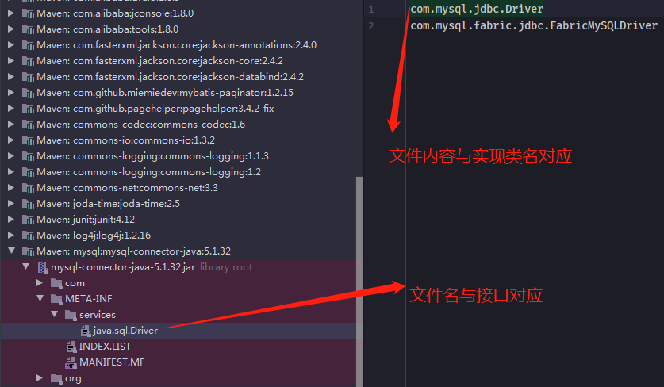

# 类加载器

## 概述

| 英文名称                | 中文名称       | 加载哪的类            | 说明                                      |
| ----------------------- | -------------- | --------------------- | ----------------------------------------- |
| Bootstrap ClassLoader   | 启动类加载器   | JAVA_HOME/jre/lib     | 无法直接访问                              |
| Extension ClassLoader   | 扩展类加载器   | JAVA_HOME/jre/lib/ext | 上级是 Bootstrap ClassLoader，显示为 null |
| Application ClassLoader | 应用类加载器   | classpath             | 上级是 Extension ClassLoader              |
|                         | 自定义类加载器 | 自定义                | 上级为 Application ClassLoader            |

## 启动类加载器

```java
package classload;

/**
 * @author mfh
 * @date 2020/1/26 12:14
 */
public class F {
    static {
        System.out.println("Bootstrap F init");
    }
}
```

```java
package classload;

/**
 * @author mfh
 * @date 2020/1/26 12:14
 */
public class Client {
    public static void main(String[] args) throws ClassNotFoundException {
        Class<?> clazz = Class.forName("classload.F");
        System.out.println(clazz.getClassLoader());
    }
}
```

使用 Java 命令操作，防止 idea 对输出路径的干扰

路径：/jvm/src/classload

1. 进入到 classload 文件夹里，使用 javac 编译 类 Client 、 F
   1. cd classload/
   2. javac Client.java
   3. javac F.java
2. 退至 src 目录
   1. cd ..
3. java -Xbootclasspath/a:. classload.Client
4.  输出：
   1. Bootstrap F init
   2. null

由概述可知，当获取到的类加载器为 null 时，便可得知此类是由 Bootstrap ClassLoader 加载的。

* -Xbootclasspath 表示设置 bootclasspath
* 其中 /a:. 表示将当前目录追加至 bootclasspath 之后
* 可以用这个办法替换核心类
  * java -Xbootclasspath:\<new bootclasspath\>
  * java -Xbootclasspath/a:<追加路径>
    * 后置追加
  * java -Xbootclasspath/p:<追加路径>
    * 前置追加，一般用于底层替换 jvm 核心类

## 扩展类加载器

```java
package classload;

/**
 * @author mfh
 * @date 2020/1/26 14:24
 */
public class G {
    static {
        System.out.println("G classpath init");
    }
}
```

```java
package classload;

/**
 * @author mfh
 * @date 2020/1/26 12:14
 */
public class Client {
    public static void main(String[] args) throws ClassNotFoundException {
        Class<?> aClass = Class.forName("classload.G");
        System.out.println(aClass.getClassLoader());
    }
}
```

输出

```java
G classpath init
sun.misc.Launcher$AppClassLoader@18b4aac2
```

由于类`G`存在于`classpath`下，所以使用的是应用程序类加载器。

写一个同名的类，同名只的是`包名 + 类名`

```java
package classload.load;

/**
 * @author mfh
 * @date 2020/1/26 14:30
 */
public class G {
    static {
        System.out.println("ext G init");
    }
}
```

打个 jar 包

1. `cd classload`
2. `javac G.java`
3. `cd ..`
4. jar -cvf my.jar classload/G.class

将`my.jar`拷贝到 `JAVA_HOME/jre/lib/ext`（扩展类加载器下面的必须是以`jar`包形式存在），再次执行`Client`的`main`方法，输出：

```java
G ext init
sun.misc.Launcher$ExtClassLoader@7ea987ac
```

由于双亲委派机制，当应用程序类加载器加载类`G`时，会首先询问它的上一级，也就是扩展类加载器有没有加载过类`G`，结果扩展类加载器在其类路径下发现了一个同名的类`G`，然后扩展类加载器就把类`G`加载了，所以应用程序类加载器就不会再加载类`G`了，所以打印出来的是扩展类加载器路径下的`my.jar`中类`G`的输出：`G ext init`，类G的加载器就是：`sun.misc.Launcher$ExtClassLoader@7ea987ac`。

## 双亲委派

### 概念

所谓的双亲委派，指的是调用类加载器的`loadClass`方法时，查找类的规则

### 源码分析

```java
protected Class<?> loadClass(String name, boolean resolve)
        throws ClassNotFoundException
    {
        synchronized (getClassLoadingLock(name)) {
            // 1、检查该类是否已经被加载
            Class<?> c = findLoadedClass(name);
            // 没有被加载过
            if (c == null) {
                long t0 = System.nanoTime();
                try {
                    if (parent != null) {
                        // 2、有上级的话，委派上级 loadClass
                        c = parent.loadClass(name, false);
                    } else {
                        // 3、没有上级了（Extension ClassLoader），则委派 Bootstrap ClassLoader	
                        c = findBootstrapClassOrNull(name);
                    }
                } catch (ClassNotFoundException e) {
                    // ClassNotFoundException thrown if class not found
                    // from the non-null parent class loader
                }

                if (c == null) {
                    long t1 = System.nanoTime();
                    // 4、每一层都找不到，调用 findClass 方法（每个类加载器自己扩展）来加载
                    c = findClass(name);

                    // 5、执行耗时
                    sun.misc.PerfCounter.getParentDelegationTime().addTime(t1 - t0);
                    sun.misc.PerfCounter.getFindClassTime().addElapsedTimeFrom(t1);
                    sun.misc.PerfCounter.getFindClasses().increment();
                }
            }
            if (resolve) {
                resolveClass(c);
            }
            return c;
        }
    }
```

`findClass`方法，对于扩展类加载器，就是去`JAVA_HOME/jre/lib/ext`路径下寻找要加载类；对于应用类加载器，到类路径下查找，如果是自己定义的类加载器，就到自己定义的类加载器的`findClass`实现的查找规则中查找类，如果找到了就返回，找不到就返回`ClassNotFound Exception`。

例如

```java
package classload;

    /**
     * @author mfh
     * @date 2020/1/26 12:14
     */
    public class Client {
        public static void main(String[] args) throws ClassNotFoundException {
            Class<?> aClass = Client.class.getClassLoader().loadClass("classload.H");
            System.out.println(aClass.getClassLoader());
        }
    }
```

执行流程为：

1. sun.misc.Launcher$AppClassLoader //1 处， 开始查看已加载的类，结果没有
2. sun.misc.Launcher\$AppClassLoader // 2 处，委派上级 `sun.misc.Launcher$ExtClassLoader.loadClass()`
3. sun.misc.Launcher$ExtClassLoader // 1 处，查看已加载的类，结果没有
4. 不存在上级，sun.misc.Launcher$ExtClassLoader.findBootstrapClassOrNull()，BootstrapClassLoader 是在 `JAVA_HOME/jre/lib` 下找 H 这个类，显然没有
5. sun.misc.Launcher\$ExtClassLoader // 4 处，调用自己的`findClass`方法，是在`JAVA_HOME/jre/lib/ext`下找 H 这个类，显然没有，回到`sun.misc.Launcher$AppClassLoader`的 // 2 处
6. 继续执行到 sun.misc.Launcher$AppClassLoader // 4 处，调用它自己的`findClass`方法，在`classpath`下查找，找到了

## 线程上下文类加载器

我们在使用`JDBC`时，都需要加载`Driver`驱动，不知道你注意到没有，不写`Class.forName("com.mysql.jdbc.Driver")`也是可以让`com.mysql.jdbc.Driver`正确加载的，你知道是怎么做的吗？	

```java
public class DriverManager {
	// 注册驱动的集合
	private final static CopyOnWriteArrayList<DriverInfo> registeredDrivers = new CopyOnWriteArrayList<>();
	// 初始化驱动
	static {
		loadInitialDrivers();
		println("JDBC DriverManager initialized");
	}
```

先不看别的，看看`DriverManager`的类加载器：

`System.out.println(DriverManager.class.getClassLoader());`

打印 null，表示它的类加载器是`Bootstrap ClassLoader`，会到 JAVA_HOME/jre/lib 下搜索类，但`JAVA_HOME/jre/lib`下显然没有`mysql-connector-java-5.1.47.jar`包，这样问题来了，在`DriverManager`的静态代码块中，怎么能正确加载`com.mysql.jdbc.Driver`呢？

继续看`loadInitialDrivers()`方法：

```java
    private static void loadInitialDrivers() {
        String drivers;
        try {
            drivers = AccessController.doPrivileged(new PrivilegedAction<String>() {
                public String run() {
                    return System.getProperty("jdbc.drivers");
                }
            });
        } catch (Exception ex) {
            drivers = null;
        }
      	// 使用 ServiceLoader 机制加载驱动，即 SPI
        AccessController.doPrivileged(new PrivilegedAction<Void>() {
            public Void run() {

                ServiceLoader<Driver> loadedDrivers = ServiceLoader.load(Driver.class);
                Iterator<Driver> driversIterator = loadedDrivers.iterator();
                try{
                    while(driversIterator.hasNext()) {
                        driversIterator.next();
                    }
                } catch(Throwable t) {
                // Do nothing
                }
                return null;
            }
        });

        println("DriverManager.initialize: jdbc.drivers = " + drivers);
		// 2）使用 jdbc.drivers 定义的驱动名加载驱动
        if (drivers == null || drivers.equals("")) {
            return;
        }
        String[] driversList = drivers.split(":");
        println("number of Drivers:" + driversList.length);
        for (String aDriver : driversList) {
            try {
                println("DriverManager.Initialize: loading " + aDriver);
                // 这里的 ClassLoader.getSystemClassLoader() 就是应用程序类加载器
                Class.forName(aDriver, true, ClassLoader.getSystemClassLoader());
            } catch (Exception ex) {
                println("DriverManager.Initialize: load failed: " + ex);
            }
        }
    }
```

### 第一部分

发现它最后是使用`Class.forName`完成类的加载和初始化，关联的是应用程序类加载器，因此可以顺利完成类加载。

通过`ClassLoader.getSystemClassLoader()`得知，`JDK`打破了这一约定，按道理来说，应该使用启动类加载器（Bootstrap  ClassLoader）来加载类，但是这里如果使用启动类加载器，肯定是加载不到任何东西的，因为`mysql`驱动并没有在`JAVA_HOME/jre/lib`路径下，而是在`classpath`路径下。所以这里为了能加载到`mysql`驱动包，**`JDK`打破了双亲委派模式**，使用了应用程序类加载器（AppClassLoader）。其实`SPI`中，肯定也使用了应用程序类加载器，下面我们来看看。

### 第二部分 SPI



约定如下，在 jar 包的 META-INF/services 包下，以接口全限定名名为文件，文件内容是实现类名称。

这样就可以使用

```java
ServiceLoader<接口类型> allImpls = ServiceLoader.load(接口类型.class);
Iterator<接口类型> iter = allImpls.iterator();
while(iter.hasNext()) {
	iter.next();
}
```

来得到实现类，体现的是【面向接口编程+解耦】的思想，在下面一些框架中都运用了此思想：

* JDBC
* Servlet 初始化器
* Spring 容器
* Dubbo（对 SPI 进行了扩展）

接着看 ServiceLoader.load 方法：

```java
public static <S> ServiceLoader<S> load(Class<S> service) {
	// 获取线程上下文类加载器
	ClassLoader cl = Thread.currentThread().getContextClassLoader();
	return ServiceLoader.load(service, cl);
}
```

线程上下文类加载器是当前线程使用的类加载器，默认就是应用程序类加载器（它是在每个线程启动时，由`JVM`把应用程序类加载器赋值给当前线程），它内部又是由`Class.forName`调用了线程上下文类加载器完成类加载，具体代码在`ServiceLoader`的内部类`LazyIterator`中：

```java
        private S nextService() {
            if (!hasNextService())
                throw new NoSuchElementException();
            String cn = nextName;
            nextName = null;
            Class<?> c = null;
            try {
                c = Class.forName(cn, false, loader);
            } catch (ClassNotFoundException x) {
                fail(service,
                     "Provider " + cn + " not found");
            }
            if (!service.isAssignableFrom(c)) {
                fail(service,
                     "Provider " + cn  + " not a subtype");
            }
            try {
                S p = service.cast(c.newInstance());
                providers.put(cn, p);
                return p;
            } catch (Throwable x) {
                fail(service,
                     "Provider " + cn + " could not be instantiated",
                     x);
            }
            throw new Error();          // This cannot happen
        }
```

当`DriverManager`的静态代码块执行时，虽然`DriverManager`本身使用的是启动类加载器加载的，但是`ServiceLoader`内部使用的是线程上下文类加载器，也是破坏了双亲委派机制。

>参考：https://www.jianshu.com/p/27c837293aeb

## 自定义类加载器

### 使用场景

1. 想加载非 classpath 随意路径中的类文件
2. 都是通过接口来使用实现，希望解耦时，常用在框架设计
3. 这些类希望予以隔离，不同应用的同名类都可以加载，不冲突，常见于 tomcat 容器

### 步骤

1. 继承 ClassLoader 父类
2. 要遵从双亲委派机制，重写 findClass 方法
  * 注意不是重写 loadClass 方法，否则不会走双亲委派机制
3. 读取类文件的字节码
4. 调用父类的 defineClass 方法来加载类
5. 使用者调用该类加载器的 loadClass 方法

### 示例

```java
package classload;

/**
 * @author mfh
 * @date 2020/1/27 17:04
 */
public class A {
    private int i = 0;
    static {
        System.out.println("A init");
    }
}
```

将类`A.java`编译后的`A.class`拷贝到`E:/test`文件夹中。

```java
package classload;

import java.io.ByteArrayOutputStream;
import java.io.IOException;
import java.nio.file.Files;
import java.nio.file.Paths;

/**
 * @author mfh
 * @date 2020/1/27 22:09
 */
public class MyClassLoader extends ClassLoader {
    @Override
    protected Class<?> findClass(String name) throws ClassNotFoundException {
        String fileName = getFileName(name);
        String path = "E:\\test\\" + fileName + ".class";
        try {
            ByteArrayOutputStream os = new ByteArrayOutputStream();
            Files.copy(Paths.get(path), os);

            // 得到字节数组
            byte[] bytes = os.toByteArray();

            // byte[] -> *.class
            return defineClass(name, bytes, 0, bytes.length);

        } catch (IOException e) {
            e.printStackTrace();
            throw new ClassNotFoundException("类文件未找到", e);
        }
    }

    /**
     * classload.A -> A
     * @param name
     * @return
     */
    private String getFileName(String name) {
        return name.substring(name.lastIndexOf(".") + 1);
    }
}

```

```java
package classload;

import org.junit.Test;

/**
 * @author mfh
 * @date 2020/1/27 17:35
 */
public class Load {
    @Test
    public void fun() throws ClassNotFoundException {
        MyClassLoader classLoader = new MyClassLoader();
        // classload.A 为全类名，必须为全类名
        Class<?> c1 = classLoader.loadClass("classload.A");
        Class<?> c2 = classLoader.loadClass("classload.A");
        System.out.println(c1 == c2); // true
    }
}
```

`c1`与`c2`是相同类对象，它们都是用的同一个类加载器对象加载的，并且加载的类也是同一个，所以得到的类对象肯定一样。这也说明了，类对象相等，要满足两个条件：

1. 相同的类
2. 相同的类加载器

下面验证相同的类，被不同的类加载器加载的情况：

```java
package classload;

import org.junit.Test;

/**
 * @author mfh
 * @date 2020/1/27 17:35
 */
public class Load {
    @Test
    public void fun() throws ClassNotFoundException {
        MyClassLoader classLoader = new MyClassLoader();
        Class<?> c1 = classLoader.loadClass("classload.A");
        MyClassLoader classLoader1 = new MyClassLoader();
        Class<?> c2 = classLoader1.loadClass("classload.A");
        System.out.println(c1 == c2); // false
    }
}
```

相同的类，被不同的类加载器加载，得到的类对象是不一样的。

下面验证创建类实例对象的情况：

```java
package classload;

import org.junit.Test;

/**
 * @author mfh
 * @date 2020/1/27 17:35
 */
public class Load {
    @Test
    public void fun() throws ClassNotFoundException, IllegalAccessException, InstantiationException {
        MyClassLoader classLoader = new MyClassLoader();
        Class<?> c1 = classLoader.loadClass("classload.A");
        c1.newInstance();
    }
}
```

控制台会输出`A init`，由于类`A`的静态块中输出了`A init`，`c1.newInstance()`会触发类初始化，所以执行静态块语句，所以会输出`A init`。
