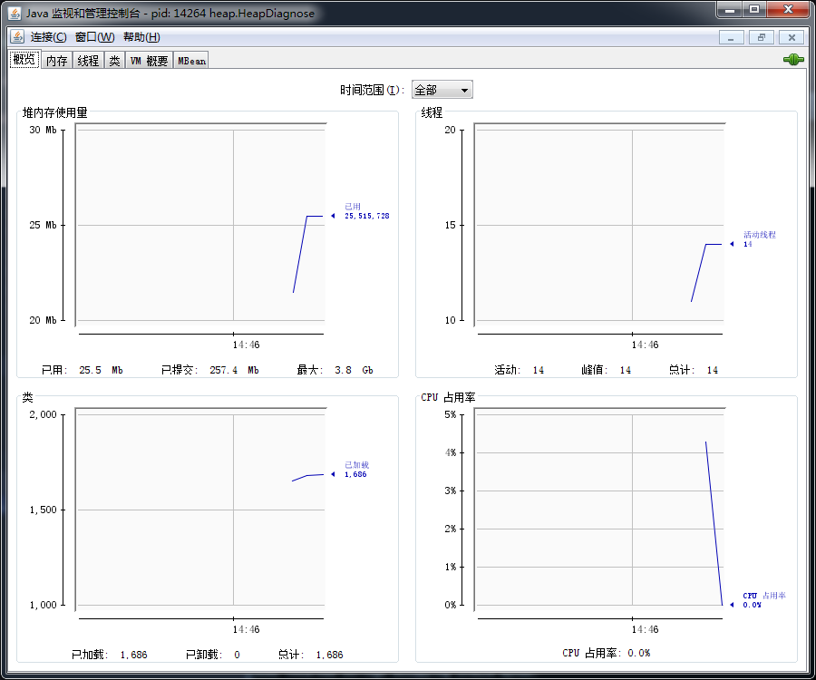
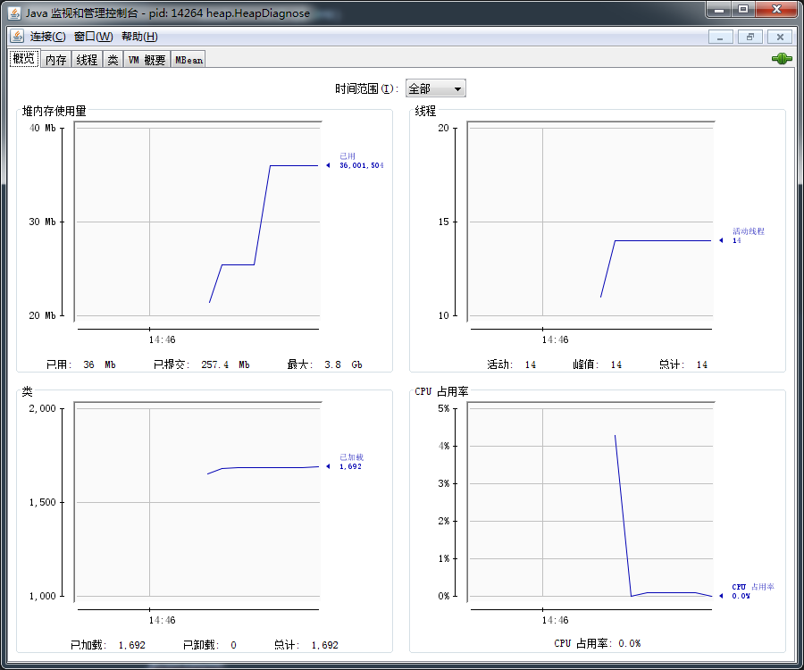
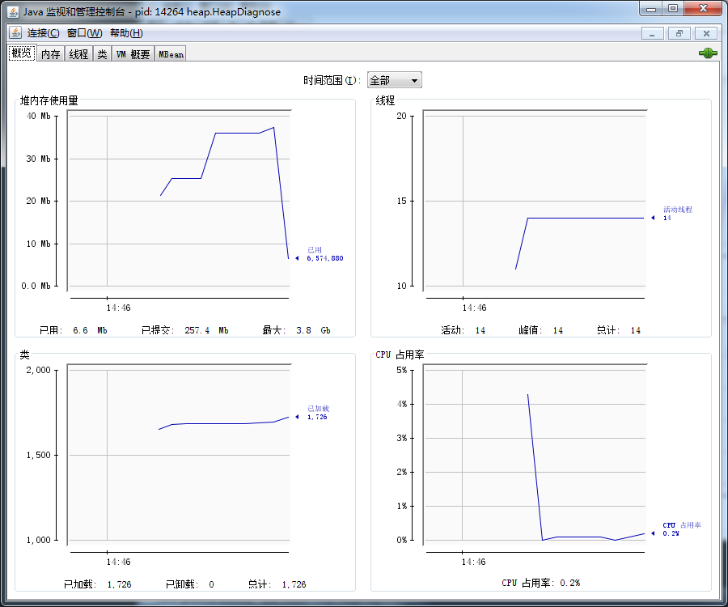
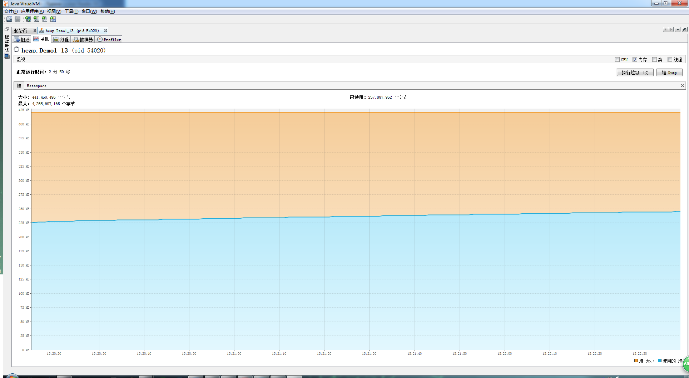
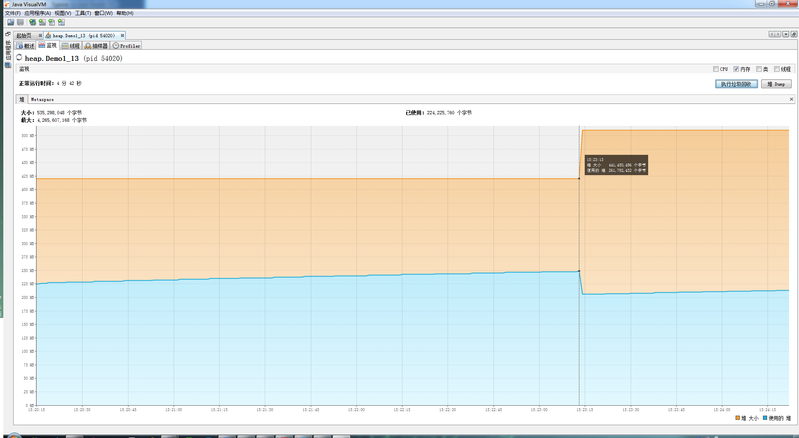
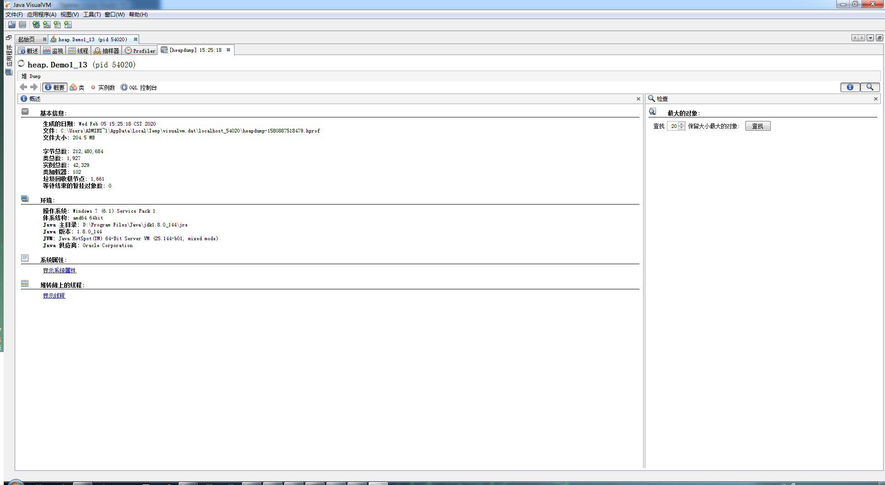
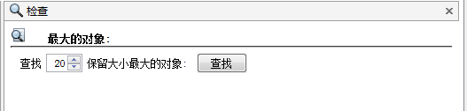
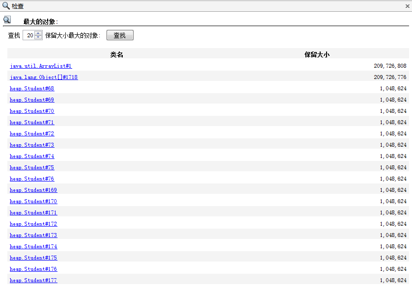
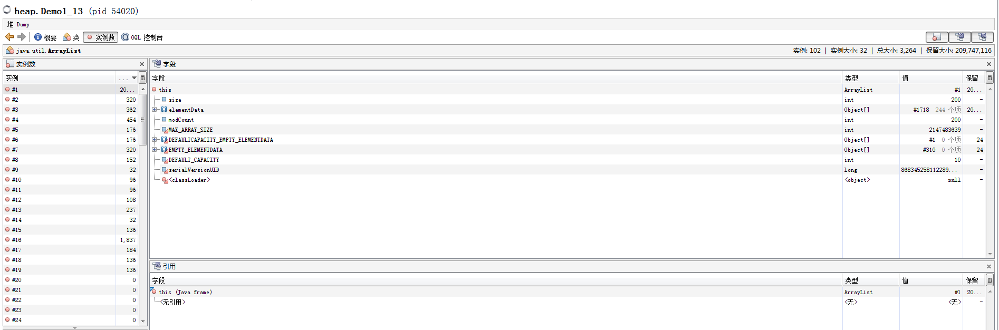
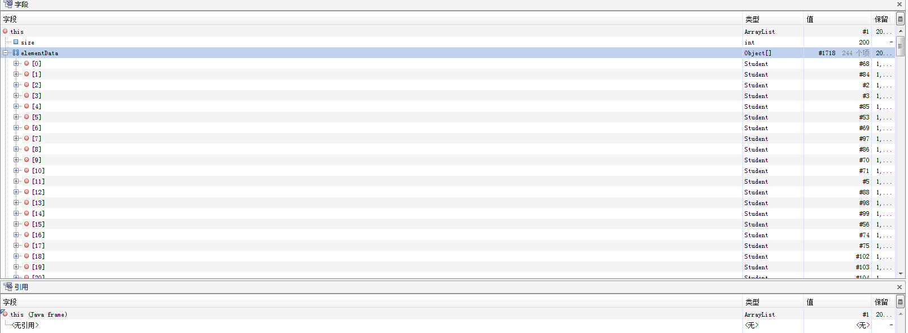

# 堆内存诊断

源码

```java
public class HeapDiagnose {
    public static void main(String[] args) throws InterruptedException {
        System.out.println("1...");
        Thread.sleep(30000);
        // 10 Mb
        byte[] array = new byte[1024 * 1024 * 10];
        System.out.println("2...");
        Thread.sleep(20000);
        array = null;
        System.gc();
        System.out.println("3...");
        Thread.sleep(1000000L);
    }
}
```

通过使用以下工具，分析上面的代码。

## jps

首先运行主方法，然后使用 `jps` 命令查看进程：

```java
$ jps
40352 Jps
47664 KotlinCompileDaemon
47284 Launcher
6084
12844 Launcher
39820 HeapDiagnose
```

可以看到进程 ID 为 39820

## jmap

使用 `jmap -heap 39820` 命令查看内存使用情况（要在30秒内输入完成，根据以上代码可以看出，过了30秒后就会分配10mb大小的字节数组，所以要先观察创建字节数组前的内存情况）

分配前：

```java
Heap Configuration:
   MinHeapFreeRatio         = 0
   MaxHeapFreeRatio         = 100
   MaxHeapSize              = 4265607168 (4068.0MB)
   NewSize                  = 89128960 (85.0MB)
   MaxNewSize               = 1421869056 (1356.0MB)
   OldSize                  = 179306496 (171.0MB)
   NewRatio                 = 2
   SurvivorRatio            = 8
   MetaspaceSize            = 21807104 (20.796875MB)
   CompressedClassSpaceSize = 1073741824 (1024.0MB)
   MaxMetaspaceSize         = 17592186044415 MB
   G1HeapRegionSize         = 0 (0.0MB)

Heap Usage:
PS Young Generation
Eden Space:
   capacity = 67108864 (64.0MB)
   used     = 6720424 (6.409095764160156MB)
   free     = 60388440 (57.590904235839844MB)
   10.014212131500244% used
From Space:
   capacity = 11010048 (10.5MB)
   used     = 0 (0.0MB)
   free     = 11010048 (10.5MB)
   0.0% used
To Space:
   capacity = 11010048 (10.5MB)
   used     = 0 (0.0MB)
   free     = 11010048 (10.5MB)
   0.0% used
PS Old Generation
   capacity = 179306496 (171.0MB)
   used     = 0 (0.0MB)
   free     = 179306496 (171.0MB)
   0.0% used
```

分配后：

```java
Heap Configuration:
   MinHeapFreeRatio         = 0
   MaxHeapFreeRatio         = 100
   MaxHeapSize              = 4265607168 (4068.0MB)
   NewSize                  = 89128960 (85.0MB)
   MaxNewSize               = 1421869056 (1356.0MB)
   OldSize                  = 179306496 (171.0MB)
   NewRatio                 = 2
   SurvivorRatio            = 8
   MetaspaceSize            = 21807104 (20.796875MB)
   CompressedClassSpaceSize = 1073741824 (1024.0MB)
   MaxMetaspaceSize         = 17592186044415 MB
   G1HeapRegionSize         = 0 (0.0MB)

Heap Usage:
PS Young Generation
Eden Space:
   capacity = 67108864 (64.0MB)
   used     = 17206200 (16.40911102294922MB)
   free     = 49902664 (47.59088897705078MB)
   25.639235973358154% used
From Space:
   capacity = 11010048 (10.5MB)
   used     = 0 (0.0MB)
   free     = 11010048 (10.5MB)
   0.0% used
To Space:
   capacity = 11010048 (10.5MB)
   used     = 0 (0.0MB)
   free     = 11010048 (10.5MB)
   0.0% used
PS Old Generation
   capacity = 179306496 (171.0MB)
   used     = 0 (0.0MB)
   free     = 179306496 (171.0MB)
   0.0% used
```

释放后：

```java
Heap Configuration:
   MinHeapFreeRatio         = 0
   MaxHeapFreeRatio         = 100
   MaxHeapSize              = 4265607168 (4068.0MB)
   NewSize                  = 89128960 (85.0MB)
   MaxNewSize               = 1421869056 (1356.0MB)
   OldSize                  = 179306496 (171.0MB)
   NewRatio                 = 2
   SurvivorRatio            = 8
   MetaspaceSize            = 21807104 (20.796875MB)
   CompressedClassSpaceSize = 1073741824 (1024.0MB)
   MaxMetaspaceSize         = 17592186044415 MB
   G1HeapRegionSize         = 0 (0.0MB)

Heap Usage:
PS Young Generation
Eden Space:
   capacity = 67108864 (64.0MB)
   used     = 1342200 (1.2800216674804688MB)
   free     = 65766664 (62.71997833251953MB)
   2.0000338554382324% used
From Space:
   capacity = 11010048 (10.5MB)
   used     = 0 (0.0MB)
   free     = 11010048 (10.5MB)
   0.0% used
To Space:
   capacity = 11010048 (10.5MB)
   used     = 0 (0.0MB)
   free     = 11010048 (10.5MB)
   0.0% used
PS Old Generation
   capacity = 179306496 (171.0MB)
   used     = 1039928 (0.9917526245117188MB)
   free     = 178266568 (170.00824737548828MB)
   0.5799722950360928% used
```

分配前：

Eden Space：used  = 6720424 (6.409095764160156MB)

分配后：

Eden Space：used  = 17206200 (16.40911102294922MB)

释放后：

Eden Space：used   = 1342200 (1.2800216674804688MB)

可见分配后比分配前多出10mb内存占用，释放后内存占用减少了很多，分配的10mb内存也被释放了。

## jconsole

图形界面，多功能监测工具，可连续监测

观察**堆内存使用量**

分配前：



分配后：



释放后：



## jvisualvm

使用 jvisualvm 工具分析实际案例

案例描述：垃圾回收后，内存占用仍然很高

使用 `jvisualvm.exe` 命令打开 jvisualvm



点击【执行垃圾回收】按钮



由上图可知，执行完垃圾回收后，内存得到释放，但效果不明显。

点击【堆 Dump】按钮





点击【查找】按钮



由上图可知，占用内存最大的对象是 ArrayList，大小约200mb，点击进入观察



展开 elementData



由上图可知，集合中装着 Student 对象，数量为200，由此可推测出是这些 Student 对象导致的内存占用，下面来看源码：

```java
package heap;

import java.util.ArrayList;
import java.util.List;

/**
 * 演示查看对象个数 堆转储 dump
 */
public class HeapDump {

    public static void main(String[] args) throws InterruptedException {
        List<Student> students = new ArrayList<>();
        for (int i = 0; i < 200; i++) {
            students.add(new Student());
        }
        Thread.sleep(1000000000L);
    }
}
class Student {
    private byte[] big = new byte[1024*1024];
}

```

源码中果然是将 Student 对象装进了集合中，数量为200，每一个 Student 对象持有1mb的字节数组引用，并且这些 Student 对象一直得不到释放。

以上均与推测吻合。