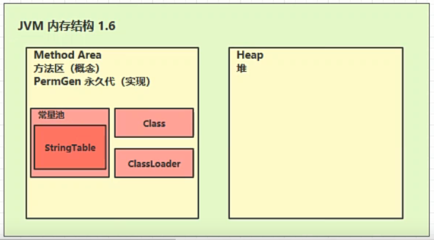
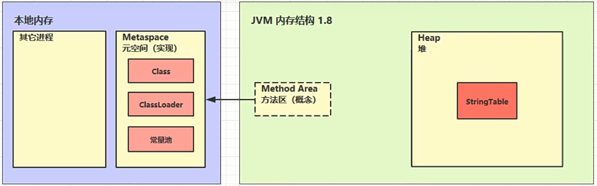

# StringTable位置

## jdk1.6



1.6版本时，`String table` 是常量池的一部分，存放于永久代

## jdk18



1.8版本，`String table` 被转移到了堆中

为什么会有这种改变呢？永久代的数据必须`Full GC`时才能被回收，而`Full GC`要等到老年代满时才会执行。现在的项目中，充斥着大量的字符串对象，`String table`的使用很频繁，所以如果不能及时回收，就会造成大量的内存占用，基于这个缺点，1.8就将`String table`放到了堆中，而堆的垃圾回收是很频繁的。

下面通过代码先来证明1.6版本时，`String table`存在于永久代，在证明1.8版本时存在于堆中，具体做法是，通过添加大量的字符串对象，使对应的区域产生内存溢出。

## 示例（一）

```java
public class Demo {
    public static void main(String[] args) {
        int count = 0;
        int num = 26 * 10000;
        List<String> list = new ArrayList<String>();
        try {
            for (int i = 0; i < num; i++) {
                list.add(String.valueOf(i).intern());
                count++;
            }
        } catch (Exception e) {
            e.printStackTrace();
        } finally {
            System.out.println(count);
        }
    }
}
```

将永久代空间调小（-XX:MaxPermSize=10m），并运行代码

```java
Exception in thread "main" java.lang.OutOfMemoryError: PermGen space
	at java.lang.String.intern(Native Method)
	at Demo.main(Demo.java from InputFileObject:15)
```

运行一会后将会看见以上报错信息，`java.lang.OutOfMemoryError: PermGen space`永久代内存溢出。

## 示例（二）

下面是1.8版本，代码与1.6一模一样

```java
public class Demo {
    public static void main(String[] args) {
        int count = 0;
        int num = 26 * 10000;
        List<String> list = new ArrayList<String>();
        try {
            for (int i = 0; i < num; i++) {
                list.add(String.valueOf(i).intern());
                count++;
            }
        } catch (Exception e) {
            e.printStackTrace();
        } finally {
            System.out.println(count);
        }
    }
}
```

```java
Exception in thread "main" java.lang.OutOfMemoryError: GC overhead limit exceeded
	at java.lang.Integer.toString(Integer.java:403)
	at java.lang.String.valueOf(String.java:3099)
	at string.Demo.main(Demo.java:17)
```

注意，报错信息虽然也是`OutOfMemoryError`，但并不是我们想象的，出现`heap space...`，而是`GC overhead limit exceeded`，是超过了某种限制导致的内存不足。为什么呢？

官方解释

>-XX:+UseGCOverheadLimit
>
>Enables the use of a policy that limits the proportion of time spent by the JVM on GC before an `OutOfMemoryError` exception is thrown. This option is enabled, by default and the parallel GC will throw an `OutOfMemoryError` if more than 98% of the total time is spent on garbage collection and less than 2% of the heap is recovered. When the heap is small, this feature can be used to prevent applications from running for long periods of time with little or no progress. To disable this option, specify `-XX:-UseGCOverheadLimit`.


`if more than 98% of the total time is spent on garbage collection and less than 2% of the heap is recovered：花费98%的时间进行垃圾回收，但只有2%被回收了。说明虚拟机已经到了无可救药的地步。然后就会报出这个错误，如果不想报这个错误，就使用以下命令关闭它。

`-XX:-UseGCOverheadLimit`

然后再运行代码，出现了堆内存溢出错误。

```java
Exception in thread "main" java.lang.OutOfMemoryError: Java heap space
	at string.Demo.main(Demo.java:23)
```

## 结论

* 1.6版本时，`String table` 是常量池的一部分，存放于永久代
* 1.8版本，`String table` 被转移到了堆中