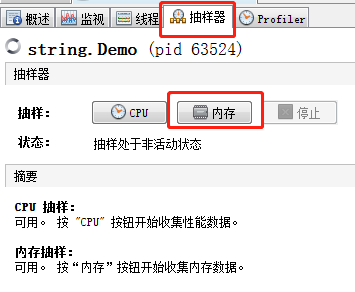
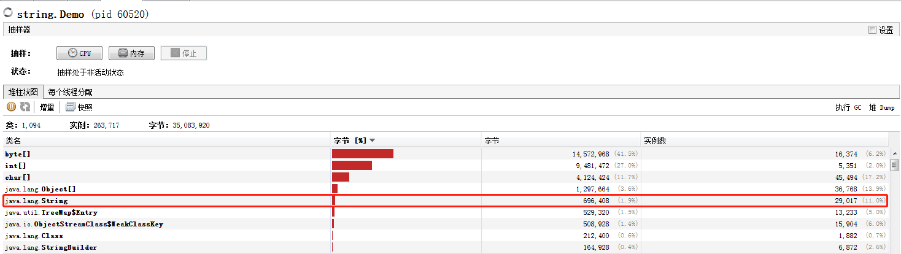
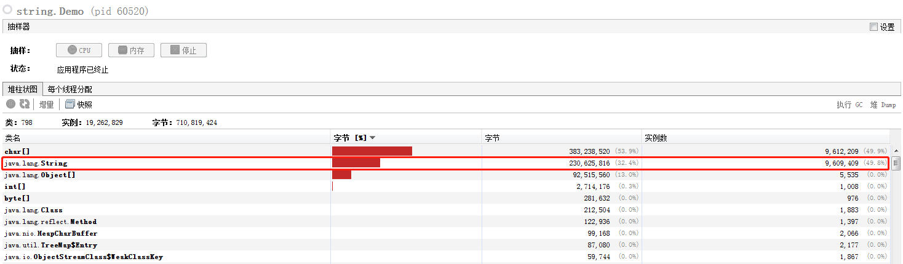
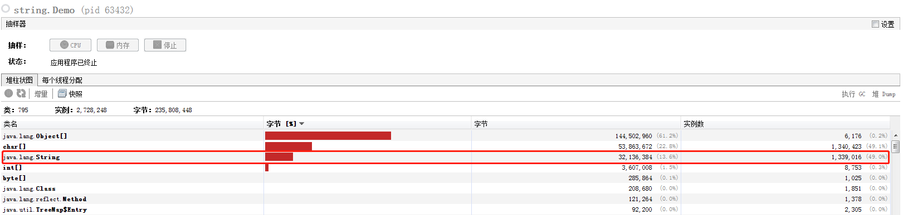

# String table 性能调优

## 性能调优

`String table` 的底层实现类似于`HashTable`，既然是哈希表，那么它的速度与大小密切相关。如果哈希表桶的个数比较多，那么元素就会比较分散，那么哈希碰撞的几率会减少，查找的速度就会变快；反之桶的个数少，哈希碰撞几率升高，导致链表较长，查找速度就会受到影响（存放字符串时，要先在哈希表里查找，看有没有这个字符串，如果有，那就不能放，因为要保证`StringTale`字符串唯一性）。

### 示例

下面在通过一个案例演示下调优的过程，其实**主要就是调整桶的个数**。

```java
public class Demo {
    public static void main(String[] args) {
        try (BufferedReader reader = new BufferedReader(new InputStreamReader(new FileInputStream(new File("E:/test/t.txt")), "utf-8"))) {
            String line;
            long start = System.nanoTime();
            while ((line = reader.readLine()) != null) {
                line.intern();
            }
            System.out.println("cost:" + (System.nanoTime() - start) / (100 * 10000) );
        } catch (IOException e) {
            e.printStackTrace();
        }
    }
}
```

```java
cost:1181
[GC (Allocation Failure) [PSYoungGen: 65536K->847K(76288K)] 65536K->855K(251392K), 0.1190819 secs] [Times: user=0.13 sys=0.00, real=0.12 secs] 
Heap
 PSYoungGen      total 76288K, used 3469K [0x000000076b400000, 0x0000000774900000, 0x00000007c0000000)
  eden space 65536K, 4% used [0x000000076b400000,0x000000076b68f768,0x000000076f400000)
  from space 10752K, 7% used [0x000000076f400000,0x000000076f4d3cc0,0x000000076fe80000)
  to   space 10752K, 0% used [0x0000000773e80000,0x0000000773e80000,0x0000000774900000)
 ParOldGen       total 175104K, used 8K [0x00000006c1c00000, 0x00000006cc700000, 0x000000076b400000)
  object space 175104K, 0% used [0x00000006c1c00000,0x00000006c1c02000,0x00000006cc700000)
 Metaspace       used 3374K, capacity 4592K, committed 4864K, reserved 1056768K
  class space    used 357K, capacity 424K, committed 512K, reserved 1048576K
Disconnected from the target VM, address: '127.0.0.1:0', transport: 'socket'
SymbolTable statistics:
Number of buckets       :     20011 =    160088 bytes, avg   8.000
Number of entries       :     13842 =    332208 bytes, avg  24.000
Number of literals      :     13842 =    597776 bytes, avg  43.186
Total footprint         :           =   1090072 bytes
Average bucket size     :     0.692
Variance of bucket size :     0.693
Std. dev. of bucket size:     0.833
Maximum bucket size     :         6
StringTable statistics:
Number of buckets       :     60013 =    480104 bytes, avg   8.000
Number of entries       :      1749 =     41976 bytes, avg  24.000
Number of literals      :      1749 =    157728 bytes, avg  90.182
Total footprint         :           =    679808 bytes
Average bucket size     :     0.029
Variance of bucket size :     0.029
Std. dev. of bucket size:     0.171
Maximum bucket size     :         2
```

由以上信息得知，在默认桶数量时。共花费大约1.1秒（`cost:1181`），桶个数为60013。

使用`-XX:StringTableSize=1099`，将桶个数调整为1099个，然后再次运行。

```java
cost:38284
Heap
 PSYoungGen      total 76288K, used 2900K [0x000000076b400000, 0x0000000770900000, 0x00000007c0000000)
  eden space 65536K, 2% used [0x000000076b400000,0x000000076b5ab2e0,0x000000076f400000)
  from space 10752K, 11% used [0x000000076f400000,0x000000076f52a020,0x000000076fe80000)
  to   space 10752K, 0% used [0x000000076fe80000,0x000000076fe80000,0x0000000770900000)
 ParOldGen       total 175104K, used 8K [0x00000006c1c00000, 0x00000006cc700000, 0x000000076b400000)
  object space 175104K, 0% used [0x00000006c1c00000,0x00000006c1c02000,0x00000006cc700000)
 Metaspace       used 4016K, capacity 4572K, committed 4864K, reserved 1056768K
  class space    used 440K, capacity 460K, committed 512K, reserved 1048576K
SymbolTable statistics:
Number of buckets       :     20011 =    160088 bytes, avg   8.000
Number of entries       :     16762 =    402288 bytes, avg  24.000
Number of literals      :     16762 =    690664 bytes, avg  41.204
Total footprint         :           =   1253040 bytes
Average bucket size     :     0.838
Variance of bucket size :     0.836
Std. dev. of bucket size:     0.914
Maximum bucket size     :         6
StringTable statistics:
Number of buckets       :      1099 =      8792 bytes, avg   8.000
Number of entries       :      5820 =    139680 bytes, avg  24.000
Number of literals      :      5820 =    428880 bytes, avg  73.691
Total footprint         :           =    577352 bytes
Average bucket size     :     5.296
Variance of bucket size :     4.893
Std. dev. of bucket size:     2.212
Maximum bucket size     :        13
```

`cost:38284`，大约花费38秒。

### 优化建议

由此可见，桶的个数还是很影响效率的，所以如果项目中存在大量字符串常量，建议可以适当的将`StirngTable`个数调的大一些，有更好的哈希分布，减少哈希冲突，减小链表长度，减少查表时间。串池效率就会提升。

## 使用`intern`优化内存

话说如果存在大量重复的字符串，这些字符串全部都放在堆内存，势必会占用大量的堆内存。但如果使用了`intern`方法，基于串池的特性，重复的字符串对象不会入池，会节省堆空间。

### 示例

观察内存情况，使用`jvisualvm.exe`工具中的抽样器（其实不光是抽样器可以看到内存占用情况，其他的也可以）

```java
/** -XX:+PrintStringTableStatistics -XX:+PrintGCDetails -verbose:gc -XX:StringTableSize=20000 */
public class Demo {
    public static void main(String[] args) throws IOException {
        List<String> list = new ArrayList<>();
        System.in.read();
        for (int k = 0; k < 10; k++) {
            try (BufferedReader reader = new BufferedReader(new InputStreamReader(new FileInputStream(new File("E:/test/t.txt")), "utf-8"))) {
                String line;
                long start = System.nanoTime();
                while ((line = reader.readLine()) != null) {
                    // 防止字符串被垃圾回收，将其放在集合中，保证有引用一直指向它们
                    list.add(line);
                }
                System.out.println("cost:" + (System.nanoTime() - start) / (100 * 10000) );
            } catch (IOException e) {
                e.printStackTrace();
            }
        }
        System.in.read();
    }
}
```



先选择抽样器，然后点击【内存】按钮，等取一会样，点击【停止】按钮。



以上是代码还没有执行到循环时的内存中字符串占用情况，下图是执行后的情况。



由图可见，差别还是很大的，由`696,408`涨到了`230,625,816`

使用`intern`后的效果



由之前的`230,625,816`降到了`32,136,384`，效果还是很明显的。所以`intern`方法的合理使用，会减少字符串对象个数，从而减少堆内存的占用。

