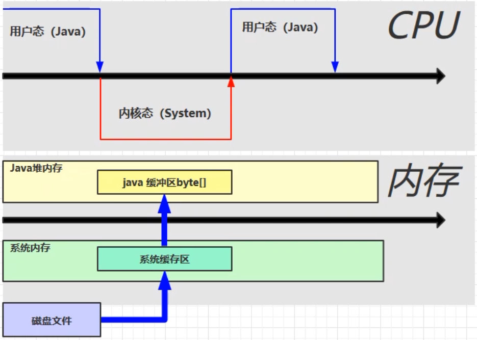
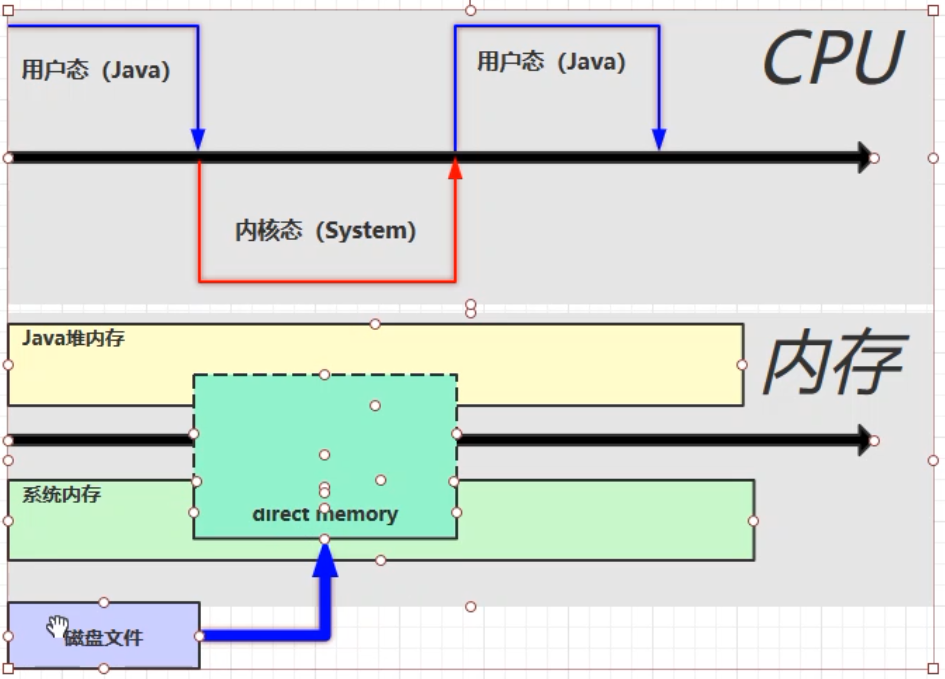
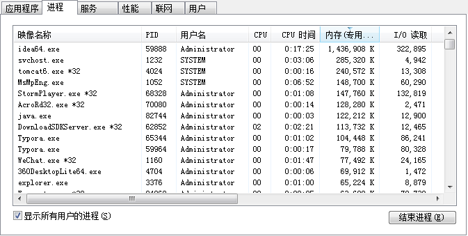
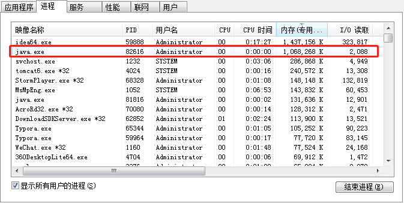
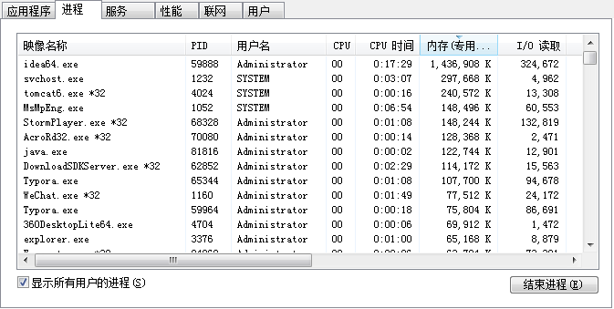
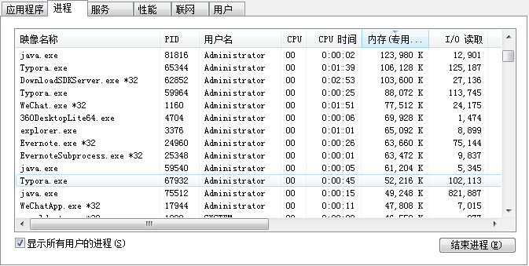
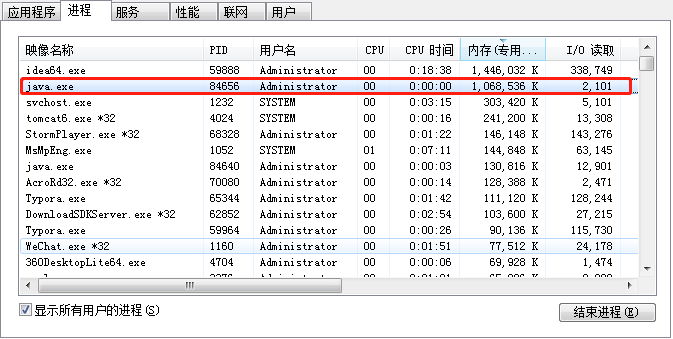
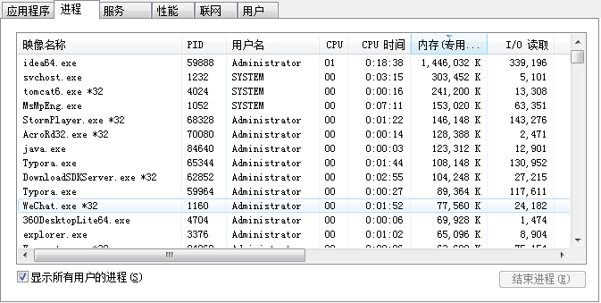
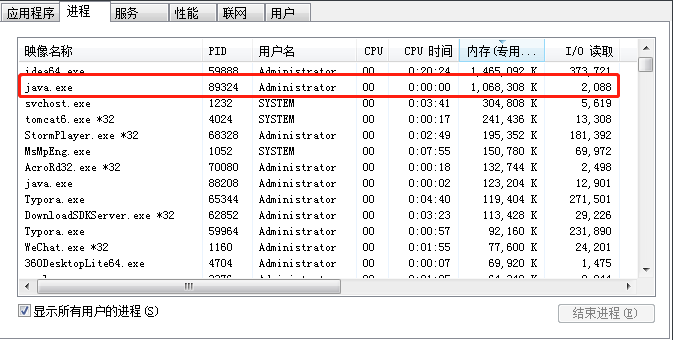

# Direct Memory 直接内存

## 定义

* 常见于`NIO（ByteBuffer）`操作时，用于数据缓冲区，占用操作系统内存
* 分配回收成本较高，但读写性能高
* 不受`JVM`内存回收管理

## 示例

### 对比 IO 与 NIO 的速度差异

```java
public class Demo {
    // 文件大小：1.19GB
    private final static String FROM = "E:/test/testVideo.wmv";
    private final static String TO = "F:/test/a.wmv";
    static final int ONE_MB = 1024 * 1024;
    private static void io() {
        long start = System.nanoTime();
        try (InputStream in = new FileInputStream(new File(FROM));
            OutputStream out = new FileOutputStream(new File(TO))) {
            byte[] b = new byte[ONE_MB];
            int length;
            while ((length = in.read(b)) != -1) {
                out.write(b, 0, length);
            }
        } catch (IOException e) {
            e.printStackTrace();
        }
        long end = System.nanoTime();
        System.out.println("io 耗时：" + (end - start) / 1000_000.0);
    }

    private static void nio() {
        long start = System.nanoTime();
        try (final FileChannel inChannel = new FileInputStream(FROM).getChannel(); final FileChannel outChannel = new FileOutputStream(TO).getChannel()) {
            // ByteBuffer 分配读写缓冲区
            final ByteBuffer bb = ByteBuffer.allocateDirect(ONE_MB);
            while (inChannel.read(bb) != -1) {
                bb.flip();
                outChannel.write(bb);
                bb.clear();
            }
        } catch (IOException e) {
            e.printStackTrace();
        }
        long end = System.nanoTime();
        System.out.println("nio 耗时：" + (end - start) / 1000_000.0);
    }
    public static void main(String[] args) {
        io();
        nio();
    }
}
```

```java
多运行几次取平均值
io 耗时：2888.036584
nio 耗时：938.028544
```

### 结论

`NIO`速度快

## NIO 高效的原因

### IO 内存图



`java`本身是不能读取文件的，它是通过调用本地方法（Native Method）操作的文件。而在调用本地方法时，`CPU`的状态也会发生改变，会由`用户态`切换为`内核态`。

当切换为内核态时，就可以由`CPU`函数读取磁盘文件了。此时会在系统内存划分出一块`系统缓存区`，磁盘的文件内容分次读取到系统缓存区。`java`会在堆内存创建缓冲区（代码中的`new byte[1m]`），将数据在从系统缓冲区读取到`java`缓冲区，然后`CPU`状态变为用户态再去调用输出流的写入操作。然后这么反复的读写读写，直到将文件存储到目标位置。

由于有两块缓冲区，读取时必然存在数据要存两份，要有`java`缓冲区把数据从系统缓冲区读取进来的过程，时间主要就花费在这个过程上。

### NIO 内存图（直接内存）



当调用了`ByteBuffer.allocateDirect(ONE_MB)`之后，系统会分配出一块`直接内存（direct memory）`，这块内存`java`代码可以直接访问，比刚才两块缓冲区时就少了缓冲区的复制操作，所以速度就有了提升，这就是直接内存带来的好处，它很擅长做文件的`IO`操作。

## 直接内存溢出

### 示例

```java
public class Demo_1 {
    final static int HUNDRED_MB = 1024 * 1024 * 100;
    public static void main(String[] args) {
        List<ByteBuffer> list = new ArrayList<>();
        int i = 0;
        try {
            while (true) {
                final ByteBuffer byteBuffer = ByteBuffer.allocateDirect(HUNDRED_MB);
                list.add(byteBuffer);
                i++;
            }
        } finally {
            System.out.println(i);
        }
    }
}
```

```java
36
Exception in thread "main" java.lang.OutOfMemoryError: Direct buffer memory
	at java.nio.Bits.reserveMemory(Bits.java:694)
	at java.nio.DirectByteBuffer.<init>(DirectByteBuffer.java:123)
	at java.nio.ByteBuffer.allocateDirect(ByteBuffer.java:311)
	at directmemory.Demo_1.main(Demo_1.java:18)
```

### 结论

直接内存也会发生溢出

## 释放原理

直接内存不受虚拟机管理，那么它能不能被正确回收，底层实现又是怎么样的？下面通过代码来揭晓答案。

### 示例

```java
public class Demo_2 {
    private final static int ONE_GB = 1024 * 1024 * 1024;
    public static void main(String[] args) throws IOException {
        ByteBuffer byteBuffer = ByteBuffer.allocateDirect(ONE_GB);
        System.out.println("分配完毕...");
        System.in.read();
        System.out.println("开始释放...");
        byteBuffer = null;
        System.gc();
        System.in.read();
    }
}
```



以上是代码运行之前的系统进程情况。



以上是分配内存后的系统进程情况，可见多了一个`java`进程，内存占用为`1GB`左右。



以上是释放内存后的系统进程情况，可见刚才那个`java`进程不见了，系统内存被释放。

根据代码示例，当开始释放时，将`byteBuffer`置为`null`，然后调用垃圾回收，此时`byteButter`对象被回收，进而释放了系统内存。

### 疑问

刚不是还说垃圾回收不会管理直接内存吗？为什么现在`byteBuffer`被回收了，分配的直接内存就被释放了呢？

### 答疑

`ByteBuffer`分配与释放内存，底层使用的是一个叫做<font color='red'>`Unsafe`</font>的`java`类，它是`java`非常底层的类。

```java
public class Demo_3 {
    static int ONE_GB = 1024 * 1024 * 1024;

    public static void main(String[] args) throws IOException {
        Unsafe unsafe = getUnsafe();
        // 分配内存
        // base 为刚分配的内存的地址	
        long base = unsafe.allocateMemory(ONE_GB);
        unsafe.setMemory(base, ONE_GB, (byte) 0);
        System.in.read();

        // 释放内存（使用内存地址）
        unsafe.freeMemory(base);
        System.in.read();
    }

    public static Unsafe getUnsafe() {
        try {
            // Unsafe 对象不能直接获取，得通过反射获取其私有静态成员变量 theUnsafe,进而获取 Unsafe 对象
            Field f = Unsafe.class.getDeclaredField("theUnsafe");
            f.setAccessible(true);
            Unsafe unsafe = (Unsafe) f.get(null);
            return unsafe;
        } catch (NoSuchFieldException | IllegalAccessException e) {
            throw new RuntimeException(e);
        }
    }
}
```



以上是代码运行之前的系统进程情况。



以上是分配内存后的系统进程情况，可见多了一个`java`进程，内存占用为`1GB`左右。



以上是释放内存后的系统进程情况，可见刚才那个`java`进程不见了，系统内存被释放。

### 结论

直接内存的分配与释放并不受垃圾回收的管理，而是依赖`Unsafe`对象。垃圾回收只能释放`java`的内存，换句话说，垃圾回收针对`java`中无用的对象的释放是自动的，不需要我们手动来调动任何方法，但直接内存不同，必须由我们主动调用一个叫做`freeMemory`的方法来释放内存。

## 分析源码

### `ByteBuffer.allocateDirect`源码

```java
public static ByteBuffer allocateDirect(int capacity) {
        return new DirectByteBuffer(capacity);
    }
```

```java
DirectByteBuffer(int cap) {                   // package-private

        super(-1, 0, cap, cap);
        boolean pa = VM.isDirectMemoryPageAligned();
        int ps = Bits.pageSize();
        long size = Math.max(1L, (long)cap + (pa ? ps : 0));
        Bits.reserveMemory(size, cap);

        long base = 0;
        try {
            base = unsafe.allocateMemory(size);
        } catch (OutOfMemoryError x) {
            Bits.unreserveMemory(size, cap);
            throw x;
        }
        unsafe.setMemory(base, size, (byte) 0);
        if (pa && (base % ps != 0)) {
            // Round up to page boundary
            address = base + ps - (base & (ps - 1));
        } else {
            address = base;
        }
        cleaner = Cleaner.create(this, new Deallocator(base, size, cap));
        att = null;
    }
```

通过源码`base = unsafe.allocateMemory(size);unsafe.setMemory(base, size, (byte) 0);`得知，在`DirectByteBuffer`构造函数中调用了`unsafe`分配内存的方法，那么在什么时候又发生的直接内存释放呢？通过之前的代码得知，直接内存必须显式调用`unsafe.freeMemory`才会释放内存。这里的关键在于<font color='red'>`Cleaner`</font>这个特殊的对象。

`Cleaner.create(this, new Deallocator(base, size, cap));`

### `Deallocator（回调任务对象）`源码

```java
private static class Deallocator implements Runnable {
        private static Unsafe unsafe = Unsafe.getUnsafe();

        private long address;
        private long size;
        private int capacity;

        private Deallocator(long address, long size, int capacity) {
            assert (address != 0);
            this.address = address;
            this.size = size;
            this.capacity = capacity;
        }

        public void run() {
            if (address == 0) {
                // Paranoia
                return;
            }
            unsafe.freeMemory(address);
            address = 0;
            Bits.unreserveMemory(size, capacity);
        }

    }
```

为什么说它是回调任务呢？因为它实现了`Runnable`接口。在它的`run`方法中找到了`unsafe.freeMemory(address)`

### 结论

证明了还是得主动的调用`freeMemory`才能释放直接内存。

### `Cleaner` 源码

```java
public class Cleaner extends PhantomReference<Object> {
    private final Runnable thunk;
    // 省略部分源码...
    private Cleaner(Object var1, Runnable var2) {
        super(var1, dummyQueue);
        this.thunk = var2;
    }

    public static Cleaner create(Object var0, Runnable var1) {
        return var1 == null ? null : add(new Cleaner(var0, var1));
    }
    public void clean() {
        if (remove(this)) {
            try {
                this.thunk.run();
            } catch (final Throwable var2) {
                AccessController.doPrivileged(new PrivilegedAction<Void>() {
                    public Void run() {
                        if (System.err != null) {
                            (new Error("Cleaner terminated abnormally", var2)).printStackTrace();
                        }
                        System.exit(1);
                        return null;
                    }
                });
            }
        }
    }
}

```

`Cleaner`是一种特殊的引用类型，叫做`虚引用`类型。它的特点：当它所关联的对象被回收时，`Cleaner`会触发虚引用的`clean`方法。它关联的是谁呢？由`Cleaner.create(this, new Deallocator(base, size, cap))`得知，它关联的是`this`，`this`也就是`DirectByteBuffer`。所以当`DirectByteBuffer`被垃圾回收回收掉时（`DirectByteBuffer`是`java`管理的对象，受垃圾回收的管理），就会触发`Cleaner`这个虚引用的`clean`方法。

通过源码得知，当`clean`方法执行到`this.thunk.run()`时，也就执行了刚提到的回调。通过代码`Cleaner.create(this, new Deallocator(base, size, cap))`得知，`this.trunk`就是`Deallocator`对象，而`Deallocator`类实现了`Runnable`接口，并且在`run`方法中调用了`unsafe.freeMemory`。

`Cleaner`的`clean`方法不是在主线程中执行的，而是在一个叫做`Reference handler`的守护线程中执行的，这个线程专门检测虚引用对象，一旦虚引用对象所关联的实际对象（`DirectByteBuffer`）被回收后，就会调用到虚引用对象的`clean`方法。然后执行任务对象（Deallocator）,最后调用`run`方法。关于虚引用，后面还会继续讨论。

## 分配和回收原理

* 使用了 `Unsafe` 对象完成直接内存的分配回收，并且回收需要主动调用 `freeMemory` 方法
* `ByteBuffer` 的实现类内部，使用了 `Cleaner` （虚引用）来监测 `ByteBuffer` 对象，一旦`ByteBuffer` 对象被垃圾回收，那么就会由 `ReferenceHandler` 线程通过 `Cleaner` 的 `clean` 方法调用 `freeMemory` 来释放直接内存

## 禁用显式的垃圾回收

`-XX:+DisableExplicitGC`

以上虚拟机设置可以禁用显式的`GC`调用，即会使得`System.gc()`无效。

这种显式的`GC`调用，会导致`Full GC`的发生，`Full GC`是会影响性能的垃圾回收，因为`Full GC`会回收老年代和新生代，会造成程序暂停时间较长。

如果使用了禁用显式`GC`，有可能就会影响直接内存的释放。

```java
public class Demo_2 {
    private final static int ONE_GB = 1024 * 1024 * 1024;
    public static void main(String[] args) throws IOException {
        ByteBuffer byteBuffer = ByteBuffer.allocateDirect(ONE_GB);
        System.out.println("分配完毕...");
        System.in.read();
        System.out.println("开始释放...");
        byteBuffer = null;
        System.gc();
        System.in.read();
    }
}
```




以上是分配内存后的系统进程情况，可见多了一个`java`进程，内存占用为`1GB`左右。

释放内存后，进程中依旧存在这个`java`进程，可见直接内存没有被释放。因为禁用了显式`GC`，即使`byteBuffer = null`，但此时由于堆内存很充裕，还不需要进行垃圾回收，所以`byteBuffer`还存活着，既然`byteBuffer`存活着，那么它对应的那块直接内存也没有被释放，所以进程中还存在那个占用`1GB`左右内存的`java`进程。

因此，只能等到真正的垃圾回收发生时，`byteBuffer`对象才会被清理，对应的直接内存才会被释放。这造成了直接内存不能被及时释放，占用内存空间的问题。但如果将禁用取消，那么程序中如果存在主动调用垃圾回收的代码，也会对程序造成影响。如何解决呢？

### 建议

在直接内存使用比较多的时候，一般采用直接操作`Unsafe`对象的`freeMemory`方式来释放直接内存，即还是手动的管理直接内存。