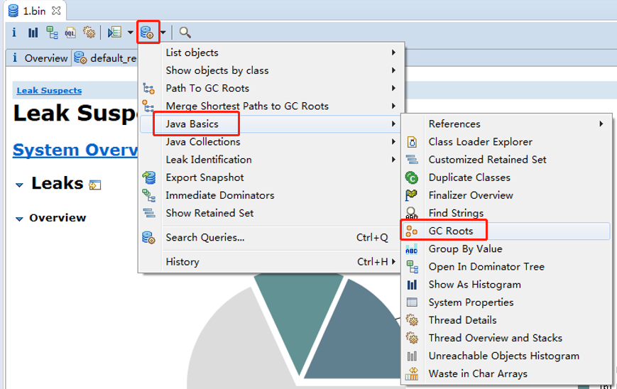

# Memory Analysis 工具使用

## 可达性分析算法

* Java 虚拟机中的垃圾回收器采用可达性分析来探索所有存活的对象
* 扫描堆中的对象，看是否能够沿着`GC Root`对象 为起点的引用链找到该对象，找不到，表示可以
  回收
* 哪些对象可以作为`GC Root`?

## 查看 GC Root 对象

```java
public class Demo2 {
    public static void main(String[] args) throws IOException {
        List<Object> list = new ArrayList<>();
        list.add("a");
        list.add("b");
        System.out.println(1);
        System.in.read();

        list = null;
        System.out.println(2);
        System.in.read();
        System.out.println("end...");
    }
}
```

当输出1后，程序进入阻塞状态，此时要转储堆信息，方式如下

1. 使用 `jps` 查看进程


可见当前进程号为：10152

2. 导出 dump 文件

   * jmap -dump:format=b,live,file=1.bin 10152
     * format：转储文件的格式
     * b：2进制格式
     * live：找出存活的对象。找之前会进行一次垃圾回收
     * file：输出的文件，后缀为bin

   

3. 使用`MAT`打开`1.bin`
   * File -> Open Heap Dump
   * 选择文件
   * 
   * 
   * 

由上图可知，MAT将根对象分作了好几类

System Class : 系统类，启动类加载器加载的类，也就是核心的类，运行期间肯定会用到的，他们可以作为`GC Root`对象，它们肯定不会被垃圾回收

Busy Monitor : synchronized 如果对对象加了锁，被加锁的对象也是`GC Root`对象，也是不能被回收的。如果这些对象被回收了，那么谁来解锁，解哪个对象上的锁？所以被加锁的对象也可以作为根对象

Thread : 活动线程。这些线程中的对象，也不能当做垃圾回收。线程运行时都由一次次的方法调用组成，每次方法调用都会产生栈帧，栈帧内使用的局部变量所引用的对象可以作为根对象。


上图展示了主线程的信息。主线程中的局部变量所引用的对象，都可以作为根对象。`ArrayList`对象存在于主线程中，它是根对象。

就文章开头的代码而言，list 是主线程的局部变量，存在与活动栈帧中，它所引用的对象是存储在堆里的，那么所提到的根对象也指的是存在于根中的那些对象，而不是说`list`这个引用，不是栈帧中局部变量的引用。

在当前活动线程执行过程中，局部变量所引用的对象可以作为根对象。方法参数所引用的对象，也是根对象，比如`String[] args` 参数引用的字符串数组对象。

回车，让程序进入下一个状态，然后再次转储`dump`文件并打开。


由上图可见，`ArrayList`对象已经不存在了。

由于`list = null;`局部变量置为了`null`，`ArrayList`对象也就没有引用指向了。当转储`2.bin`时，使用的`live`参数可导致发生垃圾回收，所以`ArrayList`对象被回收了，所以在根对象列表中找打不到了。

