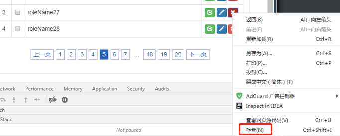

###2019.12.16
- Mybatis 更新功能 updateByPrimaryKeySelective，如果被更新的对象只有 id 不为空，其他的属性全部为空，此时会报错，缺少关键字 set
- 按照创建时间倒叙排列数据并取第一条，sql语句可能是 `SELECT * FROM XXX WHERE ROWNUM = 1 ORDER BY CREATETIME`,这样取得的数据是不对的，此 sql 语句的执行顺序是，先取的结果集的第一条数据，然后再排序，这与逾期不符。正确的写法应该是`SELECT * FROM (SELECT * FROM XXX WHERE 1=1 ORDER BY CREATETIME) WHERE ROWNUM = 1`
- ajax 请求后台，查询结果集，然后使用 ResponseBody 返回结果集，如果结果集为 null，则会直接进 ajax 的 error。
- Jquery 使用 ajax 传递数据时，如果使用的传递方式为 POST 且传递的数据时一般类型，比如，String、Long，而不是对象类型，比如 User。此时后端使用 Springboot 框架接收数据。Ajax 的 contentType可以不写，即默认 "application/x-www-form-urlencoded"，但如果设置为 "application/json"，后台是接收不到数据的。如果使用 GET 方式传递数据，
```js
	$.ajax({
		type:'GET'
		contentType:'application/json'
		data:{currentDate:currentDate}
	})
```
后台要加上 @RequestParam 注解。
```java
    @GetMapping(…)
    public void foo(@RequestParam String current) {}
```

- 使用 bootstrapValidator 验证功能，被验证的元素外层必须包裹着 div，并且 div 的 class 必须是 form-group。伪代码：这样就是有问题，页面一加载， 验证的的时候浏览器会报堆栈溢出错误，并且点击【保存并新增】按钮也不会有验证效果。
```js
<body>
        <form id="form">
	      <!--将下面的注释就不会报错了-->
            <!--<div class="form-group">-->
                <input id="abc" name="c" class="form-control" type="text" style="width: 240px">
            <!--</div>-->
        </form>
    <div style="height: 40px;">
        <footer class="footer navbar-fixed-bottom ">
            <div class="container">
                <div style="text-align: center;margin-bottom: 20px; ">
                    <button id="saveAndAdd" class="btn btn-info">保存并新增</button>
                    <button id="saveAndNext" class="btn btn-info">保存并下一步</button>
                    <button id="back" class="btn btn-info">返回列表</button>
                </div>
            </div>
        </footer>
    </div>
</body>
<script th:inline="javascript">
    $(document).ready(function () {
        formValidator();
    });
    function formValidator(){
        $('#form').bootstrapValidator({
            live: 'enabled',
            message: '必填',
            feedbackIcons: {
                validating: 'glyphicon glyphicon-refresh'
            },
            fields: {
                c: {
                    validators: {
                        notEmpty: {
                            message: '业务类型不能为空！'
                        }
                    }
                }
            }
        });
    }
    /* 保存并新增 */
    $("#saveAndAdd").click(function () {
        $('#form').data('bootstrapValidator').validate();
    });
</script>

```

- 使用开启新事务的场景：为了让此方法事务影响最小化，如果此方法外部的方法是一个很大很长的事务，那么就会影响此方法，如果这里新开启一个事务，就不会受到外面事务的影响。对于这种加锁的操作，不能有大事务，必须是很小很快的操作。
```java
	/**
     * 获得任务执行标记（原子操作）
     * @return true:执行中；false:空闲
     */
    @Transactional(propagation = Propagation.REQUIRES_NEW)
    public boolean getExeTaskFlagAtomic() {
        /* 根据PROJECT_REMIND_TASK_ID获取任务状态（原子操作：行级锁获取此行记录，如果处于空闲，则将其修改为执行中，并返回true；否则返回false） */
        StCronDto dto = stCronService.findOneByIdAtomic(PROJECT_REMIND_TASK_ID);
        if (FoticNullUtils.isNotNull(dto)) {
            if (dto.getStatus().equals(FREE)) {
                dto.setStatus(BUSY);
                stCronService.update(dto);
                return true;
            }
            return false;
        } else {
            logger.error("ID 为 {} 的定时任务表达式实例为空", PROJECT_REMIND_TASK_ID);
            throw new BusinessException("ID 为" + PROJECT_REMIND_TASK_ID + " 的定时任务表达式实例为空");
        }
    }
```

- 提前处理的思想：有一个查询涉及到的字段比较多，查询效率低。可以将能确认的数据，提前落地，然后最后最查询操作的时候，就不需要在现查某些数据了，而是可以从提前落地的数据中去取，这样就会提升效率。
- 净值日期从名称上是时间类型，其实在做数据库设计时，可以设置为Number类型，便于查询和计算。
-  业务主键： 比如“估值产品编码” + “净值日期” 就是业务主键。业务主键，顾名思义，就是业务上能确认唯一性的主键，业务上自己规定的。
- 如果查询条件需要，则必须写到 join 里面，如果查询条件不需要，就写到 exist 里, PROJECT_ROLE_CONFIG 表中的字段不需要展示，所以可以写到 exist 条件中，从而代替内连接

	SELECT
    biz_pro.PROJECTNAME AS PROJECT_NAME,
    net_info.REVIEW_STATE
	FROM
    NET_INFO net_info
	`INNER JOIN`
    `PROJECT_ROLE_CONFIG pro_role_conf`
	`ON`
    `net_info.PROJECT_ID = pro_role_conf.PROJECT_ID`
	INNER JOIN
    BIZPROJECT biz_pro
	ON
    net_info.PROJECT_ID = biz_pro.ID
	WHERE
    1=1
    `AND pro_role_conf.USER_ID=3588`
    AND biz_pro.LEDGERID=2
    `AND pro_role_conf.ROLE_CODE='r001'`
    `AND pro_role_conf.PRIMARY_DUTY='1'`
    ORDER BY net_info.NET_DATE DESC,biz_pro.PROJECTNAME
	可以改写为(注意变色部分)
    SELECT
    biz_pro.PROJECTNAME AS PROJECT_NAME,
    net_info.NET_DATE,
	FROM
    NET_INFO net_info
	INNER JOIN
    BIZPROJECT biz_pro
	ON
    net_info.PROJECT_ID = biz_pro.ID
	WHERE
    1=1
	AND EXISTS
    (
    `SELECT`
    `1`
    `FROM`
    `PROJECT_ROLE_CONFIG pro_role_conf`
    `WHERE`
    `net_info.PROJECT_ID = pro_role_conf.PROJECT_ID`
    `AND pro_role_conf.USER_ID=:currentUserId`
    `AND pro_role_conf.ROLE_CODE=:roleCode`
    `AND pro_role_conf.PRIMARY_DUTY=:primaryDuty`)
	AND biz_pro.LEDGERID=:ledgerId
	ORDER BY
    net_info.NET_DATE DESC,
    biz_pro.PROJECTNAME

- <s:if> 标签之空格问题，比如数据应该是 123456.000；，如果没有写成一行，就会变成 123456.000 ；

```html
<span id="sevenDayRate-${status.count}">
<s:if test="${sevenDayRate} == 0.000000"></s:if>
<s:else>
<s:property value="sevenDayRate"/>
</s:else>
</span>
```
```html
<s:if test="${sevenDayRate} == 0.000000"></s:if><s:else><s:property value="sevenDayRate"/></s:else></span>
```
写到一行，就不会有空格


- ajax不进入success回调，可使用 error 回调进行调试，只要后台没报错，前台也没报错，80%是进入到了 error 回调中，可以在错误回调中输出错误信息
```javascript
	$.ajax({
		url:"review.html",
		type:'POST',
		data:{selectedRow:arr.toJSONString()},
		dataType:'text',
		success: function(msg) {
			alert("tt");
		},
		error: function (XMLHttpRequest, textStatus, errorThrown) {
			console.log(XMLHttpRequest.status);
			// 状态
			console.log(XMLHttpRequest.readyState);
			// 错误信息
			console.log(textStatus);
		}
	});
```
遇到的问题是， dataType:'json' ，但是返回的数据不是标准的 json 格式，导致解析错误。还有一种情况是：`HttpServletResponse resp; resp.setContentType("text/html;charset=utf-8")`设置的 contentType 是 text/html;
但是 ajax 使用的 dataType 是 json。
```javascript
	$.ajax({
		dataType:'json',
	});

```
也会导致解析错误，进入 error 回调。解决方式有两种:
1、将 dataType改为dataType:'text'
2、resp.setContentType("application/json;charset=utf-8")

- 录入与新增数据时对于录入长度的限制
无论需求中是否提及需要对录入数据的长度进行限制，都需要根据数据库的实际长度，对录入的数据的长度进行限制，否则录入数据的长度一旦超出了数据库限制的长度，就会报错，尤其是针对数值类型。

### 2019.12.27

```sql
select case own.INTEREST_FREQUENCY when 2 then 5 when 3 then 4 when 4 then 2 when 5 then 1 when 6 then 4 END from IAI_ASSET_PRODUCT own
```

以上sql，case when 的情况如果越来越多，或者到后期发生改变，那么上面的方式就不好维护。比较好的做法是新增一张表，将以上关系存入表中，然后关联查询。

newTable

| ID   | INTEREST_FREQUENCY | TEMP_COL |
| ---- | ------------------ | -------- |
| 1    | 2                  | 5        |
| 2    | 3                  | 4        |
| 3    | 4                  | 2        |
| 4    | 5                  | 1        |
| 5    | 6                  | 4        |

existTable

| ID   | INTEREST_FREQUENCY | OTHER_COL |
| ---- | ------------------ | --------- |
| 1    | 2                  | A         |
| 2    | 2                  | B         |
| 3    | 3                  | C         |
| 4    | 4                  | D         |
| 5    | 5                  | E         |
| 6    | 3                  | F         |
| 7    | 6                  | G         |

select nt.TEMP_COL from newTable nt,existTable et where 1=1 and  nt.INTEREST_FREQUENCY = et.INTEREST_FREQUENCY

如果以后匹配发生变更，修改`newTable`就可以了，如果有新增匹配的字段，在`newTable`增加新列即可。

### 2019.02.07

### 抽取 action 层方法问题

#### 背景

由于工作需要，现要将 action 层的一个方法中的部分代码抽取到 service 层。

#### 现象

抽取完成后，发现程序运行出现问题，原本不该更新的数据更新了

#### 自问

为什么会有这样的现象？代码原封不动的抽取过去的，根本不可能有修改，更别谈什么更新的操作了。是什么原因导致的问题呢？

#### 答案

由于被抽取的代码中含有对持久态（hibernate 对象三种状态之一）对象的设值操作，原先在 action 层时，不会更新数据库，但现在将代码抽取到了 service 层，service 层是受事务控制的，所以当操作持久态对象时，会触发数据库更新，所以会导致数据变化，进而导致程序出现问题。所以今后抽取代码时要慎重，不要以为只是简单地抽取就不会出现问题。

### 封装  js 方法时参数的处理

封装公共的拥有批量删除功能的 js 方法 doBatchRemove

```javascript
/**
 * 批量删除数据，删除数据后，刷新页面，并将页面保留在当前分页
 * @param adminIdArr 要被删除的数据的 id 数组
 * @param pageNum    页码
 * @param keyword    查询关键字
 */
function doBatchRemove(adminIdArr, pageNum, keyword) {
    //TODO
}
```

此方法被抽取成公共方法的目的是公用批量删除功能，只要传进去 id 数组，就可以进行批量删除。pageNum 与 keyword 这两个参数略显多余。如果别人要调用此方法，还得知道页码和关键字这些与删除操作无关的参数，玷污了此方法的纯粹性。

```javascript
/**
 * 批量删除数据，删除数据后，刷新页面，并将页面保留在当前分页
 * @param adminIdArr 要被删除的数据的 id 数组
 * @param pageNum    页码
 * @param keyword    查询关键字
 */
function doBatchRemove(adminIdArr) {
    // window.pageNum;window.keyword
}
```

删除后两个参数，页码与关键字可以从 window 这个全局对象中获取。所以我们要维护全局对象里的页码与关键字这两个属性的值，即，一旦当前页码与关键字发生变化，都要把全局对象里的页码与关键字的属性值更新。

利用好 window 这个全局对象，可以帮助我们省很多事情。

### EL 表达式

```jsp
<%@ page contentType="text/html;charset=UTF-8" language="java" %>
<html>
<head>
    <title>Title</title>
    <script type='text/javascript' charset='utf8'>
    	$(function(){
           window.pageNum = ${requestScope['PAGE-INFO'].pageNum};
           window.keyword = "${param.keyword}"; 
        });
    </script>
</head>
<body>

</body>
</html>
```

```javascript
function foo() {
    window.location.href = "/admin/do.html?pageNum=" + window.pageNum + "&keyword=" + window.keyword
 }
```

keyword 可能为数字，也可能是汉字，所以当通过 el 表达式获取值时，要加上双引号，否则当 keyword 的值是字符串时，在 foo方法中使用时会出现问题。比如，keyword 的值为 aa，如果没有加双引号，在 foo 中，window.keyword 等于 aa，此时会将 aa 当做一个变量，所以会出现问题，如果 aa 是字符串则没有问题。

pageNum 一定是数字，所以可不加双引号。

由此也可以看出，双引号并不会影响 el 解析。

### 2020.02.12

#### ContextLoaderListener 和 Spring MVC 中 DispatcherServlet 加载内容的区别

配置 springmvc 项目时，会在 web.xml 中配置 DispatcherSevlet

```xml
<servlet>
        <servlet-name>app</servlet-name>
        <servlet-class>org.springframework.web.servlet.DispatcherServlet</servlet-class>
        <init-param>
            <param-name>contextConfigLocation</param-name>
            <param-value>这里可以配置什么？</param-value>
        </init-param>
        <load-on-startup>1</load-on-startup>
    </servlet>
```

param-value 中一般配置 dispatcher-servlet.xml，但是也可以什么都不配置。如果这里什么都不配置，那么在 contextConfigLocation中就需要配置

```xml
<listener>
        <listener-class>org.springframework.web.context.ContextLoaderListener</listener-class>
    </listener>

    <context-param>
        <param-name>contextConfigLocation</param-name>
        <param-value>classpath:dispatcher-servlet.xml</param-value>
    </context-param>
```

先说结论：把所有的东西都配置到 contextConfigLocation 中是可以的！

但是，在实际的项目中，两个地方都有配置，也就是说实际项目中喜欢分开配置，这样会更加清晰，那么一般分开的原则是什么，也就是说哪个该配置到 DispatcherServlet，哪个该配置到 contextConfigLocation 呢？

>https://docs.spring.io/spring-framework/docs/current/spring-framework-reference/web.html#mvc-container-config
>
> If an application context hierarchy is not required, applications may configure a “root” context only and leave the `contextConfigLocation` Servlet parameter empty.
>
>

> https://www.cnblogs.com/vanl/p/5759671.html　
>
> ContextLoaderListener和DispatcherServlet都会在Web容器启动的时候加载一下bean配置. 区别在于:
>
> 　　DispatcherServlet一般会加载MVC相关的bean配置管理(如: ViewResolver, Controller, MultipartResolver, ExceptionHandler, etc.)
>
> 　　ContextLoaderListener一般会加载整个Spring容器相关的bean配置管理(如: Log, Service, Dao, PropertiesLoader, etc.)
>
> 　　DispatcherServlet默认使用WebApplicationContext作为上下文.
>
> 　　值得注意的是, DispatcherServlet的上下文仅仅是Spring MVC的上下文, 而ContextLoaderListener的上下文则对整个Spring都有效. 一般Spring web项目中同时会使用这两种上下文. 

### 2020.02.18

#### 动态生成的dom元素绑定单击相应事件


通过 jquery 操作生成的 dom 元素，在浏览器查看源代码时是看不见

只能通过右键检查的方式查看源代码




什么是 jquery 操作？

$("#xxx").append("<tr><td>yyy</td></tr>");

这种元素通过click绑定的单击响应事件是不稳定的：

```javascript
$(".removeBtn").click(function(){}); // 不稳定，有的时候只有一次有效果，具体原因未知
```

使用离此元素最近的一个非动态生成的元素，这里我们可以选择外面的tableBody，给 tableBody 设置一个 id，绑定事件这么写：

```javascript
$("#tableBodyId").on("click",".removeBtn", function(){
    // TODO
});
```

#### 通过添加 class 给按钮绑定事件

现有如下按钮：

```html
<button type='button' class='btn btn-danger btn-xs' roleId='" + data.id + "'><i class=' glyphicon glyphicon-remove'></i></button>
```

现在想给此按钮绑定click事件，一般的操作是给按钮添加 id 属性，但是注意 id 要唯一，然后使用 jquery id 选择器进行绑定；还有一种思路是加入 class 样式：

```html
<button type='button' class='btn btn-danger btn-xs removeBtn' roleId='" + data.id + "'><i class=' glyphicon glyphicon-remove'></i></button>
```

在 class 最后加入 removeBtn，此样式没有任何 css 代码，只是为了绑定事件，然后可以这样绑定：

```javascript
$(".removeBtn").click(function(){});
```

### 2020.02.25

#### 小议动态代理

##### 生成动态代理文件_v_1.8.0_144

使用以下的 jdk 版本：

```java
java version "1.8.0_144"
Java(TM) SE Runtime Environment (build 1.8.0_144-b01)
Java HotSpot(TM) 64-Bit Server VM (build 25.144-b01, mixed mode)
```


1. 加入虚拟机参数
   * -Dsun.misc.ProxyGenerator.saveGeneratedFiles=true
   * 

2. 

程序运行后，就会看见生成的代理类：com/sun/proxy/$Proxy0.class

##### 生成代理类的核心方法追溯

java.lang.reflect.Proxy.ProxyClassFactory#apply

​	sun.misc.ProxyGenerator#generateProxyClass(java.lang.String, java.lang.Class<?>[], int)

​		sun.misc.ProxyGenerator#generateClassFile

>https://www.cnblogs.com/zuidongfeng/p/8735241.html


##### 生成代理文件_新版jdk

PS. 新版指的是比上面的版本新的版本

在 main 方法开始的地方写

```java
 System.getProperties().put("jdk.misc.ProxyGenerator.saveGeneratedFiles", true);
```

这样就不用修改虚拟机运行参数了。

### 2020.03.04

#### git  窗口显示中文为16进制解决方案

设置新的环境变量

LESSCHARSET=utf-8

#### git 窗口显示中文为乱码解决方案

打开 git-bash，右击窗口进入 options，分别将 text 选项的 Locale 改为 zh-CN，character-set 改为 UTF-8

### 2020.03.08

任意文本编辑器（记事本，notepad++）,在打开文本时，都会查询编码表，把字节转换成字符表示。

0~127：查询 ASCII 表

其他值：查询系统默认码表（中文系统GBK）

fileOutputStream.write(97) -> 打开文件后，实际上是 a

一次写多个字节：

如果写的第一个字节是正数（0~127），显示时会查询 ASCII 表。

如果写的第一个字节是负数，那么第一个字节和第二个字节，两个字节组成一个中文显示，查询系统默认码表（GBK）

```java
byte[] b = {65,66,67,68,69}; //ABCDE
byte[] b1 = {-65,-66,-67,68,69}; //烤紻E
fos.write(b1);
```

### 2020.03.30

#### maven私服jar包无法下载问题

##### 背景：

maven 编译签章应用，但是报错，关于签章的几个专用 jar 包找不到，这些 jar 包是安装在私服上的

##### 排查问题：

检查 maven 的 setting.xml 配置文件

```xml
<server>
      <id>group</id>
      <username>admin</username>
      <password>admin123</password>
    </server>
	
	<server>
		<id>releases</id>
		<username>admin</username>
		<password>admin123</password>
	</server>
	
	<server>
		<id>snapshots</id>
		<username>admin</username>
		<password>admin123</password>
	</server>
```

```xml
<mirror>
      <id>group</id>
	  <name>maven_fotic_group</name>
      <mirrorOf>*</mirrorOf>
      <url>http://10.7.101.237:9111/repository/maven_fotic_group/</url>
</mirror>	
```

`http://10.7.101.237:9111/repository/maven_fotic_group/`是私服地址，输入此地址登录私服。


登录后，可看到 maven_fotic_group 的库，点击进入。


搜索需要的 jar。


什么都没有搜到，证明此仓库中没有对应 jar。

更换仓库地址

```xml
<server>
      <id>test-snapshot-repo</id>
      <username>test_snapshot</username>
      <password>test_snapshot</password>
    </server>
    <server>
      <id>test-release-repo</id>
      <username>test_release</username>
      <password>test_release</password>
    </server>
  </servers>
```

```xml
<mirror>
      <id>foticRepo</id>
      <mirrorOf>*</mirrorOf>
      <name>foticRepo</name>
      <url>http://10.7.101.237:9111/repository/test_group/</url>
    </mirror>
  </mirrors>
```

使用`http://10.7.101.237:9111/repository/test_group/`地址，可以找到对应的 jar。


点击进入一个 jar 包文件夹，观察红框部分。


点击 Analyze application。


要求输入用户名与密码，此时就可以输入

```xml
<username>test_release</username>
<password>test_release</password>
```

或者

```xml
<username>test_snapshot</username>
<password>test_snapshot</password>
```

这就是 setting.xml 中配置的用户名和密码。

打开本地仓库 isiganture 中的 _remote.repositories 文件。


foticRepo 对应着


##### 私服库的 type


### 2020.05.11

#### oracle varchar2(50) 的含义

oracle 中定义字段的类型为 varchar2(50)，其中 50 指的是字节长度。
试验：
存入：你好你好你好你好你好你好你好你好你好你好，共 20 个汉字
结果：java.sql.SQLException: ORA-12899: 列 "PORTAL"."WORD2PDF_INFO_LOG"."DOC_VERSION_ID" 的值太大 (实际值: 60, 最大值: 50)
分析：由于采用 utf8 编码格式，一个汉字占用 3 个字节，所以 20 个汉字一共 60 个字节，所以会超出。

试验：
存入：111111111111111111111111111111111111111111111111111，共 51 个数字
结果：java.sql.SQLException: ORA-12899: 列 "PORTAL"."WORD2PDF_INFO_LOG"."DOC_VERSION_ID" 的值太大 (实际值: 51, 最大值: 50)
分析：一个数字占用一个字节，所以会超出。

试验：
存入：aaaaaaaaaaaaaaaaaaaaaaaaaaaaaaaaaaaaaaaaaaaaaaaaaaa，共 51 个 a
结果：java.sql.SQLException: ORA-12899: 列 "PORTAL"."WORD2PDF_INFO_LOG"."DOC_VERSION_ID" 的值太大 (实际值: 51, 最大值: 50)
分析：一个字母占用一个字节，所以会超出。